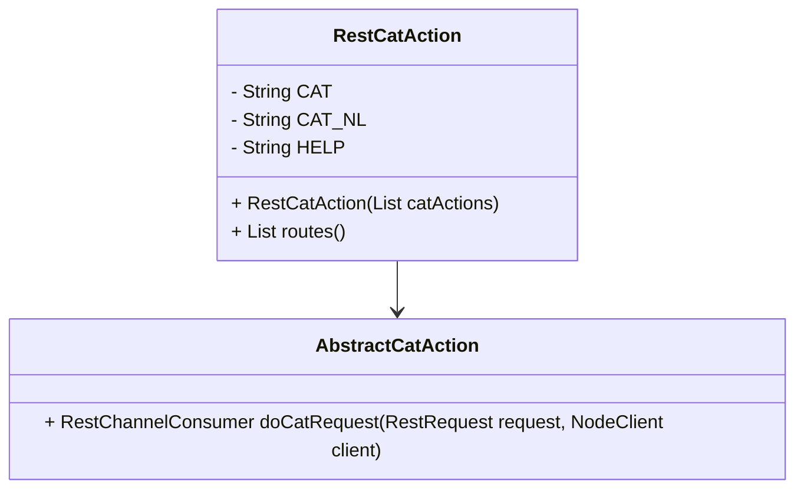

# Overview

Cat APIs provide information about the state and health of the Elasticsearch cluster in a human-readable format. These APIs are essential for monitoring and managing the cluster efficiently.

# RestCatAction Class

The `RestCatAction` class is responsible for handling requests to the Cat APIs. It initializes with a list of `AbstractCatAction` instances, which represent individual Cat actions.

<SwmSnippet path="/server/src/main/java/org/elasticsearch/rest/action/cat/RestCatAction.java" line="25">

---

The `RestCatAction` class defines constants and initializes the help documentation.

```java
public class RestCatAction extends BaseRestHandler {

    private static final String CAT = "=^.^=";
    private static final String CAT_NL = CAT + "\n";
    private final String HELP;
```

---

</SwmSnippet>

# CAT Constant

The `CAT` constant is defined as a string `=^.^=` and is used to create a newline constant `CAT_NL` by appending a newline character to it.

<SwmSnippet path="/server/src/main/java/org/elasticsearch/rest/action/cat/RestCatAction.java" line="27">

---

The `CAT` and `CAT_NL` constants are defined here.

```java
    private static final String CAT = "=^.^=";
    private static final String CAT_NL = CAT + "\n";
```

---

</SwmSnippet>

# Constructor

The `RestCatAction` constructor builds the help documentation by iterating over the provided Cat actions and appending their documentation to a `StringBuilder`.

<SwmSnippet path="/server/src/main/java/org/elasticsearch/rest/action/cat/RestCatAction.java" line="31">

---

The constructor initializes the help documentation for the Cat APIs.

```java
    public RestCatAction(List<AbstractCatAction> catActions) {
        StringBuilder sb = new StringBuilder();
        sb.append(CAT_NL);
        for (AbstractCatAction catAction : catActions) {
            catAction.documentation(sb);
        }
        HELP = sb.toString();
```

---

</SwmSnippet>

# Routes Method

The `routes` method in `RestCatAction` defines the endpoint for the Cat API, which is accessible via the path `/_cat`.

<SwmSnippet path="/server/src/main/java/org/elasticsearch/rest/action/cat/RestCatRecoveryAction.java" line="47">

---

The `routes` method defines the endpoints for the Cat API.

```java
    public List<Route> routes() {
        return List.of(new Route(GET, "/_cat/recovery"), new Route(GET, "/_cat/recovery/{index}"));
    }
```

---

</SwmSnippet>

# PrepareRequest Method

The `prepareRequest` method in `AbstractCatAction` handles the incoming requests, checking if help is requested and either providing help documentation or executing the Cat request.

<SwmSnippet path="/server/src/main/java/org/elasticsearch/rest/action/cat/RestCatRecoveryAction.java" line="63">

---

The `prepareRequest` method processes the incoming requests and executes the appropriate Cat action.

```java
    public RestChannelConsumer doCatRequest(final RestRequest request, final NodeClient client) {
        final RecoveryRequest recoveryRequest = new RecoveryRequest(Strings.splitStringByCommaToArray(request.param("index")));
        recoveryRequest.detailed(request.paramAsBoolean("detailed", false));
        recoveryRequest.activeOnly(request.paramAsBoolean("active_only", false));
        recoveryRequest.indicesOptions(IndicesOptions.fromRequest(request, recoveryRequest.indicesOptions()));

        return channel -> new RestCancellableNodeClient(client, request.getHttpChannel()).admin()
            .indices()
            .recoveries(recoveryRequest, new RestResponseListener<RecoveryResponse>(channel) {
                @Override
                public RestResponse buildResponse(final RecoveryResponse response) throws Exception {
                    return RestTable.buildResponse(buildRecoveryTable(request, response), channel);
                }
            });
    }
```

---

</SwmSnippet>

&nbsp;

*This is an auto-generated document by Swimm AI 🌊 and has not yet been verified by a human*

<SwmMeta version="3.0.0" repo-id="Z2l0aHViJTNBJTNBZWxhc3RpY3NlYXJjaCUzQSUzQVN3aW1tLURlbW8=" repo-name="elasticsearch" doc-type="overview"><sup>Powered by [Swimm](https://app.swimm.io/)</sup></SwmMeta>
