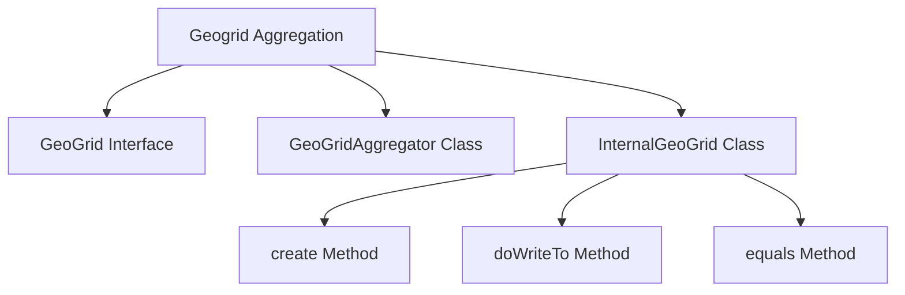

<SwmSnippet path="/server/src/main/java/org/elasticsearch/search/aggregations/bucket/geogrid/GeoGrid.java" line="8">

---

# <SwmToken path="server/src/main/java/org/elasticsearch/search/aggregations/bucket/geogrid/GeoGrid.java" pos="8:12:12" line-data="package org.elasticsearch.search.aggregations.bucket.geogrid;">`geogrid`</SwmToken> Interface

The <SwmToken path="server/src/main/java/org/elasticsearch/search/aggregations/bucket/geogrid/GeoGrid.java" pos="8:12:12" line-data="package org.elasticsearch.search.aggregations.bucket.geogrid;">`geogrid`</SwmToken> interface extends <SwmToken path="server/src/main/java/org/elasticsearch/search/aggregations/bucket/geogrid/GeoGrid.java" pos="10:12:12" line-data="import org.elasticsearch.search.aggregations.bucket.MultiBucketsAggregation;">`MultiBucketsAggregation`</SwmToken> and provides a method <SwmToken path="server/src/main/java/org/elasticsearch/search/aggregations/bucket/geogrid/GeoGrid.java" pos="30:9:9" line-data="    List&lt;? extends Bucket&gt; getBuckets();">`getBuckets`</SwmToken> to retrieve the list of buckets, each corresponding to a <SwmToken path="server/src/main/java/org/elasticsearch/search/aggregations/bucket/geogrid/GeoGrid.java" pos="15:5:7" line-data=" * A geo-grid aggregation. Defines multiple buckets, each representing a cell in a geo-grid of a specific">`geo-grid`</SwmToken> cell.

```java
package org.elasticsearch.search.aggregations.bucket.geogrid;

import org.elasticsearch.search.aggregations.bucket.MultiBucketsAggregation;
```

---

</SwmSnippet>

<SwmSnippet path="/server/src/main/java/org/elasticsearch/search/aggregations/bucket/geogrid/GeoGridAggregator.java" line="38">

---

# <SwmToken path="server/src/main/java/org/elasticsearch/search/aggregations/bucket/geogrid/GeoGridAggregator.java" pos="38:6:6" line-data="public abstract class GeoGridAggregator&lt;T extends InternalGeoGrid&lt;?&gt;&gt; extends BucketsAggregator {">`GeoGridAggregator`</SwmToken> Class

The <SwmToken path="server/src/main/java/org/elasticsearch/search/aggregations/bucket/geogrid/GeoGridAggregator.java" pos="38:6:6" line-data="public abstract class GeoGridAggregator&lt;T extends InternalGeoGrid&lt;?&gt;&gt; extends BucketsAggregator {">`GeoGridAggregator`</SwmToken> class is responsible for creating and managing the buckets for each cell in the geogrid. It includes fields like <SwmToken path="server/src/main/java/org/elasticsearch/search/aggregations/bucket/geogrid/GeoGridAggregator.java" pos="40:7:7" line-data="    protected final int requiredSize;">`requiredSize`</SwmToken> and <SwmToken path="server/src/main/java/org/elasticsearch/search/aggregations/bucket/geogrid/GeoGridAggregator.java" pos="41:7:7" line-data="    protected final int shardSize;">`shardSize`</SwmToken> to define the size of the grid and the number of shards.

```java
public abstract class GeoGridAggregator<T extends InternalGeoGrid<?>> extends BucketsAggregator {

    protected final int requiredSize;
    protected final int shardSize;
    protected final ValuesSource.Numeric valuesSource;
```

---

</SwmSnippet>

<SwmSnippet path="/server/src/main/java/org/elasticsearch/search/aggregations/bucket/geogrid/InternalGeoGrid.java" line="39">

---

# <SwmToken path="server/src/main/java/org/elasticsearch/search/aggregations/bucket/geogrid/GeoGridAggregator.java" pos="38:12:12" line-data="public abstract class GeoGridAggregator&lt;T extends InternalGeoGrid&lt;?&gt;&gt; extends BucketsAggregator {">`InternalGeoGrid`</SwmToken> Class

The <SwmToken path="server/src/main/java/org/elasticsearch/search/aggregations/bucket/geogrid/GeoGridAggregator.java" pos="38:12:12" line-data="public abstract class GeoGridAggregator&lt;T extends InternalGeoGrid&lt;?&gt;&gt; extends BucketsAggregator {">`InternalGeoGrid`</SwmToken> class contains the actual implementation of the geogrid buckets. It includes a list of <SwmToken path="server/src/main/java/org/elasticsearch/search/aggregations/bucket/geogrid/InternalGeoGrid.java" pos="39:1:1" line-data="    InternalGeoGridBucket&gt; implements GeoGrid {">`InternalGeoGridBucket`</SwmToken> objects, each representing a cell in the geogrid.

```java
    InternalGeoGridBucket> implements GeoGrid {

    protected final int requiredSize;
    protected final List<InternalGeoGridBucket> buckets;
```

---

</SwmSnippet>

<SwmSnippet path="/server/src/main/java/org/elasticsearch/search/aggregations/bucket/geogrid/InternalGeoGrid.java" line="68">

---

# Creating <SwmToken path="server/src/main/java/org/elasticsearch/search/aggregations/bucket/geogrid/GeoGrid.java" pos="8:12:12" line-data="package org.elasticsearch.search.aggregations.bucket.geogrid;">`geogrid`</SwmToken> Buckets

The <SwmToken path="server/src/main/java/org/elasticsearch/search/aggregations/bucket/geogrid/InternalGeoGrid.java" pos="68:10:10" line-data="    protected abstract InternalGeoGrid&lt;B&gt; create(">`create`</SwmToken> method in the <SwmToken path="server/src/main/java/org/elasticsearch/search/aggregations/bucket/geogrid/InternalGeoGrid.java" pos="68:5:5" line-data="    protected abstract InternalGeoGrid&lt;B&gt; create(">`InternalGeoGrid`</SwmToken> class is used to create the geogrid buckets. It takes parameters like <SwmToken path="server/src/main/java/org/elasticsearch/search/aggregations/bucket/geogrid/InternalGeoGrid.java" pos="69:3:3" line-data="        String name,">`name`</SwmToken>, <SwmToken path="server/src/main/java/org/elasticsearch/search/aggregations/bucket/geogrid/InternalGeoGrid.java" pos="70:3:3" line-data="        int requiredSize,">`requiredSize`</SwmToken>, and a list of <SwmToken path="server/src/main/java/org/elasticsearch/search/aggregations/bucket/geogrid/InternalGeoGrid.java" pos="71:3:3" line-data="        List&lt;InternalGeoGridBucket&gt; buckets,">`InternalGeoGridBucket`</SwmToken> objects.

```java
    protected abstract InternalGeoGrid<B> create(
        String name,
        int requiredSize,
        List<InternalGeoGridBucket> buckets,
        Map<String, Object> metadata
    );
```

---

</SwmSnippet>

<SwmSnippet path="/server/src/main/java/org/elasticsearch/search/aggregations/bucket/geogrid/InternalGeoGrid.java" line="62">

---

## <SwmToken path="server/src/main/java/org/elasticsearch/search/aggregations/bucket/geogrid/InternalGeoGrid.java" pos="63:5:5" line-data="    protected void doWriteTo(StreamOutput out) throws IOException {">`doWriteTo`</SwmToken> Method

The <SwmToken path="server/src/main/java/org/elasticsearch/search/aggregations/bucket/geogrid/InternalGeoGrid.java" pos="63:5:5" line-data="    protected void doWriteTo(StreamOutput out) throws IOException {">`doWriteTo`</SwmToken> method is responsible for writing the state of the <SwmToken path="server/src/main/java/org/elasticsearch/search/aggregations/bucket/geogrid/GeoGridAggregator.java" pos="38:12:12" line-data="public abstract class GeoGridAggregator&lt;T extends InternalGeoGrid&lt;?&gt;&gt; extends BucketsAggregator {">`InternalGeoGrid`</SwmToken> object to a <SwmToken path="server/src/main/java/org/elasticsearch/search/aggregations/bucket/geogrid/InternalGeoGrid.java" pos="63:7:7" line-data="    protected void doWriteTo(StreamOutput out) throws IOException {">`StreamOutput`</SwmToken>. This includes writing the size and the collection of buckets.

```java
    @Override
    protected void doWriteTo(StreamOutput out) throws IOException {
        writeSize(requiredSize, out);
        out.writeCollection(buckets);
    }
```

---

</SwmSnippet>

<SwmSnippet path="/server/src/main/java/org/elasticsearch/search/aggregations/bucket/geogrid/InternalGeoGrid.java" line="171">

---

## equals Method

The <SwmToken path="server/src/main/java/org/elasticsearch/search/aggregations/bucket/geogrid/InternalGeoGrid.java" pos="171:5:5" line-data="    public boolean equals(Object obj) {">`equals`</SwmToken> method is used to compare two <SwmToken path="server/src/main/java/org/elasticsearch/search/aggregations/bucket/geogrid/InternalGeoGrid.java" pos="176:1:1" line-data="        InternalGeoGrid&lt;?&gt; other = (InternalGeoGrid&lt;?&gt;) obj;">`InternalGeoGrid`</SwmToken> objects for equality. It checks if the required size and the list of buckets are equal between the two objects.

```java
    public boolean equals(Object obj) {
        if (this == obj) return true;
        if (obj == null || getClass() != obj.getClass()) return false;
        if (super.equals(obj) == false) return false;

        InternalGeoGrid<?> other = (InternalGeoGrid<?>) obj;
        return Objects.equals(requiredSize, other.requiredSize) && Objects.equals(buckets, other.buckets);
    }
```

---

</SwmSnippet>

&nbsp;

*This is an auto-generated document by Swimm AI 🌊 and has not yet been verified by a human*

<SwmMeta version="3.0.0" repo-id="Z2l0aHViJTNBJTNBZWxhc3RpY3NlYXJjaCUzQSUzQVN3aW1tLURlbW8=" repo-name="elasticsearch" doc-type="overview"><sup>Powered by [Swimm](/)</sup></SwmMeta>
