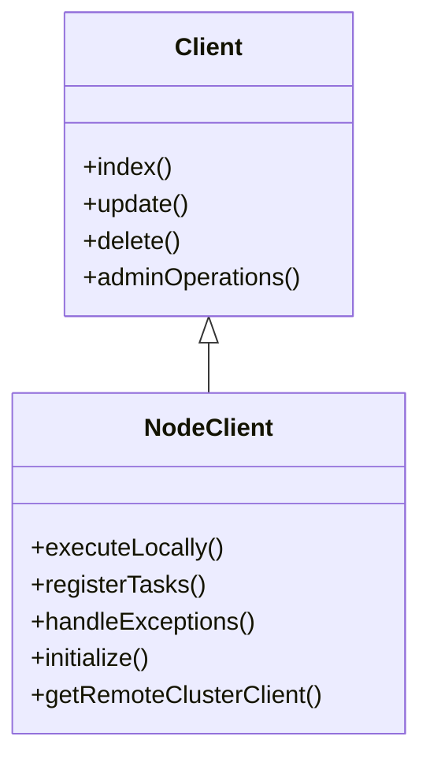

# Client Interface

The <SwmToken path="server/src/main/java/org/elasticsearch/client/internal/node/NodeClient.java" pos="34:3:3" line-data=" * Client that executes actions on the local node.">`Client`</SwmToken> interface provides a unified way to perform actions and operations against the Elasticsearch cluster. It includes methods for indexing, updating, and deleting documents, as well as administrative operations. All operations performed are asynchronous by nature, returning an <SwmToken path="server/src/main/java/org/elasticsearch/client/internal/support/AbstractClient.java" pos="119:20:20" line-data="    public final &lt;Request extends ActionRequest, Response extends ActionResponse&gt; ActionFuture&lt;Response&gt; execute(">`ActionFuture`</SwmToken> or accepting an <SwmToken path="server/src/main/java/org/elasticsearch/client/internal/node/NodeClient.java" pos="79:1:1" line-data="        ActionListener&lt;Response&gt; listener">`ActionListener`</SwmToken>.

# <SwmToken path="server/src/main/java/org/elasticsearch/client/internal/node/NodeClient.java" pos="36:4:4" line-data="public class NodeClient extends AbstractClient {">`NodeClient`</SwmToken> Class

The <SwmToken path="server/src/main/java/org/elasticsearch/client/internal/node/NodeClient.java" pos="36:4:4" line-data="public class NodeClient extends AbstractClient {">`NodeClient`</SwmToken> class is a concrete implementation of the <SwmToken path="server/src/main/java/org/elasticsearch/client/internal/node/NodeClient.java" pos="34:3:3" line-data=" * Client that executes actions on the local node.">`Client`</SwmToken> interface. It is designed to execute actions on the local node and manage tasks, actions, and connections specific to that node.

<SwmSnippet path="/server/src/main/java/org/elasticsearch/client/internal/node/NodeClient.java" line="33">

---

The <SwmToken path="server/src/main/java/org/elasticsearch/client/internal/node/NodeClient.java" pos="36:4:4" line-data="public class NodeClient extends AbstractClient {">`NodeClient`</SwmToken> class extends <SwmToken path="server/src/main/java/org/elasticsearch/client/internal/node/NodeClient.java" pos="36:8:8" line-data="public class NodeClient extends AbstractClient {">`AbstractClient`</SwmToken> and focuses on executing actions on the local node.

```java
/**
 * Client that executes actions on the local node.
 */
public class NodeClient extends AbstractClient {
```

---

</SwmSnippet>

<SwmSnippet path="/server/src/main/java/org/elasticsearch/client/internal/node/NodeClient.java" line="54">

---

The <SwmToken path="server/src/main/java/org/elasticsearch/client/internal/node/NodeClient.java" pos="54:5:5" line-data="    public void initialize(">`initialize`</SwmToken> method sets up the necessary components for the <SwmToken path="server/src/main/java/org/elasticsearch/client/internal/node/NodeClient.java" pos="36:4:4" line-data="public class NodeClient extends AbstractClient {">`NodeClient`</SwmToken> to function properly.

```java
    public void initialize(
        Map<ActionType<? extends ActionResponse>, TransportAction<? extends ActionRequest, ? extends ActionResponse>> actions,
        TaskManager taskManager,
        Supplier<String> localNodeId,
        Transport.Connection localConnection,
        RemoteClusterService remoteClusterService
    ) {
        this.actions = actions;
        this.taskManager = taskManager;
        this.localNodeId = localNodeId;
        this.localConnection = localConnection;
        this.remoteClusterService = remoteClusterService;
    }
```

---

</SwmSnippet>

# Executing Actions Locally

The <SwmToken path="server/src/main/java/org/elasticsearch/client/internal/node/NodeClient.java" pos="36:4:4" line-data="public class NodeClient extends AbstractClient {">`NodeClient`</SwmToken> class provides methods to execute actions locally, register tasks, and handle exceptions that may occur during task execution. It ensures that tasks are properly tracked and linked with action listeners.

<SwmSnippet path="/server/src/main/java/org/elasticsearch/client/internal/node/NodeClient.java" line="76">

---

The <SwmToken path="server/src/main/java/org/elasticsearch/client/internal/node/NodeClient.java" pos="76:20:20" line-data="    public &lt;Request extends ActionRequest, Response extends ActionResponse&gt; void doExecute(">`doExecute`</SwmToken> method handles the execution of actions locally and manages exceptions that may arise during task execution.

```java
    public <Request extends ActionRequest, Response extends ActionResponse> void doExecute(
        ActionType<Response> action,
        Request request,
        ActionListener<Response> listener
    ) {
        // Discard the task because the Client interface doesn't use it.
        try {
            executeLocally(action, request, listener);
        } catch (TaskCancelledException | IllegalArgumentException | IllegalStateException e) {
            // #executeLocally returns the task and throws TaskCancelledException if it fails to register the task because the parent
            // task has been cancelled, IllegalStateException if the client was not in a state to execute the request because it was not
            // yet properly initialized or IllegalArgumentException if header validation fails we forward them to listener since this API
            // does not concern itself with the specifics of the task handling
            listener.onFailure(e);
        }
    }
```

---

</SwmSnippet>

# <SwmToken path="server/src/main/java/org/elasticsearch/client/internal/node/NodeClient.java" pos="140:3:3" line-data="    public RemoteClusterClient getRemoteClusterClient(">`RemoteClusterClient`</SwmToken> Interface

The <SwmToken path="server/src/main/java/org/elasticsearch/client/internal/node/NodeClient.java" pos="140:3:3" line-data="    public RemoteClusterClient getRemoteClusterClient(">`RemoteClusterClient`</SwmToken> interface extends the functionality of the <SwmToken path="server/src/main/java/org/elasticsearch/client/internal/node/NodeClient.java" pos="34:3:3" line-data=" * Client that executes actions on the local node.">`Client`</SwmToken> by enabling the execution of actions on remote clusters. This is useful for cross-cluster operations and managing tasks across different clusters.

<SwmSnippet path="/server/src/main/java/org/elasticsearch/client/internal/node/NodeClient.java" line="140">

---

The <SwmToken path="server/src/main/java/org/elasticsearch/client/internal/node/NodeClient.java" pos="140:5:5" line-data="    public RemoteClusterClient getRemoteClusterClient(">`getRemoteClusterClient`</SwmToken> method provides a way to interact with remote clusters, facilitating cross-cluster operations.

```java
    public RemoteClusterClient getRemoteClusterClient(
        String clusterAlias,
        Executor responseExecutor,
        RemoteClusterService.DisconnectedStrategy disconnectedStrategy
    ) {
        return remoteClusterService.getRemoteClusterClient(clusterAlias, responseExecutor, disconnectedStrategy);
    }
```

---

</SwmSnippet>

# Main Functions

The main functions of the <SwmToken path="server/src/main/java/org/elasticsearch/client/internal/node/NodeClient.java" pos="36:4:4" line-data="public class NodeClient extends AbstractClient {">`NodeClient`</SwmToken> class include <SwmToken path="server/src/main/java/org/elasticsearch/client/internal/node/NodeClient.java" pos="86:32:32" line-data="            // task has been cancelled, IllegalStateException if the client was not in a state to execute the request because it was not">`execute`</SwmToken> and <SwmToken path="server/src/main/java/org/elasticsearch/client/internal/node/NodeClient.java" pos="76:20:20" line-data="    public &lt;Request extends ActionRequest, Response extends ActionResponse&gt; void doExecute(">`doExecute`</SwmToken>.

## execute

The <SwmToken path="server/src/main/java/org/elasticsearch/client/internal/node/NodeClient.java" pos="86:32:32" line-data="            // task has been cancelled, IllegalStateException if the client was not in a state to execute the request because it was not">`execute`</SwmToken> function is the single execution point for all clients. It takes an action and a request, and returns an <SwmToken path="server/src/main/java/org/elasticsearch/client/internal/support/AbstractClient.java" pos="119:20:20" line-data="    public final &lt;Request extends ActionRequest, Response extends ActionResponse&gt; ActionFuture&lt;Response&gt; execute(">`ActionFuture`</SwmToken>.

<SwmSnippet path="/server/src/main/java/org/elasticsearch/client/internal/support/AbstractClient.java" line="119">

---

The <SwmToken path="server/src/main/java/org/elasticsearch/client/internal/support/AbstractClient.java" pos="119:25:25" line-data="    public final &lt;Request extends ActionRequest, Response extends ActionResponse&gt; ActionFuture&lt;Response&gt; execute(">`execute`</SwmToken> method initiates the execution of an action and request, returning an <SwmToken path="server/src/main/java/org/elasticsearch/client/internal/support/AbstractClient.java" pos="119:20:20" line-data="    public final &lt;Request extends ActionRequest, Response extends ActionResponse&gt; ActionFuture&lt;Response&gt; execute(">`ActionFuture`</SwmToken>.

```java
    public final <Request extends ActionRequest, Response extends ActionResponse> ActionFuture<Response> execute(
        ActionType<Response> action,
        Request request
    ) {
        PlainActionFuture<Response> actionFuture = new RefCountedFuture<>();
        execute(action, request, actionFuture);
        return actionFuture;
    }
```

---

</SwmSnippet>

## <SwmToken path="server/src/main/java/org/elasticsearch/client/internal/node/NodeClient.java" pos="76:20:20" line-data="    public &lt;Request extends ActionRequest, Response extends ActionResponse&gt; void doExecute(">`doExecute`</SwmToken>

The <SwmToken path="server/src/main/java/org/elasticsearch/client/internal/node/NodeClient.java" pos="76:20:20" line-data="    public &lt;Request extends ActionRequest, Response extends ActionResponse&gt; void doExecute(">`doExecute`</SwmToken> function is an abstract method that must be implemented by subclasses. It handles the actual execution of the action and request.

<SwmSnippet path="/server/src/main/java/org/elasticsearch/client/internal/support/AbstractClient.java" line="145">

---

The <SwmToken path="server/src/main/java/org/elasticsearch/client/internal/support/AbstractClient.java" pos="145:22:22" line-data="    protected abstract &lt;Request extends ActionRequest, Response extends ActionResponse&gt; void doExecute(">`doExecute`</SwmToken> method is abstract and must be implemented by subclasses to handle the execution logic.

```java
    protected abstract <Request extends ActionRequest, Response extends ActionResponse> void doExecute(
        ActionType<Response> action,
```

---

</SwmSnippet>

&nbsp;

*This is an auto-generated document by Swimm AI 🌊 and has not yet been verified by a human*

<SwmMeta version="3.0.0" repo-id="Z2l0aHViJTNBJTNBZWxhc3RpY3NlYXJjaCUzQSUzQVN3aW1tLURlbW8=" repo-name="elasticsearch" doc-type="overview"><sup>Powered by [Swimm](/)</sup></SwmMeta>
