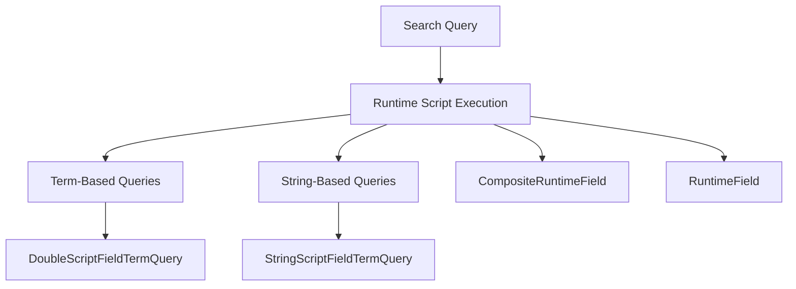

# Basic Concepts of Runtime in Search

Runtime in Elasticsearch refers to the dynamic execution of scripts during search queries. This allows for more flexible and powerful search capabilities by enabling custom logic to be applied at query time.

The <SwmToken path="server/src/main/java/org/elasticsearch/search/runtime/DoubleScriptFieldTermQuery.java" pos="9:2:8" line-data="package org.elasticsearch.search.runtime;">`org.elasticsearch.search.runtime`</SwmToken> package contains various classes that define different types of script field queries. These classes enable the execution of scripts that can manipulate and evaluate fields dynamically during search operations.

## Term-Based Queries

Classes like <SwmToken path="server/src/main/java/org/elasticsearch/search/runtime/DoubleScriptFieldTermQuery.java" pos="16:4:4" line-data="public class DoubleScriptFieldTermQuery extends AbstractDoubleScriptFieldQuery {">`DoubleScriptFieldTermQuery`</SwmToken> allow for term-based queries on script fields, where the terms are evaluated using custom scripts.

<SwmSnippet path="/server/src/main/java/org/elasticsearch/search/runtime/DoubleScriptFieldTermQuery.java" line="1">

---

The <SwmToken path="server/src/main/java/org/elasticsearch/search/runtime/DoubleScriptFieldTermQuery.java" pos="16:4:4" line-data="public class DoubleScriptFieldTermQuery extends AbstractDoubleScriptFieldQuery {">`DoubleScriptFieldTermQuery`</SwmToken> class enables term-based queries on script fields, where the terms are evaluated using custom scripts.

```java
/*
 * Copyright Elasticsearch B.V. and/or licensed to Elasticsearch B.V. under one
 * or more contributor license agreements. Licensed under the Elastic License
 * 2.0 and the Server Side Public License, v 1; you may not use this file except
 * in compliance with, at your election, the Elastic License 2.0 or the Server
 * Side Public License, v 1.
 */

package org.elasticsearch.search.runtime;

import org.elasticsearch.script.DoubleFieldScript;
import org.elasticsearch.script.Script;

import java.util.Objects;

public class DoubleScriptFieldTermQuery extends AbstractDoubleScriptFieldQuery {
    private final double term;

    public DoubleScriptFieldTermQuery(Script script, DoubleFieldScript.LeafFactory leafFactory, String fieldName, double term) {
        super(script, leafFactory, fieldName);
```

---

</SwmSnippet>

## String-Based Queries

Similarly, `StringScriptFieldTermQuery` enables term-based queries on string script fields.

## Flexibility and Control

These runtime script queries are essential for scenarios where the data needs to be processed or transformed on-the-fly, providing a high degree of flexibility and control over search behavior.

## Main Functions

There are several main functions in this folder. Some of them are <SwmToken path="server/src/main/java/org/elasticsearch/index/mapper/CompositeRuntimeField.java" pos="31:4:4" line-data="public class CompositeRuntimeField implements RuntimeField {">`CompositeRuntimeField`</SwmToken> and <SwmToken path="server/src/main/java/org/elasticsearch/index/mapper/CompositeRuntimeField.java" pos="31:8:8" line-data="public class CompositeRuntimeField implements RuntimeField {">`RuntimeField`</SwmToken>. We will dive a little into both.

### <SwmToken path="server/src/main/java/org/elasticsearch/index/mapper/CompositeRuntimeField.java" pos="31:4:4" line-data="public class CompositeRuntimeField implements RuntimeField {">`CompositeRuntimeField`</SwmToken>

The <SwmToken path="server/src/main/java/org/elasticsearch/index/mapper/CompositeRuntimeField.java" pos="31:4:4" line-data="public class CompositeRuntimeField implements RuntimeField {">`CompositeRuntimeField`</SwmToken> class is used to define a runtime field that is composed of multiple other runtime fields. This allows for complex field definitions that can combine the logic of several simpler fields.

<SwmSnippet path="/server/src/main/java/org/elasticsearch/index/mapper/CompositeRuntimeField.java" line="1">

---

The <SwmToken path="server/src/main/java/org/elasticsearch/index/mapper/CompositeRuntimeField.java" pos="31:4:4" line-data="public class CompositeRuntimeField implements RuntimeField {">`CompositeRuntimeField`</SwmToken> class defines a runtime field composed of multiple other runtime fields, allowing for complex field definitions.

```java
/*
 * Copyright Elasticsearch B.V. and/or licensed to Elasticsearch B.V. under one
 * or more contributor license agreements. Licensed under the Elastic License
 * 2.0 and the Server Side Public License, v 1; you may not use this file except
 * in compliance with, at your election, the Elastic License 2.0 or the Server
 * Side Public License, v 1.
 */

package org.elasticsearch.index.mapper;

import org.elasticsearch.script.CompositeFieldScript;
import org.elasticsearch.script.Script;
import org.elasticsearch.search.lookup.SearchLookup;
import org.elasticsearch.xcontent.XContentBuilder;

import java.io.IOException;
import java.util.ArrayList;
import java.util.Collection;
import java.util.Collections;
import java.util.HashMap;
```

---

</SwmSnippet>

### <SwmToken path="server/src/main/java/org/elasticsearch/index/mapper/CompositeRuntimeField.java" pos="31:8:8" line-data="public class CompositeRuntimeField implements RuntimeField {">`RuntimeField`</SwmToken>

The <SwmToken path="server/src/main/java/org/elasticsearch/index/mapper/CompositeRuntimeField.java" pos="31:8:8" line-data="public class CompositeRuntimeField implements RuntimeField {">`RuntimeField`</SwmToken> class represents a single runtime field in Elasticsearch. It provides the basic structure and functionality for defining and manipulating fields that are evaluated at query time using custom scripts.

<SwmSnippet path="/server/src/main/java/org/elasticsearch/index/mapper/RuntimeField.java" line="1">

---

The <SwmToken path="server/src/main/java/org/elasticsearch/index/mapper/CompositeRuntimeField.java" pos="31:8:8" line-data="public class CompositeRuntimeField implements RuntimeField {">`RuntimeField`</SwmToken> class provides the basic structure and functionality for defining and manipulating fields evaluated at query time using custom scripts.

```java
/*
 * Copyright Elasticsearch B.V. and/or licensed to Elasticsearch B.V. under one
 * or more contributor license agreements. Licensed under the Elastic License
 * 2.0 and the Server Side Public License, v 1; you may not use this file except
 * in compliance with, at your election, the Elastic License 2.0 or the Server
 * Side Public License, v 1.
 */

package org.elasticsearch.index.mapper;

import org.elasticsearch.index.mapper.FieldMapper.Parameter;
import org.elasticsearch.script.CompositeFieldScript;
import org.elasticsearch.script.Script;
import org.elasticsearch.script.ScriptType;
import org.elasticsearch.search.lookup.SearchLookup;
import org.elasticsearch.xcontent.ToXContentFragment;

import java.util.Collection;
import java.util.Collections;
import java.util.HashMap;
```

---

</SwmSnippet>

&nbsp;

*This is an auto-generated document by Swimm AI 🌊 and has not yet been verified by a human*

<SwmMeta version="3.0.0" repo-id="Z2l0aHViJTNBJTNBZWxhc3RpY3NlYXJjaCUzQSUzQVN3aW1tLURlbW8=" repo-name="elasticsearch" doc-type="overview"><sup>Powered by [Swimm](/)</sup></SwmMeta>
