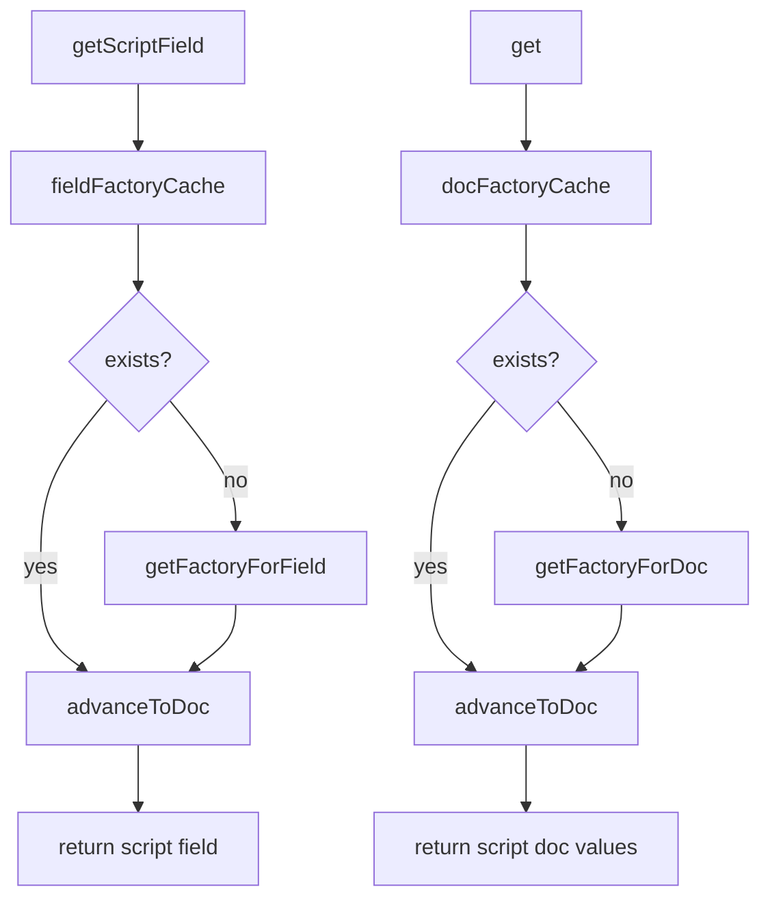

# Basic Concepts of Search Lookup

Lookup refers to the process of retrieving specific data or values from a dataset or index. It is a fundamental operation in search functionalities.

In Elasticsearch, Lookup is used to fetch <SwmToken path="server/src/main/java/org/elasticsearch/search/lookup/SearchLookup.java" pos="25:15:17" line-data=" * Provides a way to look up per-document values from docvalues, stored fields or _source">`per-document`</SwmToken> values from various sources such as docvalues, stored fields, or the \_source field.

# <SwmToken path="server/src/main/java/org/elasticsearch/search/lookup/SearchLookup.java" pos="27:4:4" line-data="public class SearchLookup implements SourceProvider {">`SearchLookup`</SwmToken> Class

The <SwmToken path="server/src/main/java/org/elasticsearch/search/lookup/SearchLookup.java" pos="27:4:4" line-data="public class SearchLookup implements SourceProvider {">`SearchLookup`</SwmToken> class provides the mechanism to perform these lookups. It defines how to look up field types, field data, and the source. It also ensures that field dependencies are tracked and managed to prevent cyclic dependencies and excessive depth in field chains.

<SwmSnippet path="/server/src/main/java/org/elasticsearch/search/lookup/SearchLookup.java" line="24">

---

The <SwmToken path="server/src/main/java/org/elasticsearch/search/lookup/SearchLookup.java" pos="27:4:4" line-data="public class SearchLookup implements SourceProvider {">`SearchLookup`</SwmToken> class provides a way to look up <SwmToken path="server/src/main/java/org/elasticsearch/search/lookup/SearchLookup.java" pos="25:15:17" line-data=" * Provides a way to look up per-document values from docvalues, stored fields or _source">`per-document`</SwmToken> values from docvalues, stored fields, or \_source.

```java
/**
 * Provides a way to look up per-document values from docvalues, stored fields or _source
 */
public class SearchLookup implements SourceProvider {
```

---

</SwmSnippet>

<SwmSnippet path="/server/src/main/java/org/elasticsearch/search/lookup/SearchLookup.java" line="55">

---

The constructor of <SwmToken path="server/src/main/java/org/elasticsearch/search/lookup/SearchLookup.java" pos="56:9:9" line-data="     * Create a new SearchLookup, using the default stored fields provider">`SearchLookup`</SwmToken> initializes the lookup mechanisms for field types, field data, and the source.

```java
    /**
     * Create a new SearchLookup, using the default stored fields provider
     * @param fieldTypeLookup   defines how to look up field types
     * @param fieldDataLookup   defines how to look up field data
     * @param sourceProvider    defines how to look up the source
     */
    public SearchLookup(
        Function<String, MappedFieldType> fieldTypeLookup,
        TriFunction<MappedFieldType, Supplier<SearchLookup>, MappedFieldType.FielddataOperation, IndexFieldData<?>> fieldDataLookup,
        SourceProvider sourceProvider
    ) {
        this(fieldTypeLookup, fieldDataLookup, sourceProvider, LeafFieldLookupProvider.fromStoredFields());
    }
```

---

</SwmSnippet>

<SwmSnippet path="/server/src/main/java/org/elasticsearch/search/lookup/SearchLookup.java" line="89">

---

The <SwmToken path="server/src/main/java/org/elasticsearch/search/lookup/SearchLookup.java" pos="90:13:13" line-data="     * Create a new {@link SearchLookup} that looks fields up the same as the one provided as argument,">`SearchLookup`</SwmToken> class also tracks field references to detect cycles and prevent resolving fields that depend on more than a specified depth.

```java
    /**
     * Create a new {@link SearchLookup} that looks fields up the same as the one provided as argument,
     * while also tracking field references starting from the provided field name. It detects cycles
     * and prevents resolving fields that depend on more than {@link #MAX_FIELD_CHAIN_DEPTH} fields.
     * @param searchLookup the existing lookup to create a new one from
     * @param fieldChain the chain of fields that required the field currently being loaded
     */
    private SearchLookup(SearchLookup searchLookup, Set<String> fieldChain) {
        this.fieldChain = Collections.unmodifiableSet(fieldChain);
        this.sourceProvider = searchLookup.sourceProvider;
        this.fieldTypeLookup = searchLookup.fieldTypeLookup;
        this.fieldDataLookup = searchLookup.fieldDataLookup;
        this.fieldLookupProvider = searchLookup.fieldLookupProvider;
    }
```

---

</SwmSnippet>

<SwmSnippet path="/server/src/main/java/org/elasticsearch/search/lookup/SearchLookup.java" line="125">

---

The <SwmToken path="server/src/main/java/org/elasticsearch/search/lookup/SearchLookup.java" pos="125:5:5" line-data="    public LeafSearchLookup getLeafSearchLookup(LeafReaderContext context) {">`getLeafSearchLookup`</SwmToken> method creates a <SwmToken path="server/src/main/java/org/elasticsearch/search/lookup/SearchLookup.java" pos="125:3:3" line-data="    public LeafSearchLookup getLeafSearchLookup(LeafReaderContext context) {">`LeafSearchLookup`</SwmToken> instance for a specific segment of the index.

```java
    public LeafSearchLookup getLeafSearchLookup(LeafReaderContext context) {
        return new LeafSearchLookup(
            context,
            new LeafDocLookup(fieldTypeLookup, this::getForField, context),
            sourceProvider,
            new LeafStoredFieldsLookup(fieldTypeLookup, fieldLookupProvider.apply(context))
        );
    }
```

---

</SwmSnippet>

<SwmSnippet path="/server/src/main/java/org/elasticsearch/search/lookup/SearchLookup.java" line="142">

---

The <SwmToken path="server/src/main/java/org/elasticsearch/search/lookup/SearchLookup.java" pos="143:5:5" line-data="    public Source getSource(LeafReaderContext ctx, int doc) throws IOException {">`getSource`</SwmToken> method retrieves the source for a specific document within a segment.

```java
    @Override
    public Source getSource(LeafReaderContext ctx, int doc) throws IOException {
        return sourceProvider.getSource(ctx, doc);
    }
```

---

</SwmSnippet>

# <SwmToken path="server/src/main/java/org/elasticsearch/search/lookup/SearchLookup.java" pos="125:3:3" line-data="    public LeafSearchLookup getLeafSearchLookup(LeafReaderContext context) {">`LeafSearchLookup`</SwmToken> Class

The <SwmToken path="server/src/main/java/org/elasticsearch/search/lookup/SearchLookup.java" pos="125:3:3" line-data="    public LeafSearchLookup getLeafSearchLookup(LeafReaderContext context) {">`LeafSearchLookup`</SwmToken> class is a <SwmToken path="server/src/main/java/org/elasticsearch/search/lookup/LeafDocLookup.java" pos="75:1:3" line-data="                     per-segment computation as opposed to per-document computation">`per-segment`</SwmToken> version of <SwmToken path="server/src/main/java/org/elasticsearch/search/lookup/SearchLookup.java" pos="27:4:4" line-data="public class SearchLookup implements SourceProvider {">`SearchLookup`</SwmToken>, which handles lookups within a specific segment of the index.

The <SwmToken path="server/src/main/java/org/elasticsearch/search/lookup/SearchLookup.java" pos="27:4:4" line-data="public class SearchLookup implements SourceProvider {">`SearchLookup`</SwmToken> and <SwmToken path="server/src/main/java/org/elasticsearch/search/lookup/SearchLookup.java" pos="125:3:3" line-data="    public LeafSearchLookup getLeafSearchLookup(LeafReaderContext context) {">`LeafSearchLookup`</SwmToken> classes are used extensively in scripts and queries to fetch and manipulate document data during search operations.

## <SwmToken path="server/src/main/java/org/elasticsearch/search/lookup/SearchLookup.java" pos="27:4:4" line-data="public class SearchLookup implements SourceProvider {">`SearchLookup`</SwmToken>

The <SwmToken path="server/src/main/java/org/elasticsearch/search/lookup/SearchLookup.java" pos="27:4:4" line-data="public class SearchLookup implements SourceProvider {">`SearchLookup`</SwmToken> function is used to create a new <SwmToken path="server/src/main/java/org/elasticsearch/search/lookup/SearchLookup.java" pos="27:4:4" line-data="public class SearchLookup implements SourceProvider {">`SearchLookup`</SwmToken> instance, defining how to look up field types, field data, and the source.

<SwmSnippet path="/server/src/main/java/org/elasticsearch/search/lookup/SearchLookup.java" line="55">

---

The <SwmToken path="server/src/main/java/org/elasticsearch/search/lookup/SearchLookup.java" pos="56:9:9" line-data="     * Create a new SearchLookup, using the default stored fields provider">`SearchLookup`</SwmToken> function initializes the lookup mechanisms for field types, field data, and the source.

```java
    /**
     * Create a new SearchLookup, using the default stored fields provider
     * @param fieldTypeLookup   defines how to look up field types
     * @param fieldDataLookup   defines how to look up field data
     * @param sourceProvider    defines how to look up the source
     */
    public SearchLookup(
        Function<String, MappedFieldType> fieldTypeLookup,
        TriFunction<MappedFieldType, Supplier<SearchLookup>, MappedFieldType.FielddataOperation, IndexFieldData<?>> fieldDataLookup,
        SourceProvider sourceProvider
    ) {
        this(fieldTypeLookup, fieldDataLookup, sourceProvider, LeafFieldLookupProvider.fromStoredFields());
    }
```

---

</SwmSnippet>

## <SwmToken path="server/src/main/java/org/elasticsearch/search/lookup/SearchLookup.java" pos="112:7:7" line-data="    public final SearchLookup forkAndTrackFieldReferences(String field) {">`forkAndTrackFieldReferences`</SwmToken>

The <SwmToken path="server/src/main/java/org/elasticsearch/search/lookup/SearchLookup.java" pos="112:7:7" line-data="    public final SearchLookup forkAndTrackFieldReferences(String field) {">`forkAndTrackFieldReferences`</SwmToken> function creates a copy of the current <SwmToken path="server/src/main/java/org/elasticsearch/search/lookup/SearchLookup.java" pos="27:4:4" line-data="public class SearchLookup implements SourceProvider {">`SearchLookup`</SwmToken> that tracks field references to detect cycles and prevent resolving fields that depend on too many other fields.

<SwmSnippet path="/server/src/main/java/org/elasticsearch/search/lookup/SearchLookup.java" line="104">

---

The <SwmToken path="server/src/main/java/org/elasticsearch/search/lookup/SearchLookup.java" pos="112:7:7" line-data="    public final SearchLookup forkAndTrackFieldReferences(String field) {">`forkAndTrackFieldReferences`</SwmToken> function ensures that cyclic dependencies are detected and prevents resolving fields that depend on more than a specified depth.

```java
    /**
     * Creates a copy of the current {@link SearchLookup} that looks fields up in the same way, but also tracks field references
     * in order to detect cycles and prevent resolving fields that depend on more than {@link #MAX_FIELD_CHAIN_DEPTH} other fields.
     * @param field the field being referred to, for which fielddata needs to be loaded
     * @return the new lookup
     * @throws IllegalArgumentException if a cycle is detected in the fields required to build doc values, or if the field
     * being resolved depends on more than {@link #MAX_FIELD_CHAIN_DEPTH}
     */
    public final SearchLookup forkAndTrackFieldReferences(String field) {
        Objects.requireNonNull(field, "field cannot be null");
        Set<String> newFieldChain = new LinkedHashSet<>(fieldChain);
        if (newFieldChain.add(field) == false) {
            String message = String.join(" -> ", newFieldChain) + " -> " + field;
            throw new IllegalArgumentException("Cyclic dependency detected while resolving runtime fields: " + message);
        }
        if (newFieldChain.size() > MAX_FIELD_CHAIN_DEPTH) {
            throw new IllegalArgumentException("Field requires resolving too many dependent fields: " + String.join(" -> ", newFieldChain));
        }
        return new SearchLookup(this, newFieldChain);
    }
```

---

</SwmSnippet>

## <SwmToken path="server/src/main/java/org/elasticsearch/search/lookup/LeafDocLookup.java" pos="129:6:6" line-data="    public Field&lt;?&gt; getScriptField(String fieldName) {">`getScriptField`</SwmToken>

The <SwmToken path="server/src/main/java/org/elasticsearch/search/lookup/LeafDocLookup.java" pos="129:6:6" line-data="    public Field&lt;?&gt; getScriptField(String fieldName) {">`getScriptField`</SwmToken> method retrieves a script field for a given field name. It first checks the <SwmToken path="server/src/main/java/org/elasticsearch/search/lookup/LeafDocLookup.java" pos="130:7:7" line-data="        FieldFactoryWrapper factoryWrapper = fieldFactoryCache.get(fieldName);">`fieldFactoryCache`</SwmToken> for an existing factory wrapper. If not found, it calls <SwmToken path="server/src/main/java/org/elasticsearch/search/lookup/LeafDocLookup.java" pos="133:5:5" line-data="            factoryWrapper = getFactoryForField(fieldName);">`getFactoryForField`</SwmToken> to create one, advances the factory to the current document ID, and returns the script field.

<SwmSnippet path="/server/src/main/java/org/elasticsearch/search/lookup/LeafDocLookup.java" line="129">

---

The <SwmToken path="server/src/main/java/org/elasticsearch/search/lookup/LeafDocLookup.java" pos="129:6:6" line-data="    public Field&lt;?&gt; getScriptField(String fieldName) {">`getScriptField`</SwmToken> method retrieves a script field for a given field name, ensuring that the factory is advanced to the current document ID.

```java
    public Field<?> getScriptField(String fieldName) {
        FieldFactoryWrapper factoryWrapper = fieldFactoryCache.get(fieldName);

        if (factoryWrapper == null) {
            factoryWrapper = getFactoryForField(fieldName);
        }
        factoryWrapper.advanceToDoc();

        return factoryWrapper.factory.toScriptField();
    }
```

---

</SwmSnippet>

## get

The <SwmToken path="server/src/main/java/org/elasticsearch/search/lookup/LeafDocLookup.java" pos="130:9:9" line-data="        FieldFactoryWrapper factoryWrapper = fieldFactoryCache.get(fieldName);">`get`</SwmToken> method retrieves <SwmToken path="server/src/main/java/org/elasticsearch/search/lookup/LeafDocLookup.java" pos="180:3:3" line-data="    public ScriptDocValues&lt;?&gt; get(Object key) {">`ScriptDocValues`</SwmToken> for a given field name. It first checks the <SwmToken path="server/src/main/java/org/elasticsearch/search/lookup/LeafDocLookup.java" pos="182:7:7" line-data="        FieldFactoryWrapper factoryWrapper = docFactoryCache.get(fieldName);">`docFactoryCache`</SwmToken> for an existing factory wrapper. If not found, it calls <SwmToken path="server/src/main/java/org/elasticsearch/search/lookup/LeafDocLookup.java" pos="185:5:5" line-data="            factoryWrapper = getFactoryForDoc(key.toString());">`getFactoryForDoc`</SwmToken> to create one, advances the factory to the current document ID, and returns the script doc values.

<SwmSnippet path="/server/src/main/java/org/elasticsearch/search/lookup/LeafDocLookup.java" line="179">

---

The <SwmToken path="server/src/main/java/org/elasticsearch/search/lookup/LeafDocLookup.java" pos="180:6:6" line-data="    public ScriptDocValues&lt;?&gt; get(Object key) {">`get`</SwmToken> method retrieves <SwmToken path="server/src/main/java/org/elasticsearch/search/lookup/LeafDocLookup.java" pos="180:3:3" line-data="    public ScriptDocValues&lt;?&gt; get(Object key) {">`ScriptDocValues`</SwmToken> for a given field name, ensuring that the factory is advanced to the current document ID.

```java
    @Override
    public ScriptDocValues<?> get(Object key) {
        String fieldName = key.toString();
        FieldFactoryWrapper factoryWrapper = docFactoryCache.get(fieldName);

        if (factoryWrapper == null) {
            factoryWrapper = getFactoryForDoc(key.toString());
        }
        factoryWrapper.advanceToDoc();

        return factoryWrapper.factory.toScriptDocValues();
    }
```

---

</SwmSnippet>

&nbsp;

*This is an auto-generated document by Swimm AI 🌊 and has not yet been verified by a human*

<SwmMeta version="3.0.0" repo-id="Z2l0aHViJTNBJTNBZWxhc3RpY3NlYXJjaCUzQSUzQVN3aW1tLURlbW8=" repo-name="elasticsearch" doc-type="overview"><sup>Powered by [Swimm](/)</sup></SwmMeta>
