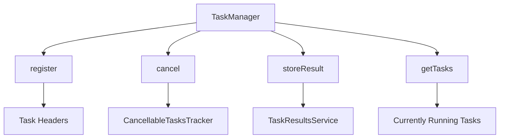

# Basic Concepts of Task Management

Tasks are units of work that are tracked and managed within the Elasticsearch server core. The <SwmToken path="server/src/main/java/org/elasticsearch/tasks/TaskManager.java" pos="268:19:19" line-data="     * If the task is completed or unregistered from TaskManager, then the listener is called immediately.">`TaskManager`</SwmToken> class is responsible for keeping track of currently running tasks on the nodes. Tasks can be registered, executed, and canceled using the <SwmToken path="server/src/main/java/org/elasticsearch/tasks/TaskManager.java" pos="268:19:19" line-data="     * If the task is completed or unregistered from TaskManager, then the listener is called immediately.">`TaskManager`</SwmToken>. Additionally, the <SwmToken path="server/src/main/java/org/elasticsearch/tasks/TaskManager.java" pos="268:19:19" line-data="     * If the task is completed or unregistered from TaskManager, then the listener is called immediately.">`TaskManager`</SwmToken> handles task headers, which are copied from the request context.

Tasks can be cancellable, and the <SwmToken path="server/src/main/java/org/elasticsearch/tasks/TaskManager.java" pos="74:5:5" line-data="    private final CancellableTasksTracker&lt;CancellableTaskHolder&gt; cancellableTasks = new CancellableTasksTracker&lt;&gt;();">`CancellableTasksTracker`</SwmToken> is used to manage these tasks. The <SwmToken path="server/src/main/java/org/elasticsearch/tasks/TaskManager.java" pos="432:1:1" line-data="        taskResultsService.storeResult(taskResult, new ActionListener&lt;Void&gt;() {">`taskResultsService`</SwmToken> is used to store the results of completed tasks. Tasks are tracked across threads and nodes and can be killed or canceled if necessary.

<SwmSnippet path="/server/src/main/java/org/elasticsearch/tasks/TaskManager.java" line="61">

---

# <SwmToken path="server/src/main/java/org/elasticsearch/tasks/TaskManager.java" pos="268:19:19" line-data="     * If the task is completed or unregistered from TaskManager, then the listener is called immediately.">`TaskManager`</SwmToken>

The <SwmToken path="server/src/main/java/org/elasticsearch/tasks/TaskManager.java" pos="268:19:19" line-data="     * If the task is completed or unregistered from TaskManager, then the listener is called immediately.">`TaskManager`</SwmToken> class is responsible for keeping track of currently running tasks on the nodes.

```java
/**
 * Task Manager service for keeping track of currently running tasks on the nodes
 */
```

---

</SwmSnippet>

Tasks can be registered using the <SwmToken path="server/src/main/java/org/elasticsearch/tasks/TaskManager.java" pos="116:5:5" line-data="    public Task register(String type, String action, TaskAwareRequest request) {">`register`</SwmToken> method in the <SwmToken path="server/src/main/java/org/elasticsearch/tasks/TaskManager.java" pos="268:19:19" line-data="     * If the task is completed or unregistered from TaskManager, then the listener is called immediately.">`TaskManager`</SwmToken> class.

<SwmSnippet path="/server/src/main/java/org/elasticsearch/tasks/TaskManager.java" line="125">

---

The <SwmToken path="server/src/main/java/org/elasticsearch/tasks/TaskManager.java" pos="125:5:5" line-data="    public Task register(String type, String action, TaskAwareRequest request, boolean traceRequest) {">`register`</SwmToken> method handles task headers, which are copied from the request context.

```java
    public Task register(String type, String action, TaskAwareRequest request, boolean traceRequest) {
        Map<String, String> headers = new HashMap<>();
```

---

</SwmSnippet>

<SwmSnippet path="/server/src/main/java/org/elasticsearch/tasks/TaskManager.java" line="150">

---

Tasks can be cancellable, and the <SwmToken path="server/src/main/java/org/elasticsearch/tasks/TaskManager.java" pos="74:5:5" line-data="    private final CancellableTasksTracker&lt;CancellableTaskHolder&gt; cancellableTasks = new CancellableTasksTracker&lt;&gt;();">`CancellableTasksTracker`</SwmToken> is used to manage these tasks.

```java
        if (task instanceof CancellableTask) {
            registerCancellableTask(task, request.getRequestId(), traceRequest);
        } else {
```

---

</SwmSnippet>

<SwmSnippet path="/server/src/main/java/org/elasticsearch/tasks/TaskResultsService.java" line="43">

---

The <SwmToken path="server/src/main/java/org/elasticsearch/tasks/TaskManager.java" pos="432:1:1" line-data="        taskResultsService.storeResult(taskResult, new ActionListener&lt;Void&gt;() {">`taskResultsService`</SwmToken> is used to store the results of completed tasks.

```java
/**
 * Service that can store task results.
 */
```

---

</SwmSnippet>

# Main Functions

There are several main functions in the <SwmToken path="server/src/main/java/org/elasticsearch/tasks/TaskManager.java" pos="268:19:19" line-data="     * If the task is completed or unregistered from TaskManager, then the listener is called immediately.">`TaskManager`</SwmToken> class. Some of them are <SwmToken path="server/src/main/java/org/elasticsearch/tasks/TaskManager.java" pos="116:5:5" line-data="    public Task register(String type, String action, TaskAwareRequest request) {">`register`</SwmToken>, <SwmToken path="server/src/main/java/org/elasticsearch/tasks/TaskManager.java" pos="266:28:28" line-data="     * After starting cancellation on the parent task, the task manager tries to cancel all children tasks">`cancel`</SwmToken>, <SwmToken path="server/src/main/java/org/elasticsearch/tasks/TaskManager.java" pos="415:13:13" line-data="    public &lt;Response extends ActionResponse&gt; void storeResult(Task task, Response response, ActionListener&lt;Response&gt; listener) {">`storeResult`</SwmToken>, and <SwmToken path="server/src/main/java/org/elasticsearch/tasks/TaskManager.java" pos="449:11:11" line-data="    public Map&lt;Long, Task&gt; getTasks() {">`getTasks`</SwmToken>. We will dive a little into <SwmToken path="server/src/main/java/org/elasticsearch/tasks/TaskManager.java" pos="116:5:5" line-data="    public Task register(String type, String action, TaskAwareRequest request) {">`register`</SwmToken> and <SwmToken path="server/src/main/java/org/elasticsearch/tasks/TaskManager.java" pos="266:28:28" line-data="     * After starting cancellation on the parent task, the task manager tries to cancel all children tasks">`cancel`</SwmToken>.

## register

The <SwmToken path="server/src/main/java/org/elasticsearch/tasks/TaskManager.java" pos="116:5:5" line-data="    public Task register(String type, String action, TaskAwareRequest request) {">`register`</SwmToken> function is used to register a new task without a parent task. It initializes the task with the provided type, action, and request.

<SwmSnippet path="/server/src/main/java/org/elasticsearch/tasks/TaskManager.java" line="113">

---

The <SwmToken path="server/src/main/java/org/elasticsearch/tasks/TaskManager.java" pos="116:5:5" line-data="    public Task register(String type, String action, TaskAwareRequest request) {">`register`</SwmToken> function initializes the task with the provided type, action, and request.

```java
    /**
     * Registers a task without parent task
     */
    public Task register(String type, String action, TaskAwareRequest request) {
        return register(type, action, request, true);
    }
```

---

</SwmSnippet>

## cancel

The <SwmToken path="server/src/main/java/org/elasticsearch/tasks/TaskManager.java" pos="266:28:28" line-data="     * After starting cancellation on the parent task, the task manager tries to cancel all children tasks">`cancel`</SwmToken> function is used to cancel a task. It attempts to cancel all children tasks of the current task and triggers a listener once the cancellation is complete.

<SwmSnippet path="/server/src/main/java/org/elasticsearch/tasks/TaskManager.java" line="263">

---

The <SwmToken path="server/src/main/java/org/elasticsearch/tasks/TaskManager.java" pos="266:28:28" line-data="     * After starting cancellation on the parent task, the task manager tries to cancel all children tasks">`cancel`</SwmToken> function attempts to cancel all children tasks of the current task and triggers a listener once the cancellation is complete.

```java
    /**
     * Cancels a task
     * <p>
     * After starting cancellation on the parent task, the task manager tries to cancel all children tasks
     * of the current task. Once cancellation of the children tasks is done, the listener is triggered.
     * If the task is completed or unregistered from TaskManager, then the listener is called immediately.
     */
    public void cancel(CancellableTask task, String reason, Runnable listener) {
        CancellableTaskHolder holder = cancellableTasks.get(task.getId());
        if (holder != null) {
            logger.trace("cancelling task with id {}", task.getId());
            holder.cancel(reason, listener);
        } else {
            listener.run();
        }
    }
```

---

</SwmSnippet>

<SwmSnippet path="/server/src/main/java/org/elasticsearch/tasks/TaskManager.java" line="412">

---

The <SwmToken path="server/src/main/java/org/elasticsearch/tasks/TaskManager.java" pos="415:13:13" line-data="    public &lt;Response extends ActionResponse&gt; void storeResult(Task task, Response response, ActionListener&lt;Response&gt; listener) {">`storeResult`</SwmToken> function handles the response and stores the task result using the <SwmToken path="server/src/main/java/org/elasticsearch/tasks/TaskManager.java" pos="432:1:1" line-data="        taskResultsService.storeResult(taskResult, new ActionListener&lt;Void&gt;() {">`taskResultsService`</SwmToken>.

```java
    /**
     * Stores the task result
     */
    public <Response extends ActionResponse> void storeResult(Task task, Response response, ActionListener<Response> listener) {
        DiscoveryNode localNode = lastDiscoveryNodes.getLocalNode();
        if (localNode == null) {
            // too early to store anything, shouldn't really be here - just pass the response along
            logger.warn("couldn't store response {}, the node didn't join the cluster yet", response);
            listener.onResponse(response);
            return;
        }
        final TaskResult taskResult;
        try {
            taskResult = task.result(localNode, response);
        } catch (IOException ex) {
            logger.warn(() -> format("couldn't store response %s", response), ex);
            listener.onFailure(ex);
            return;
        }

        taskResultsService.storeResult(taskResult, new ActionListener<Void>() {
```

---

</SwmSnippet>

## <SwmToken path="server/src/main/java/org/elasticsearch/tasks/TaskManager.java" pos="449:11:11" line-data="    public Map&lt;Long, Task&gt; getTasks() {">`getTasks`</SwmToken>

The <SwmToken path="server/src/main/java/org/elasticsearch/tasks/TaskManager.java" pos="449:11:11" line-data="    public Map&lt;Long, Task&gt; getTasks() {">`getTasks`</SwmToken> function returns a list of currently running tasks on the node. It combines tasks from both the <SwmToken path="server/src/main/java/org/elasticsearch/tasks/TaskManager.java" pos="62:21:21" line-data=" * Task Manager service for keeping track of currently running tasks on the nodes">`tasks`</SwmToken> and <SwmToken path="server/src/main/java/org/elasticsearch/tasks/TaskManager.java" pos="271:7:7" line-data="        CancellableTaskHolder holder = cancellableTasks.get(task.getId());">`cancellableTasks`</SwmToken> collections.

<SwmSnippet path="/server/src/main/java/org/elasticsearch/tasks/TaskManager.java" line="446">

---

The <SwmToken path="server/src/main/java/org/elasticsearch/tasks/TaskManager.java" pos="449:11:11" line-data="    public Map&lt;Long, Task&gt; getTasks() {">`getTasks`</SwmToken> function returns a list of currently running tasks on the node.

```java
    /**
     * Returns the list of currently running tasks on the node
     */
    public Map<Long, Task> getTasks() {
        HashMap<Long, Task> taskHashMap = new HashMap<>(this.tasks);
        for (CancellableTaskHolder holder : cancellableTasks.values()) {
            taskHashMap.put(holder.getTask().getId(), holder.getTask());
        }
        return Collections.unmodifiableMap(taskHashMap);
    }
```

---

</SwmSnippet>

# Task APIs

Task APIs provide methods to interact with tasks, such as retrieving task information and status.

## <SwmToken path="server/src/main/java/org/elasticsearch/tasks/TaskResultsService.java" pos="40:10:10" line-data="import static org.elasticsearch.tasks.TaskInfo.INCLUDE_CANCELLED_PARAM;">`TaskInfo`</SwmToken>

The <SwmToken path="server/src/main/java/org/elasticsearch/tasks/TaskResultsService.java" pos="40:10:10" line-data="import static org.elasticsearch.tasks.TaskInfo.INCLUDE_CANCELLED_PARAM;">`TaskInfo`</SwmToken> method builds a version of the task status that can be sent over the wire and back to the user. It includes parameters for the local node ID and whether detailed information should be included.

<SwmSnippet path="/server/src/main/java/org/elasticsearch/tasks/Task.java" line="115">

---

The <SwmToken path="server/src/main/java/org/elasticsearch/tasks/TaskResultsService.java" pos="40:10:10" line-data="import static org.elasticsearch.tasks.TaskInfo.INCLUDE_CANCELLED_PARAM;">`TaskInfo`</SwmToken> method builds a version of the task status that can be sent over the wire and back to the user.

```java
    /**
     * Build a version of the task status you can throw over the wire and back
     * to the user.
     *
     * @param localNodeId
     *            the id of the node this task is running on
     * @param detailed
     *            should the information include detailed, potentially slow to
     *            generate data?
     */
```

---

</SwmSnippet>

## <SwmToken path="server/src/main/java/org/elasticsearch/tasks/Task.java" pos="210:5:5" line-data="    public Status getStatus() {">`getStatus`</SwmToken>

The <SwmToken path="server/src/main/java/org/elasticsearch/tasks/Task.java" pos="210:5:5" line-data="    public Status getStatus() {">`getStatus`</SwmToken> method builds a status for the task or returns null if the task doesn't have a status. This method is designed to avoid performing IO operations but might still be costly.

<SwmSnippet path="/server/src/main/java/org/elasticsearch/tasks/Task.java" line="205">

---

The <SwmToken path="server/src/main/java/org/elasticsearch/tasks/Task.java" pos="210:5:5" line-data="    public Status getStatus() {">`getStatus`</SwmToken> method builds a status for the task or returns null if the task doesn't have a status.

```java
     * Build a status for this task or null if this task doesn't have status.
     * Since most tasks don't have status this defaults to returning null. While
     * this can never perform IO it might be a costly operation, requiring
     * collating lists of results, etc. So only use it if you need the value.
     */
    public Status getStatus() {
        return null;
    }
```

---

</SwmSnippet>

&nbsp;

*This is an auto-generated document by Swimm AI 🌊 and has not yet been verified by a human*

<SwmMeta version="3.0.0" repo-id="Z2l0aHViJTNBJTNBZWxhc3RpY3NlYXJjaCUzQSUzQVN3aW1tLURlbW8=" repo-name="elasticsearch" doc-type="overview"><sup>Powered by [Swimm](/)</sup></SwmMeta>
