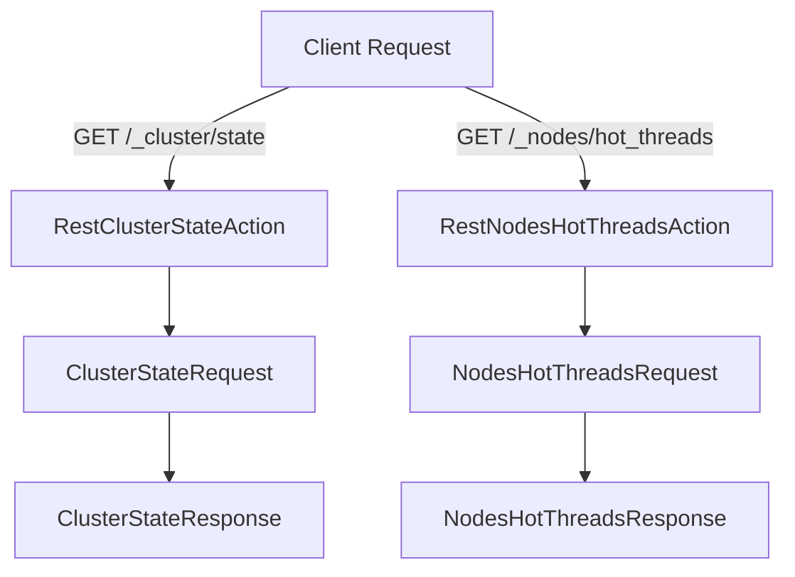

## Overview

A cluster is a collection of one or more nodes (servers) that together hold data and provide indexing and search capabilities. Each node in the cluster serves a specific purpose, such as holding data or coordinating operations. The cluster state is a critical component that keeps track of the metadata and configuration of the cluster, including information about nodes, indices, and shards.

## Cluster Coordination

Cluster coordination involves managing the state and membership of the cluster, ensuring that nodes can join and leave the cluster smoothly. The master node is responsible for managing the cluster state and ensuring that changes are propagated to all nodes in the cluster. Cluster state publication ensures that the cluster state is consistently applied across all nodes, even in the event of node failures or network partitions.

<SwmSnippet path="/server/src/main/java/org/elasticsearch/rest/action/admin/cluster/RestClusterStateAction.java" line="134">

---

## Cluster State Management

The `Fields` class defines constants like `CLUSTER_NAME` used to manage and retrieve cluster state information.

```java
    static final class Fields {
        static final String WAIT_FOR_TIMED_OUT = "wait_for_timed_out";
        static final String CLUSTER_NAME = "cluster_name";
    }
```

---

</SwmSnippet>

<SwmSnippet path="/server/src/main/java/org/elasticsearch/rest/action/admin/cluster/RestClusterAllocationExplainAction.java" line="28">

---

## Cluster Allocation Explanation

The `RestClusterAllocationExplainAction` class handles requests to explain cluster allocation, providing insights into how shards are allocated across the cluster.

```java
/**
 * Class handling cluster allocation explanation at the REST level
 */
@ServerlessScope(Scope.INTERNAL)
public class RestClusterAllocationExplainAction extends BaseRestHandler {

    @Override
    public List<Route> routes() {
        return List.of(new Route(GET, "/_cluster/allocation/explain"), new Route(POST, "/_cluster/allocation/explain"));
    }

    @Override
    public String getName() {
        return "cluster_allocation_explain_action";
    }

    @Override
    public boolean allowSystemIndexAccessByDefault() {
        return true;
    }
```

---

</SwmSnippet>

<SwmSnippet path="/server/src/main/java/org/elasticsearch/action/ActionModule.java" line="843">

---

## Registering Cluster Actions

Cluster-related actions like `RestClusterAllocationExplainAction` are registered in the `ActionModule` to handle specific REST requests related to cluster management.

```java
        registerHandler.accept(new RestNodesHotThreadsAction());
        registerHandler.accept(new RestClusterAllocationExplainAction());
        registerHandler.accept(new RestGetDesiredBalanceAction());
```

---

</SwmSnippet>

## Main Functions

There are several main functions in this folder. Some of them are Cluster State, Cluster Allocation, and Cluster Health. We will dive a little into Cluster State and Cluster Allocation.

<SwmSnippet path="/server/src/main/java/org/elasticsearch/action/admin/cluster/state/ClusterStateResponse.java" line="1">

---

### Cluster State

The `ClusterStateResponse` class is responsible for handling the state of the cluster. It keeps track of the metadata and configuration of the cluster, including information about nodes, indices, and shards.

```java
/*
 * Copyright Elasticsearch B.V. and/or licensed to Elasticsearch B.V. under one
 * or more contributor license agreements. Licensed under the Elastic License
 * 2.0 and the Server Side Public License, v 1; you may not use this file except
 * in compliance with, at your election, the Elastic License 2.0 or the Server
 * Side Public License, v 1.
 */

package org.elasticsearch.action.admin.cluster.state;
```

---

</SwmSnippet>

<SwmSnippet path="/server/src/main/java/org/elasticsearch/rest/action/admin/cluster/RestClusterHealthAction.java" line="27">

---

### Cluster Health

The `RestClusterHealthAction` class is responsible for providing the health status of the cluster. It gives information about the overall health, including the status of nodes and shards, and helps in monitoring the cluster's performance.

```java
import java.io.IOException;
import java.util.Collections;
import java.util.List;
import java.util.Locale;
import java.util.Set;
```

---

</SwmSnippet>

## Cluster Endpoints

Cluster Endpoints provide various functionalities to interact with the cluster. Below are some key endpoints.

<SwmSnippet path="/server/src/main/java/org/elasticsearch/rest/action/admin/cluster/RestClusterStateAction.java" line="67">

---

### /\_cluster/state

The `/cluster/state` endpoint retrieves the state of the cluster. It can be used to get detailed information about the cluster's metadata, nodes, and indices. This endpoint supports additional parameters to filter the response based on specific metrics or indices.

```java
    public List<Route> routes() {
        return List.of(
            new Route(GET, "/_cluster/state"),
            new Route(GET, "/_cluster/state/{metric}"),
            new Route(GET, "/_cluster/state/{metric}/{indices}")
        );
```

---

</SwmSnippet>

<SwmSnippet path="/server/src/main/java/org/elasticsearch/rest/action/admin/cluster/RestNodesHotThreadsAction.java" line="76">

---

### /\_nodes/hot_threads

The `/nodes/hot_threads` endpoint provides information about the hot threads on each node in the cluster. This can be useful for diagnosing performance issues by identifying threads that are consuming significant CPU resources.

```java
            new Route(GET, "/_nodes/hot_threads"),
            new Route(GET, "/_nodes/{nodeId}/hot_threads"),
```

---

</SwmSnippet>

&nbsp;

*This is an auto-generated document by Swimm AI 🌊 and has not yet been verified by a human*

<SwmMeta version="3.0.0" repo-id="Z2l0aHViJTNBJTNBZWxhc3RpY3NlYXJjaCUzQSUzQVN3aW1tLURlbW8=" repo-name="elasticsearch" doc-type="overview"><sup>Powered by [Swimm](https://app.swimm.io/)</sup></SwmMeta>
