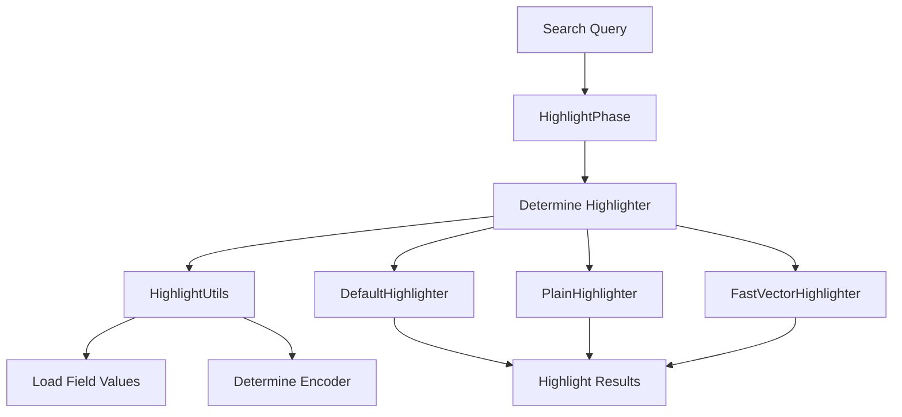

# Exploring Highlight Functionality

Highlight functionality emphasizes specific parts of search results to make them more visible to the user. It is implemented in the <SwmToken path="server/src/main/java/org/elasticsearch/search/fetch/subphase/highlight/AbstractHighlighterBuilder.java" pos="9:2:12" line-data="package org.elasticsearch.search.fetch.subphase.highlight;">`org.elasticsearch.search.fetch.subphase.highlight`</SwmToken> package, which contains various classes and utilities to handle the highlighting process.

## Highlight Utilities

The <SwmToken path="server/src/main/java/org/elasticsearch/search/fetch/subphase/highlight/DefaultHighlighter.java" pos="117:3:3" line-data="            ? HighlightUtils.Encoders.HTML">`HighlightUtils`</SwmToken> class provides utility methods and constants used across different highlighter implementations. For example, the <SwmToken path="server/src/main/java/org/elasticsearch/search/fetch/subphase/highlight/DefaultHighlighter.java" pos="74:9:9" line-data="        CheckedSupplier&lt;String, IOException&gt; loadFieldValues = () -&gt; {">`loadFieldValues`</SwmToken> method is used to load field values for highlighting.

## Highlight Constants

The <SwmToken path="server/src/main/java/org/elasticsearch/search/fetch/subphase/highlight/AbstractHighlighterBuilder.java" pos="43:6:6" line-data="public abstract class AbstractHighlighterBuilder&lt;HB extends AbstractHighlighterBuilder&lt;?&gt;&gt;">`AbstractHighlighterBuilder`</SwmToken> class defines several constants used in the highlighting process, such as <SwmToken path="server/src/main/java/org/elasticsearch/search/fetch/subphase/highlight/AbstractHighlighterBuilder.java" pos="48:9:9" line-data="    public static final ParseField PRE_TAGS_FIELD = new ParseField(&quot;pre_tags&quot;);">`PRE_TAGS_FIELD`</SwmToken>, <SwmToken path="server/src/main/java/org/elasticsearch/search/fetch/subphase/highlight/AbstractHighlighterBuilder.java" pos="50:9:9" line-data="    public static final ParseField FIELDS_FIELD = new ParseField(&quot;fields&quot;);">`FIELDS_FIELD`</SwmToken>, and <SwmToken path="server/src/main/java/org/elasticsearch/search/fetch/subphase/highlight/AbstractHighlighterBuilder.java" pos="52:9:9" line-data="    public static final ParseField HIGHLIGHT_FILTER_FIELD = new ParseField(&quot;highlight_filter&quot;);">`HIGHLIGHT_FILTER_FIELD`</SwmToken>. These constants represent various fields and options that can be configured for highlighting.

<SwmSnippet path="/server/src/main/java/org/elasticsearch/search/fetch/subphase/highlight/AbstractHighlighterBuilder.java" line="48">

---

The <SwmToken path="server/src/main/java/org/elasticsearch/search/fetch/subphase/highlight/AbstractHighlighterBuilder.java" pos="43:6:6" line-data="public abstract class AbstractHighlighterBuilder&lt;HB extends AbstractHighlighterBuilder&lt;?&gt;&gt;">`AbstractHighlighterBuilder`</SwmToken> class defines constants like <SwmToken path="server/src/main/java/org/elasticsearch/search/fetch/subphase/highlight/AbstractHighlighterBuilder.java" pos="48:9:9" line-data="    public static final ParseField PRE_TAGS_FIELD = new ParseField(&quot;pre_tags&quot;);">`PRE_TAGS_FIELD`</SwmToken> and <SwmToken path="server/src/main/java/org/elasticsearch/search/fetch/subphase/highlight/AbstractHighlighterBuilder.java" pos="49:9:9" line-data="    public static final ParseField POST_TAGS_FIELD = new ParseField(&quot;post_tags&quot;);">`POST_TAGS_FIELD`</SwmToken> used in the highlighting process.

```java
    public static final ParseField PRE_TAGS_FIELD = new ParseField("pre_tags");
    public static final ParseField POST_TAGS_FIELD = new ParseField("post_tags");
    public static final ParseField FIELDS_FIELD = new ParseField("fields");
    public static final ParseField ORDER_FIELD = new ParseField("order");
    public static final ParseField HIGHLIGHT_FILTER_FIELD = new ParseField("highlight_filter");
    public static final ParseField FRAGMENT_SIZE_FIELD = new ParseField("fragment_size");
    public static final ParseField FRAGMENT_OFFSET_FIELD = new ParseField("fragment_offset");
    public static final ParseField NUMBER_OF_FRAGMENTS_FIELD = new ParseField("number_of_fragments");
    public static final ParseField ENCODER_FIELD = new ParseField("encoder");
    public static final ParseField TAGS_SCHEMA_FIELD = new ParseField("tags_schema");
    public static final ParseField REQUIRE_FIELD_MATCH_FIELD = new ParseField("require_field_match");
    public static final ParseField BOUNDARY_SCANNER_FIELD = new ParseField("boundary_scanner");
    public static final ParseField BOUNDARY_MAX_SCAN_FIELD = new ParseField("boundary_max_scan");
    public static final ParseField BOUNDARY_CHARS_FIELD = new ParseField("boundary_chars");
    public static final ParseField BOUNDARY_SCANNER_LOCALE_FIELD = new ParseField("boundary_scanner_locale");
    public static final ParseField TYPE_FIELD = new ParseField("type");
    public static final ParseField FRAGMENTER_FIELD = new ParseField("fragmenter");
    public static final ParseField NO_MATCH_SIZE_FIELD = new ParseField("no_match_size");
    public static final ParseField FORCE_SOURCE_FIELD = new ParseField("force_source").withAllDeprecated();
    public static final ParseField PHRASE_LIMIT_FIELD = new ParseField("phrase_limit");
    public static final ParseField OPTIONS_FIELD = new ParseField("options");
```

---

</SwmSnippet>

## Default Highlighter

The <SwmToken path="server/src/main/java/org/elasticsearch/search/fetch/subphase/highlight/DefaultHighlighter.java" pos="50:4:4" line-data="public class DefaultHighlighter implements Highlighter {">`DefaultHighlighter`</SwmToken> class uses <SwmToken path="server/src/main/java/org/elasticsearch/search/fetch/subphase/highlight/DefaultHighlighter.java" pos="117:3:3" line-data="            ? HighlightUtils.Encoders.HTML">`HighlightUtils`</SwmToken> to determine the encoder based on the field options. If the encoder is set to 'html', it uses <SwmToken path="server/src/main/java/org/elasticsearch/search/fetch/subphase/highlight/DefaultHighlighter.java" pos="117:3:7" line-data="            ? HighlightUtils.Encoders.HTML">`HighlightUtils.Encoders.HTML`</SwmToken>; otherwise, it uses <SwmToken path="server/src/main/java/org/elasticsearch/search/fetch/subphase/highlight/DefaultHighlighter.java" pos="118:3:7" line-data="            : HighlightUtils.Encoders.DEFAULT;">`HighlightUtils.Encoders.DEFAULT`</SwmToken>.

<SwmSnippet path="/server/src/main/java/org/elasticsearch/search/fetch/subphase/highlight/DefaultHighlighter.java" line="116">

---

The <SwmToken path="server/src/main/java/org/elasticsearch/search/fetch/subphase/highlight/DefaultHighlighter.java" pos="50:4:4" line-data="public class DefaultHighlighter implements Highlighter {">`DefaultHighlighter`</SwmToken> class determines the encoder using <SwmToken path="server/src/main/java/org/elasticsearch/search/fetch/subphase/highlight/DefaultHighlighter.java" pos="117:3:3" line-data="            ? HighlightUtils.Encoders.HTML">`HighlightUtils`</SwmToken> based on the field options.

```java
        Encoder encoder = fieldContext.field.fieldOptions().encoder().equals("html")
            ? HighlightUtils.Encoders.HTML
            : HighlightUtils.Encoders.DEFAULT;
```

---

</SwmSnippet>

<SwmSnippet path="/server/src/main/java/org/elasticsearch/search/fetch/subphase/highlight/HighlightPhase.java" line="32">

---

The <SwmToken path="server/src/main/java/org/elasticsearch/search/fetch/subphase/highlight/HighlightPhase.java" pos="34:3:3" line-data="    public HighlightPhase(Map&lt;String, Highlighter&gt; highlighters) {">`HighlightPhase`</SwmToken> class manages the highlighting process during the search fetch phase, ensuring the correct highlighter is used.

```java
    private final Map<String, Highlighter> highlighters;

    public HighlightPhase(Map<String, Highlighter> highlighters) {
        this.highlighters = highlighters;
    }

    @Override
    public FetchSubPhaseProcessor getProcessor(FetchContext context) {
        if (context.highlight() == null) {
            return null;
        }

        return getProcessor(context, context.highlight(), context.parsedQuery().query());
    }

    public FetchSubPhaseProcessor getProcessor(FetchContext context, SearchHighlightContext highlightContext, Query query) {
        Map<String, Object> sharedCache = new HashMap<>();
        FieldContext fieldContext = contextBuilders(context, highlightContext, query, sharedCache);

        return new FetchSubPhaseProcessor() {
            @Override
```

---

</SwmSnippet>

## Main Functions

There are several main functions in this folder. Some of them are <SwmToken path="server/src/main/java/org/elasticsearch/search/fetch/subphase/highlight/HighlightPhase.java" pos="40:6:6" line-data="        if (context.highlight() == null) {">`highlight`</SwmToken>, <SwmToken path="server/src/main/java/org/elasticsearch/search/fetch/subphase/highlight/HighlightPhase.java" pos="82:5:5" line-data="    private Highlighter getHighlighter(SearchHighlightContext.Field field) {">`getHighlighter`</SwmToken>, and <SwmToken path="server/src/main/java/org/elasticsearch/search/fetch/subphase/highlight/DefaultHighlighter.java" pos="74:9:9" line-data="        CheckedSupplier&lt;String, IOException&gt; loadFieldValues = () -&gt; {">`loadFieldValues`</SwmToken>. We will dive a little into <SwmToken path="server/src/main/java/org/elasticsearch/search/fetch/subphase/highlight/HighlightPhase.java" pos="40:6:6" line-data="        if (context.highlight() == null) {">`highlight`</SwmToken> and <SwmToken path="server/src/main/java/org/elasticsearch/search/fetch/subphase/highlight/HighlightPhase.java" pos="82:5:5" line-data="    private Highlighter getHighlighter(SearchHighlightContext.Field field) {">`getHighlighter`</SwmToken>.

<SwmSnippet path="/server/src/main/java/org/elasticsearch/search/fetch/subphase/highlight/PlainHighlighter.java" line="56">

---

The <SwmToken path="server/src/main/java/org/elasticsearch/search/fetch/subphase/highlight/PlainHighlighter.java" pos="57:5:5" line-data="    public HighlightField highlight(FieldHighlightContext fieldContext) throws IOException {">`highlight`</SwmToken> function in the <SwmToken path="server/src/main/java/org/elasticsearch/search/fetch/subphase/highlight/PlainHighlighter.java" pos="42:4:4" line-data="public class PlainHighlighter implements Highlighter {">`PlainHighlighter`</SwmToken> class uses components like <SwmToken path="server/src/main/java/org/elasticsearch/search/fetch/subphase/highlight/PlainHighlighter.java" pos="75:1:1" line-data="            QueryScorer queryScorer = new CustomQueryScorer(">`QueryScorer`</SwmToken> and <SwmToken path="server/src/main/java/org/elasticsearch/search/fetch/subphase/highlight/PlainHighlighter.java" pos="15:12:12" line-data="import org.apache.lucene.search.highlight.Formatter;">`Formatter`</SwmToken> to highlight search results.

```java
    @Override
    public HighlightField highlight(FieldHighlightContext fieldContext) throws IOException {
        SearchHighlightContext.Field field = fieldContext.field;
        FetchContext context = fieldContext.context;
        FetchSubPhase.HitContext hitContext = fieldContext.hitContext;
        MappedFieldType fieldType = fieldContext.fieldType;

        Encoder encoder = field.fieldOptions().encoder().equals("html") ? HighlightUtils.Encoders.HTML : HighlightUtils.Encoders.DEFAULT;

        if (fieldContext.cache.containsKey(CACHE_KEY) == false) {
            fieldContext.cache.put(CACHE_KEY, new HashMap<>());
        }
        @SuppressWarnings("unchecked")
        Map<MappedFieldType, org.apache.lucene.search.highlight.Highlighter> cache = (Map<
            MappedFieldType,
            org.apache.lucene.search.highlight.Highlighter>) fieldContext.cache.get(CACHE_KEY);

        org.apache.lucene.search.highlight.Highlighter entry = cache.get(fieldType);
        if (entry == null) {
            QueryScorer queryScorer = new CustomQueryScorer(
                fieldContext.query,
```

---

</SwmSnippet>

### <SwmToken path="server/src/main/java/org/elasticsearch/search/fetch/subphase/highlight/HighlightPhase.java" pos="82:5:5" line-data="    private Highlighter getHighlighter(SearchHighlightContext.Field field) {">`getHighlighter`</SwmToken>

The <SwmToken path="server/src/main/java/org/elasticsearch/search/fetch/subphase/highlight/HighlightPhase.java" pos="82:5:5" line-data="    private Highlighter getHighlighter(SearchHighlightContext.Field field) {">`getHighlighter`</SwmToken> function in the <SwmToken path="server/src/main/java/org/elasticsearch/search/fetch/subphase/highlight/HighlightPhase.java" pos="34:3:3" line-data="    public HighlightPhase(Map&lt;String, Highlighter&gt; highlighters) {">`HighlightPhase`</SwmToken> class retrieves the appropriate highlighter based on the field options. It ensures that the correct highlighter type is used for the field being processed.

<SwmSnippet path="/server/src/main/java/org/elasticsearch/search/fetch/subphase/highlight/HighlightPhase.java" line="82">

---

The <SwmToken path="server/src/main/java/org/elasticsearch/search/fetch/subphase/highlight/HighlightPhase.java" pos="82:5:5" line-data="    private Highlighter getHighlighter(SearchHighlightContext.Field field) {">`getHighlighter`</SwmToken> function in the <SwmToken path="server/src/main/java/org/elasticsearch/search/fetch/subphase/highlight/HighlightPhase.java" pos="34:3:3" line-data="    public HighlightPhase(Map&lt;String, Highlighter&gt; highlighters) {">`HighlightPhase`</SwmToken> class retrieves the appropriate highlighter based on the field options.

```java
    private Highlighter getHighlighter(SearchHighlightContext.Field field) {
        String highlighterType = field.fieldOptions().highlighterType();
        if (highlighterType == null) {
            highlighterType = "unified";
        }
        Highlighter highlighter = highlighters.get(highlighterType);
        if (highlighter == null) {
            throw new IllegalArgumentException("unknown highlighter type [" + highlighterType + "] for the field [" + field.field() + "]");
        }
        return highlighter;
    }
```

---

</SwmSnippet>

&nbsp;

*This is an auto-generated document by Swimm AI 🌊 and has not yet been verified by a human*

<SwmMeta version="3.0.0" repo-id="Z2l0aHViJTNBJTNBZWxhc3RpY3NlYXJjaCUzQSUzQVN3aW1tLURlbW8=" repo-name="elasticsearch" doc-type="overview"><sup>Powered by [Swimm](/)</sup></SwmMeta>
