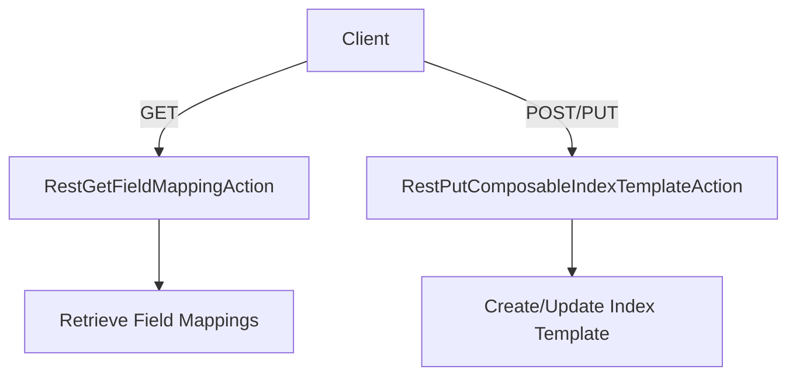

# Exploring Indices in Admin

Indices are a core component used to store and manage data. They allow for efficient searching, filtering, and aggregation of data. In the Admin module, indices are managed through various actions such as creating, deleting, and updating indices. These actions are handled by different classes within the `org.elasticsearch.rest.action.admin.indices` package.

## RestIndicesAliasesAction

The `RestIndicesAliasesAction` class handles requests related to index aliases, which are used to manage multiple indices under a single name. This class is located in `server/src/main/java/org/elasticsearch/rest/action/admin/indices/RestIndicesAliasesAction.java`.

<SwmSnippet path="/server/src/main/java/org/elasticsearch/rest/action/admin/indices/RestIndicesAliasesAction.java" line="20">

---

The `RestIndicesAliasesAction` class imports necessary libraries and defines methods to handle POST requests for managing index aliases.

```java
import java.io.IOException;
import java.util.List;

import static org.elasticsearch.rest.RestRequest.Method.POST;
```

---

</SwmSnippet>

## RestIndicesStatsAction

The `RestIndicesStatsAction` class provides statistics about indices, such as document count and storage size, to help monitor and optimize performance. It defines routes for accessing these statistics and prepares the request by setting various parameters. This class is located in `server/src/main/java/org/elasticsearch/rest/action/admin/indices/RestIndicesStatsAction.java`.

<SwmSnippet path="/server/src/main/java/org/elasticsearch/rest/action/admin/indices/RestIndicesStatsAction.java" line="11">

---

The `RestIndicesStatsAction` class imports necessary libraries and defines methods to handle GET requests for retrieving index statistics.

```java
import org.elasticsearch.action.ClusterStatsLevel;
import org.elasticsearch.action.admin.indices.stats.CommonStatsFlags;
import org.elasticsearch.action.admin.indices.stats.CommonStatsFlags.Flag;
import org.elasticsearch.action.admin.indices.stats.IndicesStatsRequest;
import org.elasticsearch.action.support.IndicesOptions;
```

---

</SwmSnippet>

<SwmSnippet path="/server/src/main/java/org/elasticsearch/rest/action/admin/indices/RestIndicesStatsAction.java" line="41">

---

The `RestIndicesStatsAction` class defines routes for accessing index statistics and prepares the request by setting various parameters.

```java
public class RestIndicesStatsAction extends BaseRestHandler {
    private static final DeprecationLogger deprecationLogger = DeprecationLogger.getLogger(RestMultiTermVectorsAction.class);
    private static final String TYPES_DEPRECATION_MESSAGE = "[types removal] "
        + "Specifying types in indices stats requests is deprecated.";

    @Override
    public List<Route> routes() {
        return List.of(
            new Route(GET, "/_stats"),
            new Route(GET, "/_stats/{metric}"),
            new Route(GET, "/{index}/_stats"),
            new Route(GET, "/{index}/_stats/{metric}")
        );
    }

    @Override
    public String getName() {
        return "indices_stats_action";
    }

    @Override
```

---

</SwmSnippet>

## RestIndicesSegmentsAction

The `RestIndicesSegmentsAction` class handles requests related to index segments. It defines routes for accessing segment information and prepares the request by setting various parameters, including options for verbose output and vector formats. This class is located in `server/src/main/java/org/elasticsearch/rest/action/admin/indices/RestIndicesSegmentsAction.java`.

<SwmSnippet path="/server/src/main/java/org/elasticsearch/rest/action/admin/indices/RestIndicesSegmentsAction.java" line="11">

---

The `RestIndicesSegmentsAction` class imports necessary libraries and defines methods to handle GET requests for retrieving index segment information.

```java
import org.elasticsearch.action.admin.indices.segments.IndicesSegmentsRequest;
import org.elasticsearch.action.support.IndicesOptions;
import org.elasticsearch.client.internal.node.NodeClient;
import org.elasticsearch.common.Strings;
```

---

</SwmSnippet>

<SwmSnippet path="/server/src/main/java/org/elasticsearch/rest/action/admin/indices/RestIndicesSegmentsAction.java" line="30">

---

The `RestIndicesSegmentsAction` class defines routes for accessing segment information and prepares the request by setting various parameters.

```java
public class RestIndicesSegmentsAction extends BaseRestHandler {

    private static final DeprecationLogger DEPRECATION_LOGGER = DeprecationLogger.getLogger(RestIndicesSegmentsAction.class);

    public RestIndicesSegmentsAction() {}

    @Override
    public List<Route> routes() {
        return List.of(new Route(GET, "/_segments"), new Route(GET, "/{index}/_segments"));
    }

    @Override
    public String getName() {
        return "indices_segments_action";
    }

    @Override
    public RestChannelConsumer prepareRequest(final RestRequest request, final NodeClient client) throws IOException {
        IndicesSegmentsRequest indicesSegmentsRequest = new IndicesSegmentsRequest(
            Strings.splitStringByCommaToArray(request.param("index"))
        ).withVectorFormatsInfo(request.paramAsBoolean("vector_formats", false));
```

---

</SwmSnippet>

## RestIndicesShardStoresAction

The `RestIndicesShardStoresAction` class handles tasks related to shard stores. This class is located in `server/src/main/java/org/elasticsearch/rest/action/admin/indices/RestIndicesShardStoresAction.java`.

<SwmSnippet path="/server/src/main/java/org/elasticsearch/rest/action/admin/indices/RestIndicesShardStoresAction.java" line="11">

---

The `RestIndicesShardStoresAction` class imports necessary libraries and defines methods to handle requests related to shard stores.

```java
import org.elasticsearch.action.admin.indices.shards.IndicesShardStoresRequest;
import org.elasticsearch.action.admin.indices.shards.TransportIndicesShardStoresAction;
import org.elasticsearch.action.support.IndicesOptions;
import org.elasticsearch.client.internal.node.NodeClient;
```

---

</SwmSnippet>

## Indices Endpoints

Indices endpoints are defined in various classes to handle different types of requests. Two important classes are `RestGetFieldMappingAction` and `RestPutComposableIndexTemplateAction`.

### RestGetFieldMappingAction

The `RestGetFieldMappingAction` class defines endpoints for retrieving field mappings of indices. The routes include `/mapping/field/{fields}`, `/{index}/mapping/field/{fields}`, and several deprecated routes that include type names. This class is located in `server/src/main/java/org/elasticsearch/rest/action/admin/indices/RestGetFieldMappingAction.java`.

<SwmSnippet path="/server/src/main/java/org/elasticsearch/rest/action/admin/indices/RestGetFieldMappingAction.java" line="45">

---

The `RestGetFieldMappingAction` class defines routes for retrieving field mappings of indices.

```java
    @Override
    public List<Route> routes() {
        return List.of(
            new Route(GET, "/_mapping/field/{fields}"),
            new Route(GET, "/{index}/_mapping/field/{fields}"),
            Route.builder(GET, "/_mapping/{type}/field/{fields}").deprecated(TYPES_DEPRECATION_MESSAGE, RestApiVersion.V_7).build(),
            Route.builder(GET, "/{index}/{type}/_mapping/field/{fields}").deprecated(TYPES_DEPRECATION_MESSAGE, RestApiVersion.V_7).build(),
            Route.builder(GET, "/{index}/_mapping/{type}/field/{fields}").deprecated(TYPES_DEPRECATION_MESSAGE, RestApiVersion.V_7).build()
        );
    }
```

---

</SwmSnippet>

### RestPutComposableIndexTemplateAction

The `RestPutComposableIndexTemplateAction` class defines endpoints for creating or updating composable index templates. The routes include `/_index_template/{name}` for both POST and PUT methods. This class is located in `server/src/main/java/org/elasticsearch/rest/action/admin/indices/RestPutComposableIndexTemplateAction.java`.

<SwmSnippet path="/server/src/main/java/org/elasticsearch/rest/action/admin/indices/RestPutComposableIndexTemplateAction.java" line="31">

---

The `RestPutComposableIndexTemplateAction` class defines routes for creating or updating composable index templates.

```java
    public List<Route> routes() {
        return List.of(new Route(POST, "/_index_template/{name}"), new Route(PUT, "/_index_template/{name}"));
    }
```

---

</SwmSnippet>

&nbsp;

*This is an auto-generated document by Swimm AI 🌊 and has not yet been verified by a human*

<SwmMeta version="3.0.0" repo-id="Z2l0aHViJTNBJTNBZWxhc3RpY3NlYXJjaCUzQSUzQVN3aW1tLURlbW8=" repo-name="elasticsearch" doc-type="overview"><sup>Powered by [Swimm](https://app.swimm.io/)</sup></SwmMeta>
