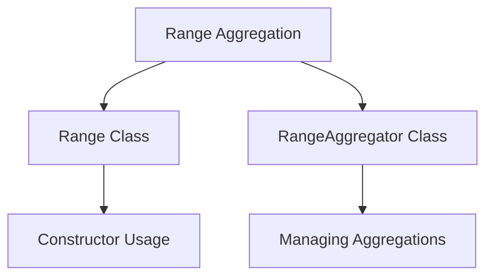

# Exploring Range Aggregation

Range aggregation is a type of aggregation that defines multiple buckets, each associated with a pre-defined value range of a field. In a range aggregation, the value of the field in all documents in each bucket falls within the bucket's range.

# Range Class

The <SwmToken path="server/src/main/java/org/elasticsearch/search/aggregations/bucket/range/IpRangeAggregationBuilder.java" pos="105:7:7" line-data="    public static class Range implements ToXContentObject, Writeable {">`Range`</SwmToken> class defines the structure of a range, including its key, lower bound (`from`), and upper bound (<SwmToken path="server/src/main/java/org/elasticsearch/search/aggregations/bucket/range/IpRangeAggregationBuilder.java" pos="109:7:7" line-data="        private final String to;">`to`</SwmToken>). Each bucket in a range aggregation has a lower bound and an upper bound, which can be retrieved using the <SwmToken path="server/src/main/java/org/elasticsearch/search/aggregations/bucket/range/RangeAggregator.java" pos="194:5:5" line-data="        public double getFrom() {">`getFrom`</SwmToken> and <SwmToken path="server/src/main/java/org/elasticsearch/search/aggregations/bucket/range/RangeAggregator.java" pos="198:5:5" line-data="        public double getTo() {">`getTo`</SwmToken> methods respectively.

<SwmSnippet path="/server/src/main/java/org/elasticsearch/search/aggregations/bucket/range/IpRangeAggregationBuilder.java" line="105">

---

The <SwmToken path="server/src/main/java/org/elasticsearch/search/aggregations/bucket/range/IpRangeAggregationBuilder.java" pos="105:7:7" line-data="    public static class Range implements ToXContentObject, Writeable {">`Range`</SwmToken> class is defined here, including its key, lower bound (`from`), and upper bound (<SwmToken path="server/src/main/java/org/elasticsearch/search/aggregations/bucket/range/IpRangeAggregationBuilder.java" pos="109:7:7" line-data="        private final String to;">`to`</SwmToken>).

```java
    public static class Range implements ToXContentObject, Writeable {

        private final String key;
        private final String from;
        private final String to;

        Range(String key, String from, String to) {
            if (from != null) {
                InetAddresses.forString(from);
            }
            if (to != null) {
                InetAddresses.forString(to);
            }
            this.key = key;
            this.from = from;
            this.to = to;
        }

        Range(String key, String mask) {
            final Tuple<InetAddress, Integer> cidr = InetAddresses.parseCidr(mask);
            final InetAddress address = cidr.v1();
```

---

</SwmSnippet>

# Constructor Usage

The constructor initializes a <SwmToken path="server/src/main/java/org/elasticsearch/search/aggregations/bucket/range/IpRangeAggregationBuilder.java" pos="105:7:7" line-data="    public static class Range implements ToXContentObject, Writeable {">`Range`</SwmToken> object with a key, from, and to values. This ensures that the range is properly defined and can be used in the aggregation process.

<SwmSnippet path="/server/src/main/java/org/elasticsearch/search/aggregations/bucket/range/IpRangeAggregationBuilder.java" line="111">

---

The constructor for the <SwmToken path="server/src/main/java/org/elasticsearch/search/aggregations/bucket/range/IpRangeAggregationBuilder.java" pos="111:1:1" line-data="        Range(String key, String from, String to) {">`Range`</SwmToken> class initializes the key, from, and to values.

```java
        Range(String key, String from, String to) {
            if (from != null) {
                InetAddresses.forString(from);
            }
            if (to != null) {
                InetAddresses.forString(to);
            }
            this.key = key;
            this.from = from;
            this.to = to;
        }
```

---

</SwmSnippet>

# <SwmToken path="server/src/main/java/org/elasticsearch/search/aggregations/bucket/range/IpRangeAggregationBuilder.java" pos="61:10:10" line-data="        PARSER.declareBoolean(IpRangeAggregationBuilder::keyed, RangeAggregator.KEYED_FIELD);">`RangeAggregator`</SwmToken> Class

The <SwmToken path="server/src/main/java/org/elasticsearch/search/aggregations/bucket/range/IpRangeAggregationBuilder.java" pos="61:10:10" line-data="        PARSER.declareBoolean(IpRangeAggregationBuilder::keyed, RangeAggregator.KEYED_FIELD);">`RangeAggregator`</SwmToken> class is responsible for building and managing range aggregations, ensuring that documents are categorized into the correct buckets. It can handle both overlapping and non-overlapping ranges, optimizing the aggregation process for performance.

<SwmSnippet path="/server/src/main/java/org/elasticsearch/search/aggregations/bucket/range/RangeAggregator.java" line="108">

---

The <SwmToken path="server/src/main/java/org/elasticsearch/search/aggregations/bucket/range/IpRangeAggregationBuilder.java" pos="61:10:10" line-data="        PARSER.declareBoolean(IpRangeAggregationBuilder::keyed, RangeAggregator.KEYED_FIELD);">`RangeAggregator`</SwmToken> class manages the range aggregations, ensuring that documents are categorized correctly.

```java
    public static class Range implements Writeable, ToXContentObject {
        public static final ParseField KEY_FIELD = new ParseField("key");
        public static final ParseField FROM_FIELD = new ParseField("from");
        public static final ParseField TO_FIELD = new ParseField("to");

        protected final String key;
        protected final double from;
        protected final Double originalFrom;
        protected final String fromAsStr;
        protected final double to;
        protected final Double originalTo;
        protected final String toAsStr;

        /**
         * Build the range. Generally callers should prefer
         * {@link Range#Range(String, Double, Double)} or
         * {@link Range#Range(String, String, String)}. If you
         * <strong>must</strong> call this know that consumers prefer
         * {@code from} and {@code to} parameters if they are non-null
         * and finite. Otherwise they parse from {@code fromrStr} and
         * {@code toStr}.
```

---

</SwmSnippet>

&nbsp;

*This is an auto-generated document by Swimm AI 🌊 and has not yet been verified by a human*

<SwmMeta version="3.0.0" repo-id="Z2l0aHViJTNBJTNBZWxhc3RpY3NlYXJjaCUzQSUzQVN3aW1tLURlbW8=" repo-name="elasticsearch" doc-type="overview"><sup>Powered by [Swimm](/)</sup></SwmMeta>
