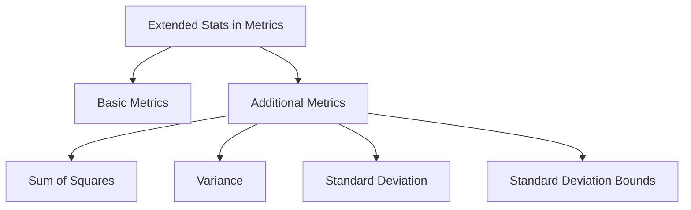

# Overview

Extended Stats in Metrics provides additional statistical calculations beyond basic metrics like count, sum, min, max, and average. These extended metrics are useful for more detailed statistical analysis.

# Available Metrics

Extended Stats includes metrics such as sum of squares, variance, variance population, variance sampling, standard deviation, standard deviation population, and standard deviation sampling. It also calculates standard deviation bounds, which include upper and lower bounds for both population and sampling.

<SwmSnippet path="/server/src/main/java/org/elasticsearch/search/aggregations/metrics/InternalExtendedStats.java" line="28">

---

# Metrics Enum

The `Metrics` enum defines the various extended statistical metrics available, such as sum of squares, variance, and standard deviation.

```java
    enum Metrics {

        count,
        sum,
        min,
        max,
        avg,
        sum_of_squares,
        variance,
        variance_population,
        variance_sampling,
        std_deviation,
        std_deviation_population,
        std_deviation_sampling,
        std_upper,
        std_lower,
        std_upper_population,
        std_lower_population,
        std_upper_sampling,
        std_lower_sampling;
```

---

</SwmSnippet>

# Accessing Extended Stats

The `value` method allows retrieval of specific extended statistical metrics by name, such as `sum_of_squares`, `variance`, and `std_deviation`.

<SwmSnippet path="/server/src/main/java/org/elasticsearch/search/aggregations/metrics/InternalExtendedStats.java" line="110">

---

The `value` method implementation shows how specific metrics like `sum_of_squares`, `variance`, and `std_deviation` are retrieved.

```java
    @Override
    public double value(String name) {
        if ("sum_of_squares".equals(name)) {
            return sumOfSqrs;
        }
        if ("variance".equals(name)) {
            return getVariance();
        }
        if ("variance_population".equals(name)) {
            return getVariancePopulation();
        }
        if ("variance_sampling".equals(name)) {
            return getVarianceSampling();
        }
        if ("std_deviation".equals(name)) {
            return getStdDeviation();
        }
        if ("std_deviation_population".equals(name)) {
            return getStdDeviationPopulation();
        }
        if ("std_deviation_sampling".equals(name)) {
```

---

</SwmSnippet>

# Formatted Metrics

Methods like `getSumOfSquaresAsString` and `getVarianceAsString` provide formatted string representations of the extended statistical metrics.

<SwmSnippet path="/server/src/main/java/org/elasticsearch/search/aggregations/metrics/InternalExtendedStats.java" line="211">

---

The methods `getSumOfSquaresAsString`, `getVarianceAsString`, and others provide formatted string representations of the metrics.

```java
    public String getSumOfSquaresAsString() {
        return valueAsString(Metrics.sum_of_squares.name());
    }

    @Override
    public String getVarianceAsString() {
        return valueAsString(Metrics.variance.name());
    }

    @Override
    public String getVariancePopulationAsString() {
        return valueAsString(Metrics.variance_population.name());
    }

    @Override
    public String getVarianceSamplingAsString() {
        return valueAsString(Metrics.variance_sampling.name());
    }

    @Override
    public String getStdDeviationAsString() {
```

---

</SwmSnippet>

# Main Functions

There are several main functions in this class. Some of them are `getVariance`, `getStdDeviation`, and `getStdDeviationBound`. We will dive a little into these functions.

## getVariance

The `getVariance` function calculates the variance of the data. It returns the population variance by default.

<SwmSnippet path="/server/src/main/java/org/elasticsearch/search/aggregations/metrics/InternalExtendedStats.java" line="168">

---

The `getVariance` function implementation shows how the population variance is calculated.

```java
    @Override
    public double getVariance() {
        return getVariancePopulation();
    }
```

---

</SwmSnippet>

<SwmSnippet path="/server/src/main/java/org/elasticsearch/search/aggregations/metrics/InternalExtendedStats.java" line="185">

---

The `getStdDeviation` function implementation shows how the population standard deviation is calculated.

```java
    @Override
    public double getStdDeviation() {
        return getStdDeviationPopulation();
    }
```

---

</SwmSnippet>

## getStdDeviationBound

The `getStdDeviationBound` function calculates the upper or lower bound of the standard deviation. It takes a `Bounds` parameter to determine which bound to calculate.

<SwmSnippet path="/server/src/main/java/org/elasticsearch/search/aggregations/metrics/InternalExtendedStats.java" line="200">

---

The `getStdDeviationBound` function implementation shows how the upper and lower bounds of the standard deviation are calculated based on the `Bounds` parameter.

```java
    @Override
    public double getStdDeviationBound(Bounds bound) {
        return switch (bound) {
            case UPPER, UPPER_POPULATION -> getAvg() + (getStdDeviationPopulation() * sigma);
            case UPPER_SAMPLING -> getAvg() + (getStdDeviationSampling() * sigma);
            case LOWER, LOWER_POPULATION -> getAvg() - (getStdDeviationPopulation() * sigma);
            case LOWER_SAMPLING -> getAvg() - (getStdDeviationSampling() * sigma);
        };
    }
```

---

</SwmSnippet>

&nbsp;

*This is an auto-generated document by Swimm AI 🌊 and has not yet been verified by a human*

<SwmMeta version="3.0.0" repo-id="Z2l0aHViJTNBJTNBZWxhc3RpY3NlYXJjaCUzQSUzQVN3aW1tLURlbW8=" repo-name="elasticsearch" doc-type="overview"><sup>Powered by [Swimm](https://app.swimm.io/)</sup></SwmMeta>
