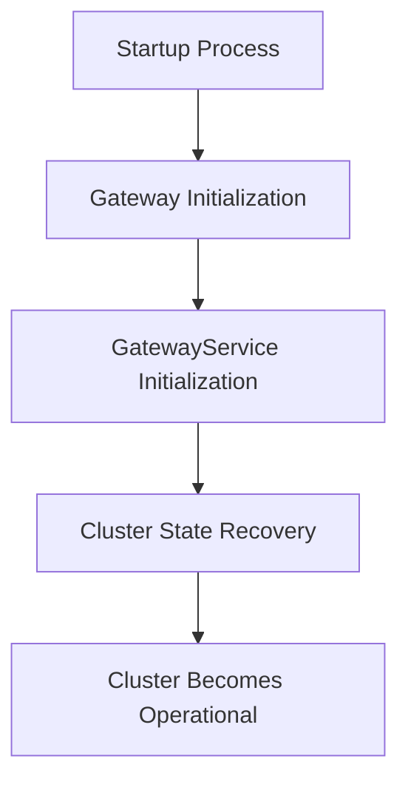

# Overview

The Gateway in Server Core is responsible for managing the recovery of the cluster state from disk during the startup process. It ensures that the cluster state is properly initialized and recovered before the cluster becomes operational. This document will cover the key components and methods involved in this process.

# <SwmToken path="server/src/main/java/org/elasticsearch/gateway/GatewayService.java" pos="88:3:3" line-data="    public GatewayService(">`GatewayService`</SwmToken>

The <SwmToken path="server/src/main/java/org/elasticsearch/gateway/GatewayService.java" pos="88:3:3" line-data="    public GatewayService(">`GatewayService`</SwmToken> class handles the recovery process, including settings for expected data nodes and recovery timing. It includes methods like <SwmToken path="server/src/main/java/org/elasticsearch/gateway/GatewayService.java" pos="112:5:5" line-data="    protected void doStart() {">`doStart`</SwmToken>, which adds listeners to the cluster service to manage state recovery.

<SwmSnippet path="/server/src/main/java/org/elasticsearch/gateway/GatewayService.java" line="87">

---

The constructor of <SwmToken path="server/src/main/java/org/elasticsearch/gateway/GatewayService.java" pos="88:3:3" line-data="    public GatewayService(">`GatewayService`</SwmToken> initializes various services and settings required for the recovery process.

```java
    @Inject
    public GatewayService(
        final Settings settings,
        final RerouteService rerouteService,
        final ClusterService clusterService,
        final ShardRoutingRoleStrategy shardRoutingRoleStrategy,
        final ThreadPool threadPool
    ) {
        this.rerouteService = rerouteService;
        this.clusterService = clusterService;
        this.shardRoutingRoleStrategy = shardRoutingRoleStrategy;
        this.threadPool = threadPool;
        this.expectedDataNodes = EXPECTED_DATA_NODES_SETTING.get(settings);

        if (RECOVER_AFTER_TIME_SETTING.exists(settings)) {
            recoverAfterTime = RECOVER_AFTER_TIME_SETTING.get(settings);
        } else if (expectedDataNodes >= 0) {
            recoverAfterTime = DEFAULT_RECOVER_AFTER_TIME_IF_EXPECTED_NODES_IS_SET;
        } else {
            recoverAfterTime = null;
        }
```

---

</SwmSnippet>

<SwmSnippet path="/server/src/main/java/org/elasticsearch/gateway/GatewayService.java" line="111">

---

The <SwmToken path="server/src/main/java/org/elasticsearch/gateway/GatewayService.java" pos="112:5:5" line-data="    protected void doStart() {">`doStart`</SwmToken> method in <SwmToken path="server/src/main/java/org/elasticsearch/gateway/GatewayService.java" pos="88:3:3" line-data="    public GatewayService(">`GatewayService`</SwmToken> adds listeners to the cluster service to manage state recovery.

```java
    @Override
    protected void doStart() {
        if (DiscoveryNode.isMasterNode(clusterService.getSettings())) {
            // use post applied so that the state will be visible to the background recovery thread we spawn in performStateRecovery
            clusterService.addListener(this);
        }
    }
```

---

</SwmSnippet>

# <SwmToken path="server/src/main/java/org/elasticsearch/gateway/GatewayModule.java" pos="13:4:4" line-data="public class GatewayModule extends AbstractModule {">`GatewayModule`</SwmToken>

The <SwmToken path="server/src/main/java/org/elasticsearch/gateway/GatewayModule.java" pos="13:4:4" line-data="public class GatewayModule extends AbstractModule {">`GatewayModule`</SwmToken> binds the necessary classes, such as <SwmToken path="server/src/main/java/org/elasticsearch/gateway/GatewayService.java" pos="88:3:3" line-data="    public GatewayService(">`GatewayService`</SwmToken> and <SwmToken path="server/src/main/java/org/elasticsearch/gateway/GatewayModule.java" pos="17:3:3" line-data="        bind(DanglingIndicesState.class).asEagerSingleton();">`DanglingIndicesState`</SwmToken>, to ensure they are initialized as eager singletons.

<SwmSnippet path="/server/src/main/java/org/elasticsearch/gateway/GatewayModule.java" line="13">

---

The <SwmToken path="server/src/main/java/org/elasticsearch/gateway/GatewayModule.java" pos="13:4:4" line-data="public class GatewayModule extends AbstractModule {">`GatewayModule`</SwmToken> class binds <SwmToken path="server/src/main/java/org/elasticsearch/gateway/GatewayModule.java" pos="17:3:3" line-data="        bind(DanglingIndicesState.class).asEagerSingleton();">`DanglingIndicesState`</SwmToken>, <SwmToken path="server/src/main/java/org/elasticsearch/gateway/GatewayModule.java" pos="18:3:3" line-data="        bind(GatewayService.class).asEagerSingleton();">`GatewayService`</SwmToken>, and <SwmToken path="server/src/main/java/org/elasticsearch/gateway/GatewayModule.java" pos="19:3:3" line-data="        bind(LocalAllocateDangledIndices.class).asEagerSingleton();">`LocalAllocateDangledIndices`</SwmToken> as eager singletons.

```java
public class GatewayModule extends AbstractModule {

    @Override
    protected void configure() {
        bind(DanglingIndicesState.class).asEagerSingleton();
        bind(GatewayService.class).asEagerSingleton();
        bind(LocalAllocateDangledIndices.class).asEagerSingleton();
    }
```

---

</SwmSnippet>

# <SwmToken path="server/src/main/java/org/elasticsearch/gateway/GatewayMetaState.java" pos="71:4:4" line-data="public class GatewayMetaState implements Closeable {">`GatewayMetaState`</SwmToken>

The <SwmToken path="server/src/main/java/org/elasticsearch/gateway/GatewayMetaState.java" pos="71:4:4" line-data="public class GatewayMetaState implements Closeable {">`GatewayMetaState`</SwmToken> class is responsible for loading and upgrading cluster metadata at startup. It ensures compatibility with the state stored on disk and performs state upgrades if necessary.

<SwmSnippet path="/server/src/main/java/org/elasticsearch/gateway/GatewayMetaState.java" line="63">

---

The <SwmToken path="server/src/main/java/org/elasticsearch/gateway/GatewayMetaState.java" pos="71:4:4" line-data="public class GatewayMetaState implements Closeable {">`GatewayMetaState`</SwmToken> class loads and upgrades cluster metadata at startup, ensuring compatibility with the state stored on disk.

```java
/**
 * Loads (and maybe upgrades) cluster metadata at startup, and persistently stores cluster metadata for future restarts.
 *
 * When started, ensures that this version is compatible with the state stored on disk, and performs a state upgrade if necessary. Note that
 * the state being loaded when constructing the instance of this class is not necessarily the state that will be used as {@link
 * ClusterState#metadata()} because it might be stale or incomplete. Master-eligible nodes must perform an election to find a complete and
 * non-stale state, and master-ineligible nodes receive the real cluster state from the elected master after joining the cluster.
 */
public class GatewayMetaState implements Closeable {

    /**
     * Fake node ID for a voting configuration written by a master-ineligible data node to indicate that its on-disk state is potentially
     * stale (since it is written asynchronously after application, rather than before acceptance). This node ID means that if the node is
     * restarted as a master-eligible node then it does not win any elections until it has received a fresh cluster state.
     */
    public static final String STALE_STATE_CONFIG_NODE_ID = "STALE_STATE_CONFIG";

    // Set by calling start()
    private final SetOnce<PersistedState> persistedState = new SetOnce<>();

    public PersistedState getPersistedState() {
```

---

</SwmSnippet>

# Gateway Endpoints

Gateway endpoints include methods like <SwmToken path="server/src/main/java/org/elasticsearch/gateway/PersistedClusterStateService.java" pos="228:5:5" line-data="    public Writer createWriter() throws IOException {">`createWriter`</SwmToken> and <SwmToken path="server/src/main/java/org/elasticsearch/gateway/PersistedClusterStateService.java" pos="413:5:5" line-data="    public OnDiskState loadBestOnDiskState() throws IOException {">`loadBestOnDiskState`</SwmToken> in the <SwmToken path="server/src/main/java/org/elasticsearch/gateway/GatewayMetaState.java" pos="100:1:1" line-data="        PersistedClusterStateService persistedClusterStateService,">`PersistedClusterStateService`</SwmToken> class, which are crucial for managing cluster state recovery.

<SwmSnippet path="/server/src/main/java/org/elasticsearch/gateway/PersistedClusterStateService.java" line="228">

---

The <SwmToken path="server/src/main/java/org/elasticsearch/gateway/PersistedClusterStateService.java" pos="228:5:5" line-data="    public Writer createWriter() throws IOException {">`createWriter`</SwmToken> method in <SwmToken path="server/src/main/java/org/elasticsearch/gateway/GatewayMetaState.java" pos="100:1:1" line-data="        PersistedClusterStateService persistedClusterStateService,">`PersistedClusterStateService`</SwmToken> creates a writer that stores cluster metadata in a Lucene index.

```java
    public Writer createWriter() throws IOException {
        final List<MetadataIndexWriter> metadataIndexWriters = new ArrayList<>();
        final List<Closeable> closeables = new ArrayList<>();
        boolean success = false;
        try {
            for (final Path path : dataPaths) {
                final Directory directory = createDirectory(path.resolve(METADATA_DIRECTORY_NAME));
                closeables.add(directory);

                final IndexWriter indexWriter = createIndexWriter(directory, false);
                closeables.add(indexWriter);
                metadataIndexWriters.add(new MetadataIndexWriter(path, directory, indexWriter));
            }
            success = true;
        } finally {
            if (success == false) {
                IOUtils.closeWhileHandlingException(closeables);
            }
        }
```

---

</SwmSnippet>

<SwmSnippet path="/server/src/main/java/org/elasticsearch/gateway/PersistedClusterStateService.java" line="413">

---

The <SwmToken path="server/src/main/java/org/elasticsearch/gateway/PersistedClusterStateService.java" pos="413:5:5" line-data="    public OnDiskState loadBestOnDiskState() throws IOException {">`loadBestOnDiskState`</SwmToken> method in <SwmToken path="server/src/main/java/org/elasticsearch/gateway/GatewayMetaState.java" pos="100:1:1" line-data="        PersistedClusterStateService persistedClusterStateService,">`PersistedClusterStateService`</SwmToken> loads the best <SwmToken path="server/src/main/java/org/elasticsearch/gateway/GatewayMetaState.java" pos="74:39:41" line-data="     * Fake node ID for a voting configuration written by a master-ineligible data node to indicate that its on-disk state is potentially">`on-disk`</SwmToken> state of the cluster during the startup process.

```java
    public OnDiskState loadBestOnDiskState() throws IOException {
        return loadBestOnDiskState(true);
    }
```

---

</SwmSnippet>

&nbsp;

*This is an auto-generated document by Swimm AI 🌊 and has not yet been verified by a human*

<SwmMeta version="3.0.0" repo-id="Z2l0aHViJTNBJTNBZWxhc3RpY3NlYXJjaCUzQSUzQVN3aW1tLURlbW8=" repo-name="elasticsearch" doc-type="overview"><sup>Powered by [Swimm](/)</sup></SwmMeta>
