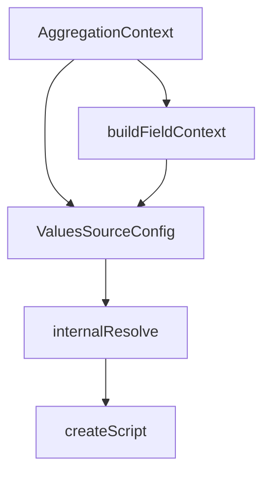

## Overview

Support in aggregations refers to the underlying mechanisms and configurations that enable the retrieval and processing of data for aggregation operations. This document will guide you through the essential classes and methods involved in setting up and using aggregation support in Elasticsearch.

<SwmSnippet path="/server/src/main/java/org/elasticsearch/search/aggregations/support/AggregationContext.java" line="61">

---

## <SwmToken path="server/src/main/java/org/elasticsearch/search/aggregations/support/AggregationContext.java" pos="69:7:7" line-data=" * {@linkplain AggregationContext}s are {@link Releasable} because they track">`AggregationContext`</SwmToken> Class

The <SwmToken path="server/src/main/java/org/elasticsearch/search/aggregations/support/AggregationContext.java" pos="69:7:7" line-data=" * {@linkplain AggregationContext}s are {@link Releasable} because they track">`AggregationContext`</SwmToken> class provides the necessary context and utilities to build and execute aggregations. It includes methods to query data, profile aggregations, and manage field contexts. This class is crucial for managing the lifecycle of aggregations and ensuring resources are properly released.

```java
/**
 * Everything used to build and execute aggregations and the
 * {@link ValuesSource data sources} that power them.
 * <p>
 * In production we always use the {@link ProductionAggregationContext} but
 * this is {@code abstract} so that tests can build it without creating the
 * massing {@link SearchExecutionContext}.
 * <p>
 * {@linkplain AggregationContext}s are {@link Releasable} because they track
 * the {@link Aggregator}s they build and {@link Aggregator#close} them when
 * the request is done. {@linkplain AggregationContext} may also preallocate
 * bytes on the "REQUEST" breaker and is responsible for releasing those bytes.
 */
public abstract class AggregationContext implements Releasable {
    /**
     * The query at the top level of the search in which these aggregations are running.
     */
    public abstract Query query();

    /**
     * Wrap the aggregator for profiling if profiling is enabled.
```

---

</SwmSnippet>

<SwmSnippet path="/server/src/main/java/org/elasticsearch/search/aggregations/support/AggregationContext.java" line="192">

---

## <SwmToken path="server/src/main/java/org/elasticsearch/search/aggregations/support/AggregationContext.java" pos="197:7:7" line-data="    public abstract Query filterQuery(Query query);">`filterQuery`</SwmToken> Method

The <SwmToken path="server/src/main/java/org/elasticsearch/search/aggregations/support/AggregationContext.java" pos="197:7:7" line-data="    public abstract Query filterQuery(Query query);">`filterQuery`</SwmToken> method adds filters from slices or filtered aliases to the query, ensuring that the top-level query is combined with any new queries. This is essential for refining the data set used in aggregations.

```java
    /**
     * Add filters from slice or filtered aliases. If you make a new query
     * and don't combine it with the {@link #query() top level query} then
     * you must provide it to this method.
     */
    public abstract Query filterQuery(Query query);
```

---

</SwmSnippet>

## ValuesSourceConfig Class

The `ValuesSourceConfig` class determines how data is fetched from the index for a specific aggregation. It resolves the appropriate `ValuesSourceType` based on the context, user hints, and field or script information.

## createScript Function

The `createScript` function within `internalResolve` compiles and creates a script if one is provided, aiding in the data retrieval process.

<SwmSnippet path="/server/src/main/java/org/elasticsearch/search/aggregations/support/AggregationContext.java" line="98">

---

## <SwmToken path="server/src/main/java/org/elasticsearch/search/aggregations/support/AggregationContext.java" pos="98:7:7" line-data="    public final FieldContext buildFieldContext(String field) {">`buildFieldContext`</SwmToken> Method

The <SwmToken path="server/src/main/java/org/elasticsearch/search/aggregations/support/AggregationContext.java" pos="98:7:7" line-data="    public final FieldContext buildFieldContext(String field) {">`buildFieldContext`</SwmToken> method constructs the context for a field, which is essential for fetching the necessary data for aggregation operations. It utilizes the <SwmToken path="server/src/main/java/org/elasticsearch/search/aggregations/support/AggregationContext.java" pos="99:1:1" line-data="        MappedFieldType ft = getFieldType(field);">`MappedFieldType`</SwmToken> to build field data.

```java
    public final FieldContext buildFieldContext(String field) {
        MappedFieldType ft = getFieldType(field);
        if (ft == null) {
            // The field is unmapped
            return null;
        }
        return new FieldContext(field, buildFieldData(ft), ft);
    }
```

---

</SwmSnippet>

<SwmSnippet path="/server/src/main/java/org/elasticsearch/search/aggregations/support/AggregationContext.java" line="112">

---

## <SwmToken path="server/src/main/java/org/elasticsearch/search/aggregations/support/AggregationContext.java" pos="112:7:7" line-data="    public abstract Analyzer getNamedAnalyzer(String analyzer) throws IOException;">`getNamedAnalyzer`</SwmToken> Method

The <SwmToken path="server/src/main/java/org/elasticsearch/search/aggregations/support/AggregationContext.java" pos="112:7:7" line-data="    public abstract Analyzer getNamedAnalyzer(String analyzer) throws IOException;">`getNamedAnalyzer`</SwmToken> method returns an existing registered analyzer that should not be closed when finished being used. This is crucial for text analysis in aggregation operations.

```java
    public abstract Analyzer getNamedAnalyzer(String analyzer) throws IOException;
```

---

</SwmSnippet>

&nbsp;

*This is an auto-generated document by Swimm AI 🌊 and has not yet been verified by a human*

<SwmMeta version="3.0.0" repo-id="Z2l0aHViJTNBJTNBZWxhc3RpY3NlYXJjaCUzQSUzQVN3aW1tLURlbW8=" repo-name="elasticsearch" doc-type="overview"><sup>Powered by [Swimm](/)</sup></SwmMeta>
