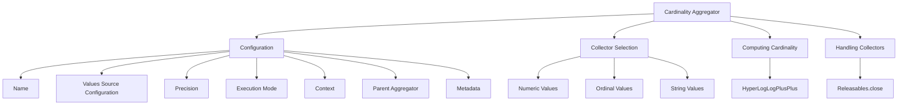

# Getting Started with Cardinality Aggregator in Metrics

The Cardinality Aggregator is an aggregator that computes approximate counts of unique values. It uses the <SwmToken path="server/src/main/java/org/elasticsearch/search/aggregations/metrics/CardinalityAggregator.java" pos="77:9:9" line-data="        this.counts = new HyperLogLogPlusPlus(precision, context.bigArrays(), 1);">`HyperLogLogPlusPlus`</SwmToken> algorithm to maintain the counts of unique values with a specified precision. The aggregator supports different types of values sources, including numeric, ordinal, and string values. Depending on the type of values source, it selects an appropriate collector to gather the data. The collected data is then used to compute the cardinality, which is the number of unique values. The precision of the cardinality estimation can be adjusted, affecting the memory usage and accuracy. The aggregator also provides methods to collect debug information and handle the lifecycle of the collectors.

<SwmSnippet path="/server/src/main/java/org/elasticsearch/search/aggregations/metrics/CardinalityAggregator.java" line="64">

---

## Cardinality Aggregator Configuration

The Cardinality Aggregator is configured with a name, values source configuration, precision, execution mode, context, parent aggregator, and metadata. This configuration is essential for setting up the aggregator correctly.

```java
    public CardinalityAggregator(
        String name,
        ValuesSourceConfig valuesSourceConfig,
        int precision,
        CardinalityAggregatorFactory.ExecutionMode executionMode,
        AggregationContext context,
        Aggregator parent,
        Map<String, Object> metadata
    ) throws IOException {
        super(name, context, parent, metadata);
        assert valuesSourceConfig.hasValues();
        this.valuesSource = valuesSourceConfig.getValuesSource();
        this.precision = precision;
        this.counts = new HyperLogLogPlusPlus(precision, context.bigArrays(), 1);
        this.executionMode = executionMode;
    }
```

---

</SwmSnippet>

<SwmSnippet path="/server/src/main/java/org/elasticsearch/search/aggregations/metrics/CardinalityAggregator.java" line="86">

---

## Selecting the Collector

The <SwmToken path="server/src/main/java/org/elasticsearch/search/aggregations/metrics/CardinalityAggregator.java" pos="86:5:5" line-data="    private Collector pickCollector(LeafReaderContext ctx) throws IOException {">`pickCollector`</SwmToken> method selects the appropriate collector based on the type of values source (numeric, ordinal, or string). This ensures that the data is collected efficiently and accurately.

```java
    private Collector pickCollector(LeafReaderContext ctx) throws IOException {
        if (valuesSource instanceof ValuesSource.Numeric source) {
            numericCollectorsUsed++;
            if (source.isFloatingPoint()) {
                SortedNumericDoubleValues values = source.doubleValues(ctx);
                NumericDoubleValues singleton = FieldData.unwrapSingleton(values);
                if (singleton != null) {
                    return new DirectSingleValuesCollector(counts, MurmurHash3SingleValues.hash(singleton));
                } else {
                    return new DirectMultiValuesCollector(counts, MurmurHash3MultiValues.hash(values));
                }
            } else {
                SortedNumericDocValues values = source.longValues(ctx);
                NumericDocValues singleton = DocValues.unwrapSingleton(values);
                if (singleton != null) {
                    return new DirectSingleValuesCollector(counts, MurmurHash3SingleValues.hash(singleton));
                } else {
                    return new DirectMultiValuesCollector(counts, MurmurHash3MultiValues.hash(values));
                }
            }
        }
```

---

</SwmSnippet>

<SwmSnippet path="/server/src/main/java/org/elasticsearch/search/aggregations/metrics/CardinalityAggregator.java" line="160">

---

## Computing Cardinality

The <SwmToken path="server/src/main/java/org/elasticsearch/search/aggregations/metrics/CardinalityAggregator.java" pos="161:5:5" line-data="    public double metric(long owningBucketOrd) {">`metric`</SwmToken> method computes the cardinality, which is the number of unique values, using the collected data. This is the core function that provides the unique count.

```java
    @Override
    public double metric(long owningBucketOrd) {
        return counts.cardinality(owningBucketOrd);
    }
```

---

</SwmSnippet>

<SwmSnippet path="/server/src/main/java/org/elasticsearch/search/aggregations/metrics/CardinalityAggregator.java" line="181">

---

## Handling Collectors

The <SwmToken path="server/src/main/java/org/elasticsearch/search/aggregations/metrics/CardinalityAggregator.java" pos="182:5:5" line-data="    protected void doClose() {">`doClose`</SwmToken> method handles the lifecycle of the collectors, ensuring they are properly closed and resources are released. This is crucial for maintaining performance and avoiding memory leaks.

```java
    @Override
    protected void doClose() {
        Releasables.close(counts, collector);
    }
```

---

</SwmSnippet>

## Main Functions

There are several main functions in this class. Some of them are <SwmToken path="server/src/main/java/org/elasticsearch/search/aggregations/metrics/CardinalityAggregator.java" pos="19:10:10" line-data="import org.apache.lucene.search.ScoreMode;">`ScoreMode`</SwmToken>, <SwmToken path="server/src/main/java/org/elasticsearch/search/aggregations/metrics/CardinalityAggregator.java" pos="86:5:5" line-data="    private Collector pickCollector(LeafReaderContext ctx) throws IOException {">`pickCollector`</SwmToken>, <SwmToken path="server/src/main/java/org/elasticsearch/search/aggregations/metrics/CardinalityAggregator.java" pos="137:5:5" line-data="    public LeafBucketCollector getLeafCollector(AggregationExecutionContext aggCtx, final LeafBucketCollector sub) throws IOException {">`getLeafCollector`</SwmToken>, <SwmToken path="server/src/main/java/org/elasticsearch/search/aggregations/metrics/CardinalityAggregator.java" pos="156:5:5" line-data="    protected void doPostCollection() throws IOException {">`doPostCollection`</SwmToken>, <SwmToken path="server/src/main/java/org/elasticsearch/search/aggregations/metrics/CardinalityAggregator.java" pos="161:5:5" line-data="    public double metric(long owningBucketOrd) {">`metric`</SwmToken>, <SwmToken path="server/src/main/java/org/elasticsearch/search/aggregations/metrics/CardinalityAggregator.java" pos="166:5:5" line-data="    public InternalAggregation buildAggregation(long owningBucketOrdinal) {">`buildAggregation`</SwmToken>, <SwmToken path="server/src/main/java/org/elasticsearch/search/aggregations/metrics/CardinalityAggregator.java" pos="168:3:3" line-data="            return buildEmptyAggregation();">`buildEmptyAggregation`</SwmToken>, <SwmToken path="server/src/main/java/org/elasticsearch/search/aggregations/metrics/CardinalityAggregator.java" pos="182:5:5" line-data="    protected void doClose() {">`doClose`</SwmToken>, and <SwmToken path="server/src/main/java/org/elasticsearch/search/aggregations/metrics/CardinalityAggregator.java" pos="187:5:5" line-data="    public void collectDebugInfo(BiConsumer&lt;String, Object&gt; add) {">`collectDebugInfo`</SwmToken>. We will dive a little into <SwmToken path="server/src/main/java/org/elasticsearch/search/aggregations/metrics/CardinalityAggregator.java" pos="86:5:5" line-data="    private Collector pickCollector(LeafReaderContext ctx) throws IOException {">`pickCollector`</SwmToken>, <SwmToken path="server/src/main/java/org/elasticsearch/search/aggregations/metrics/CardinalityAggregator.java" pos="161:5:5" line-data="    public double metric(long owningBucketOrd) {">`metric`</SwmToken>, and <SwmToken path="server/src/main/java/org/elasticsearch/search/aggregations/metrics/CardinalityAggregator.java" pos="166:5:5" line-data="    public InternalAggregation buildAggregation(long owningBucketOrdinal) {">`buildAggregation`</SwmToken>.

<SwmSnippet path="/server/src/main/java/org/elasticsearch/search/aggregations/metrics/CardinalityAggregator.java" line="86">

---

### <SwmToken path="server/src/main/java/org/elasticsearch/search/aggregations/metrics/CardinalityAggregator.java" pos="86:5:5" line-data="    private Collector pickCollector(LeafReaderContext ctx) throws IOException {">`pickCollector`</SwmToken>

The <SwmToken path="server/src/main/java/org/elasticsearch/search/aggregations/metrics/CardinalityAggregator.java" pos="86:5:5" line-data="    private Collector pickCollector(LeafReaderContext ctx) throws IOException {">`pickCollector`</SwmToken> function is responsible for selecting the appropriate collector based on the type of values source. It handles different types of values sources, including numeric, ordinal, and string values, and increments the corresponding counters for each type.

```java
    private Collector pickCollector(LeafReaderContext ctx) throws IOException {
        if (valuesSource instanceof ValuesSource.Numeric source) {
            numericCollectorsUsed++;
            if (source.isFloatingPoint()) {
                SortedNumericDoubleValues values = source.doubleValues(ctx);
                NumericDoubleValues singleton = FieldData.unwrapSingleton(values);
                if (singleton != null) {
                    return new DirectSingleValuesCollector(counts, MurmurHash3SingleValues.hash(singleton));
                } else {
                    return new DirectMultiValuesCollector(counts, MurmurHash3MultiValues.hash(values));
                }
            } else {
                SortedNumericDocValues values = source.longValues(ctx);
                NumericDocValues singleton = DocValues.unwrapSingleton(values);
                if (singleton != null) {
                    return new DirectSingleValuesCollector(counts, MurmurHash3SingleValues.hash(singleton));
                } else {
                    return new DirectMultiValuesCollector(counts, MurmurHash3MultiValues.hash(values));
                }
            }
        }
```

---

</SwmSnippet>

<SwmSnippet path="/server/src/main/java/org/elasticsearch/search/aggregations/metrics/CardinalityAggregator.java" line="160">

---

### metric

The <SwmToken path="server/src/main/java/org/elasticsearch/search/aggregations/metrics/CardinalityAggregator.java" pos="161:5:5" line-data="    public double metric(long owningBucketOrd) {">`metric`</SwmToken> function computes the cardinality for a given bucket ordinal. It retrieves the cardinality from the <SwmToken path="server/src/main/java/org/elasticsearch/search/aggregations/metrics/CardinalityAggregator.java" pos="77:9:9" line-data="        this.counts = new HyperLogLogPlusPlus(precision, context.bigArrays(), 1);">`HyperLogLogPlusPlus`</SwmToken> counts.

```java
    @Override
    public double metric(long owningBucketOrd) {
        return counts.cardinality(owningBucketOrd);
    }
```

---

</SwmSnippet>

<SwmSnippet path="/server/src/main/java/org/elasticsearch/search/aggregations/metrics/CardinalityAggregator.java" line="165">

---

### <SwmToken path="server/src/main/java/org/elasticsearch/search/aggregations/metrics/CardinalityAggregator.java" pos="166:5:5" line-data="    public InternalAggregation buildAggregation(long owningBucketOrdinal) {">`buildAggregation`</SwmToken>

The <SwmToken path="server/src/main/java/org/elasticsearch/search/aggregations/metrics/CardinalityAggregator.java" pos="166:5:5" line-data="    public InternalAggregation buildAggregation(long owningBucketOrdinal) {">`buildAggregation`</SwmToken> function constructs the final aggregation result. It checks if the bucket ordinal is valid and if the cardinality is non-zero. If valid, it clones the <SwmToken path="server/src/main/java/org/elasticsearch/search/aggregations/metrics/CardinalityAggregator.java" pos="77:9:9" line-data="        this.counts = new HyperLogLogPlusPlus(precision, context.bigArrays(), 1);">`HyperLogLogPlusPlus`</SwmToken> counts and creates a new <SwmToken path="server/src/main/java/org/elasticsearch/search/aggregations/metrics/CardinalityAggregator.java" pos="173:5:5" line-data="        return new InternalCardinality(name, copy, metadata());">`InternalCardinality`</SwmToken> aggregation.

```java
    @Override
    public InternalAggregation buildAggregation(long owningBucketOrdinal) {
        if (owningBucketOrdinal >= counts.maxOrd() || counts.cardinality(owningBucketOrdinal) == 0) {
            return buildEmptyAggregation();
        }
        // We need to build a copy because the returned Aggregation needs remain usable after
        // this Aggregator (and its HLL++ counters) is released.
        AbstractHyperLogLogPlusPlus copy = counts.clone(owningBucketOrdinal, BigArrays.NON_RECYCLING_INSTANCE);
        return new InternalCardinality(name, copy, metadata());
    }
```

---

</SwmSnippet>

&nbsp;

*This is an auto-generated document by Swimm AI 🌊 and has not yet been verified by a human*

<SwmMeta version="3.0.0" repo-id="Z2l0aHViJTNBJTNBZWxhc3RpY3NlYXJjaCUzQSUzQVN3aW1tLURlbW8=" repo-name="elasticsearch" doc-type="overview"><sup>Powered by [Swimm](/)</sup></SwmMeta>
