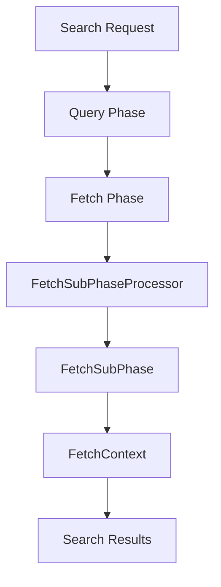

# Introduction

The Fetch Phase in Elasticsearch is responsible for retrieving search results from the shards. This document provides an overview of the key components involved in the Fetch Phase, including `FetchSearchResult`, <SwmToken path="server/src/main/java/org/elasticsearch/search/fetch/FetchSubPhase.java" pos="26:4:4" line-data="public interface FetchSubPhase {">`FetchSubPhase`</SwmToken>, <SwmToken path="server/src/main/java/org/elasticsearch/search/fetch/FetchContext.java" pos="37:4:4" line-data="public class FetchContext {">`FetchContext`</SwmToken>, and <SwmToken path="server/src/main/java/org/elasticsearch/search/fetch/FetchPhase.java" pos="56:3:3" line-data="    public FetchPhase(List&lt;FetchSubPhase&gt; fetchSubPhases) {">`FetchPhase`</SwmToken> classes.

# FetchSearchResult Class

The `FetchSearchResult` class encapsulates the results fetched from a shard. It includes methods for managing the lifecycle of the fetched results, such as `deallocate` for releasing resources and `initCounter` for initializing a counter used during the fetch phase. The `writeTo` method is used to serialize the fetch results, ensuring they can be transmitted over the network or stored.

# <SwmToken path="server/src/main/java/org/elasticsearch/search/fetch/FetchSubPhase.java" pos="26:4:4" line-data="public interface FetchSubPhase {">`FetchSubPhase`</SwmToken> Interface

The <SwmToken path="server/src/main/java/org/elasticsearch/search/fetch/FetchSubPhase.java" pos="26:4:4" line-data="public interface FetchSubPhase {">`FetchSubPhase`</SwmToken> interface defines a sub-phase within the fetch phase, used to fetch additional information about the documents, such as highlighting or matched queries. Each sub-phase must implement the <SwmToken path="server/src/main/java/org/elasticsearch/search/fetch/FetchSubPhase.java" pos="102:3:3" line-data="    FetchSubPhaseProcessor getProcessor(FetchContext fetchContext) throws IOException;">`getProcessor`</SwmToken> method, which returns a <SwmToken path="server/src/main/java/org/elasticsearch/search/fetch/FetchSubPhase.java" pos="97:11:11" line-data="     * Returns a {@link FetchSubPhaseProcessor} for this sub phase.">`FetchSubPhaseProcessor`</SwmToken> for executing the sub-phase logic.

<SwmSnippet path="/server/src/main/java/org/elasticsearch/search/fetch/FetchSubPhase.java" line="23">

---

The <SwmToken path="server/src/main/java/org/elasticsearch/search/fetch/FetchSubPhase.java" pos="26:4:4" line-data="public interface FetchSubPhase {">`FetchSubPhase`</SwmToken> interface and its <SwmToken path="server/src/main/java/org/elasticsearch/search/fetch/FetchSubPhase.java" pos="28:3:3" line-data="    class HitContext {">`HitContext`</SwmToken> class are crucial for fetching additional information about documents during the fetch phase.

```java
/**
 * Sub phase within the fetch phase used to fetch things *about* the documents like highlighting or matched queries.
 */
public interface FetchSubPhase {

    class HitContext {
        private final SearchHit hit;
        private final LeafReaderContext readerContext;
        private final int docId;
        private final Source source;
        private final Map<String, List<Object>> loadedFields;
        private final RankDoc rankDoc;

        public HitContext(
            SearchHit hit,
            LeafReaderContext context,
            int docId,
            Map<String, List<Object>> loadedFields,
            Source source,
            RankDoc rankDoc
        ) {
```

---

</SwmSnippet>

# <SwmToken path="server/src/main/java/org/elasticsearch/search/fetch/FetchContext.java" pos="37:4:4" line-data="public class FetchContext {">`FetchContext`</SwmToken> Class

The <SwmToken path="server/src/main/java/org/elasticsearch/search/fetch/FetchContext.java" pos="37:4:4" line-data="public class FetchContext {">`FetchContext`</SwmToken> class encapsulates the state required to execute fetch phases. It provides access to the search context, source loader, and configurations for fetching source and stored fields. The <SwmToken path="server/src/main/java/org/elasticsearch/search/fetch/FetchContext.java" pos="146:12:12" line-data="     * Should the response include `explain` output">`explain`</SwmToken> method determines if the response should include explanation output.

<SwmSnippet path="/server/src/main/java/org/elasticsearch/search/fetch/FetchContext.java" line="34">

---

The <SwmToken path="server/src/main/java/org/elasticsearch/search/fetch/FetchContext.java" pos="37:4:4" line-data="public class FetchContext {">`FetchContext`</SwmToken> class is essential for managing the state and configurations needed during the fetch phase.

```java
/**
 * Encapsulates state required to execute fetch phases
 */
public class FetchContext {

    private final SearchContext searchContext;
    private final SourceLoader sourceLoader;
    private final FetchSourceContext fetchSourceContext;
    private final StoredFieldsContext storedFieldsContext;

    /**
     * Create a FetchContext based on a SearchContext
     */
    public FetchContext(SearchContext searchContext) {
        this.searchContext = searchContext;
        this.sourceLoader = searchContext.newSourceLoader();
        this.storedFieldsContext = buildStoredFieldsContext(searchContext);
        this.fetchSourceContext = buildFetchSourceContext(searchContext);
    }

    private static FetchSourceContext buildFetchSourceContext(SearchContext in) {
```

---

</SwmSnippet>

# <SwmToken path="server/src/main/java/org/elasticsearch/search/fetch/FetchPhase.java" pos="56:3:3" line-data="    public FetchPhase(List&lt;FetchSubPhase&gt; fetchSubPhases) {">`FetchPhase`</SwmToken> Class

The <SwmToken path="server/src/main/java/org/elasticsearch/search/fetch/FetchPhase.java" pos="56:3:3" line-data="    public FetchPhase(List&lt;FetchSubPhase&gt; fetchSubPhases) {">`FetchPhase`</SwmToken> class manages the execution of various fetch <SwmToken path="server/src/main/java/org/elasticsearch/search/fetch/FetchPhase.java" pos="215:17:19" line-data="            throw new FetchPhaseExecutionException(target, &quot;Error building fetch sub-phases&quot;, e);">`sub-phases`</SwmToken>. It initializes the <SwmToken path="server/src/main/java/org/elasticsearch/search/fetch/FetchPhase.java" pos="215:17:19" line-data="            throw new FetchPhaseExecutionException(target, &quot;Error building fetch sub-phases&quot;, e);">`sub-phases`</SwmToken> and coordinates their execution to gather detailed information about the search hits.

<SwmSnippet path="/server/src/main/java/org/elasticsearch/search/fetch/FetchPhase.java" line="54">

---

The <SwmToken path="server/src/main/java/org/elasticsearch/search/fetch/FetchPhase.java" pos="56:3:3" line-data="    public FetchPhase(List&lt;FetchSubPhase&gt; fetchSubPhases) {">`FetchPhase`</SwmToken> class coordinates the execution of fetch <SwmToken path="server/src/main/java/org/elasticsearch/search/fetch/FetchPhase.java" pos="215:17:19" line-data="            throw new FetchPhaseExecutionException(target, &quot;Error building fetch sub-phases&quot;, e);">`sub-phases`</SwmToken> to gather detailed information about search hits.

```java
    private final FetchSubPhase[] fetchSubPhases;

    public FetchPhase(List<FetchSubPhase> fetchSubPhases) {
        this.fetchSubPhases = fetchSubPhases.toArray(new FetchSubPhase[fetchSubPhases.size() + 1]);
        this.fetchSubPhases[fetchSubPhases.size()] = new InnerHitsPhase(this);
    }

    public void execute(SearchContext context, int[] docIdsToLoad, RankDocShardInfo rankDocs) {
        if (LOGGER.isTraceEnabled()) {
            LOGGER.trace("{}", new SearchContextSourcePrinter(context));
        }

        if (context.isCancelled()) {
            throw new TaskCancelledException("cancelled");
        }

        if (docIdsToLoad == null || docIdsToLoad.length == 0) {
            // no individual hits to process, so we shortcut
            context.fetchResult()
                .shardResult(SearchHits.empty(context.queryResult().getTotalHits(), context.queryResult().getMaxScore()), null);
            return;
```

---

</SwmSnippet>

&nbsp;

*This is an auto-generated document by Swimm AI 🌊 and has not yet been verified by a human*

<SwmMeta version="3.0.0" repo-id="Z2l0aHViJTNBJTNBZWxhc3RpY3NlYXJjaCUzQSUzQVN3aW1tLURlbW8=" repo-name="elasticsearch" doc-type="overview"><sup>Powered by [Swimm](/)</sup></SwmMeta>
