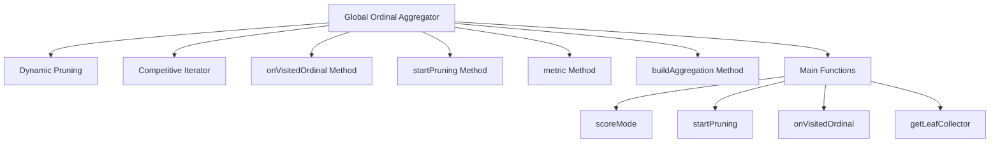

# Getting Started with Global Ordinal Aggregator in Metrics

The Global Ordinal Aggregator is an aggregator that computes approximate counts of unique values using global ordinals. It is designed to handle fields with a large number of unique terms by dynamically pruning fields that have more than 1024 unique terms.

Dynamic pruning is initiated when 128 or fewer ordinals have not been seen yet, optimizing the performance by reducing unnecessary computations. The aggregator uses a `CompetitiveIterator` to collect values that have not been collected so far, ensuring efficient data processing.

The `onVisitedOrdinal` method is called to track visited ordinals and initiate dynamic pruning when necessary. The `startPruning` method sets up the pruning process by identifying non-visited ordinals and preparing a priority queue for efficient iteration.

The `metric` method returns the cardinality of the collected unique values, providing an approximate count of unique terms. The `buildAggregation` method constructs the final aggregation result, ensuring that the returned aggregation remains usable after the aggregator is released.

# Dynamic Pruning

Dynamic pruning is initiated when 128 or fewer ordinals have not been seen yet, optimizing the performance by reducing unnecessary computations.

<SwmSnippet path="/server/src/main/java/org/elasticsearch/search/aggregations/metrics/GlobalOrdCardinalityAggregator.java" line="49">

---

The code snippet shows the constants used for dynamic pruning. Fields with more than 1024 unique terms are not dynamically pruned, and pruning starts when 128 or fewer ordinals have not been seen.

```java
    // Don't try to dynamically prune fields that have more than 1024 unique terms, there is a chance we never get to 128 unseen terms, and
    // we'd be paying the overhead of dynamic pruning without getting any benefits.
    private static final int MAX_FIELD_CARDINALITY_FOR_DYNAMIC_PRUNING = 1024;

    // Only start dynamic pruning when 128 ordinals or less have not been seen yet.
    private static final int MAX_TERMS_FOR_DYNAMIC_PRUNING = 128;
```

---

</SwmSnippet>

# Competitive Iterator

The aggregator uses a `CompetitiveIterator` to collect values that have not been collected so far, ensuring efficient data processing.

<SwmSnippet path="/server/src/main/java/org/elasticsearch/search/aggregations/metrics/GlobalOrdCardinalityAggregator.java" line="104">

---

The `CompetitiveIterator` class helps in collecting values that have not been collected so far. It uses a `BitArray` to track visited ordinals and iterates over the terms to collect non-visited ordinals.

```java
    /**
     * A competitive iterator that helps only collect values that have not been collected so far.
     */
    private class CompetitiveIterator extends DocIdSetIterator {

        private final BitArray visitedOrds;
        private long numNonVisitedOrds;
        private final TermsEnum indexTerms;
        private final DocIdSetIterator docsWithField;

        CompetitiveIterator(int numNonVisitedOrds, BitArray visitedOrds, Terms indexTerms, DocIdSetIterator docsWithField)
            throws IOException {
            this.visitedOrds = visitedOrds;
            this.numNonVisitedOrds = numNonVisitedOrds;
            this.indexTerms = Objects.requireNonNull(indexTerms).iterator();
            this.docsWithField = docsWithField;
        }
```

---

</SwmSnippet>

# onVisitedOrdinal Method

The `onVisitedOrdinal` method is called to track visited ordinals and initiate dynamic pruning when necessary.

<SwmSnippet path="/server/src/main/java/org/elasticsearch/search/aggregations/metrics/GlobalOrdCardinalityAggregator.java" line="185">

---

The `onVisitedOrdinal` method decreases the count of non-visited ordinals and initiates dynamic pruning if the count falls below the threshold.

```java
        void onVisitedOrdinal(long ordinal) throws IOException {
            numNonVisitedOrds--;
            if (nonVisitedOrds == null) {
                if (numNonVisitedOrds <= MAX_TERMS_FOR_DYNAMIC_PRUNING) {
                    startPruning();
                }
            } else {
                if (nonVisitedOrds.remove(ordinal) != null) {
                    // Could we make this more efficient?
                    nonVisitedPostings.clear();
                    for (PostingsEnum pe : nonVisitedOrds.values()) {
                        nonVisitedPostings.add(pe);
                    }
                }
            }
        }
```

---

</SwmSnippet>

<SwmSnippet path="/server/src/main/java/org/elasticsearch/search/aggregations/metrics/GlobalOrdCardinalityAggregator.java" line="159">

---

The `startPruning` method initializes the dynamic pruning process by iterating over the ordinals and setting up a priority queue for efficient iteration.

```java
        void startPruning() throws IOException {
            dynamicPruningSuccess++;
            nonVisitedOrds = new HashMap<>();
            // TODO: iterate the bitset using a `nextClearBit` operation?
            for (long ord = 0; ord < maxOrd; ++ord) {
                if (visitedOrds.get(ord)) {
                    continue;
                }
                BytesRef term = values.lookupOrd(ord);
                if (indexTerms.seekExact(term) == false) {
                    // This global ordinal maps to a value that doesn't exist in this segment
                    continue;
                }
                nonVisitedOrds.put(ord, indexTerms.postings(null, PostingsEnum.NONE));
            }
            nonVisitedPostings = new PriorityQueue<>(nonVisitedOrds.size()) {
                @Override
                protected boolean lessThan(PostingsEnum a, PostingsEnum b) {
                    return a.docID() < b.docID();
                }
            };
```

---

</SwmSnippet>

# metric Method

The `metric` method returns the cardinality of the collected unique values, providing an approximate count of unique terms.

<SwmSnippet path="/server/src/main/java/org/elasticsearch/search/aggregations/metrics/GlobalOrdCardinalityAggregator.java" line="363">

---

The `metric` method returns the cardinality of the collected unique values.

```java
    @Override
    public double metric(long owningBucketOrd) {
        return counts.cardinality(owningBucketOrd);
    }
```

---

</SwmSnippet>

# buildAggregation Method

The `buildAggregation` method constructs the final aggregation result, ensuring that the returned aggregation remains usable after the aggregator is released.

<SwmSnippet path="/server/src/main/java/org/elasticsearch/search/aggregations/metrics/GlobalOrdCardinalityAggregator.java" line="369">

---

The `buildAggregation` method constructs the final aggregation result by cloning the collected data to ensure usability after the aggregator is released.

```java
    public InternalAggregation buildAggregation(long owningBucketOrdinal) {
        if (counts == null || owningBucketOrdinal >= counts.maxOrd() || counts.cardinality(owningBucketOrdinal) == 0) {
            return buildEmptyAggregation();
        }
        // We need to build a copy because the returned Aggregation needs remain usable after
        // this Aggregator (and its HLL++ counters) is released.
        AbstractHyperLogLogPlusPlus copy = counts.clone(owningBucketOrdinal, BigArrays.NON_RECYCLING_INSTANCE);
        return new InternalCardinality(name, copy, metadata());
    }
```

---

</SwmSnippet>

## scoreMode

The `scoreMode` function determines the scoring mode based on the field and valuesSource properties. It returns different ScoreMode values such as TOP_DOCS, COMPLETE, or COMPLETE_NO_SCORES depending on the conditions.

<SwmSnippet path="/server/src/main/java/org/elasticsearch/search/aggregations/metrics/GlobalOrdCardinalityAggregator.java" line="93">

---

The `scoreMode` function returns different ScoreMode values based on the field and valuesSource properties.

```java
    @Override
    public ScoreMode scoreMode() {
        if (field != null && valuesSource.needsScores() == false && maxOrd <= MAX_FIELD_CARDINALITY_FOR_DYNAMIC_PRUNING) {
            return ScoreMode.TOP_DOCS;
        } else if (valuesSource.needsScores()) {
            return ScoreMode.COMPLETE;
        } else {
            return ScoreMode.COMPLETE_NO_SCORES;
        }
    }
```

---

</SwmSnippet>

<SwmSnippet path="/server/src/main/java/org/elasticsearch/search/aggregations/metrics/GlobalOrdCardinalityAggregator.java" line="159">

---

The `startPruning` function sets up the dynamic pruning process.

```java
        void startPruning() throws IOException {
            dynamicPruningSuccess++;
            nonVisitedOrds = new HashMap<>();
            // TODO: iterate the bitset using a `nextClearBit` operation?
            for (long ord = 0; ord < maxOrd; ++ord) {
                if (visitedOrds.get(ord)) {
                    continue;
                }
                BytesRef term = values.lookupOrd(ord);
                if (indexTerms.seekExact(term) == false) {
                    // This global ordinal maps to a value that doesn't exist in this segment
                    continue;
                }
                nonVisitedOrds.put(ord, indexTerms.postings(null, PostingsEnum.NONE));
            }
            nonVisitedPostings = new PriorityQueue<>(nonVisitedOrds.size()) {
                @Override
                protected boolean lessThan(PostingsEnum a, PostingsEnum b) {
                    return a.docID() < b.docID();
                }
            };
```

---

</SwmSnippet>

## onVisitedOrdinal

The `onVisitedOrdinal` function is called to track visited ordinals and initiate dynamic pruning when the number of non-visited ordinals falls below a certain threshold.

<SwmSnippet path="/server/src/main/java/org/elasticsearch/search/aggregations/metrics/GlobalOrdCardinalityAggregator.java" line="185">

---

The `onVisitedOrdinal` function tracks visited ordinals and initiates dynamic pruning.

```java
        void onVisitedOrdinal(long ordinal) throws IOException {
            numNonVisitedOrds--;
            if (nonVisitedOrds == null) {
                if (numNonVisitedOrds <= MAX_TERMS_FOR_DYNAMIC_PRUNING) {
                    startPruning();
                }
            } else {
                if (nonVisitedOrds.remove(ordinal) != null) {
                    // Could we make this more efficient?
                    nonVisitedPostings.clear();
                    for (PostingsEnum pe : nonVisitedOrds.values()) {
                        nonVisitedPostings.add(pe);
                    }
                }
            }
        }
```

---

</SwmSnippet>

## getLeafCollector

The `getLeafCollector` function returns a LeafBucketCollector that collects document ordinals and updates the visited ordinals bit array. It also sets up the CompetitiveIterator for efficient collection.

<SwmSnippet path="/server/src/main/java/org/elasticsearch/search/aggregations/metrics/GlobalOrdCardinalityAggregator.java" line="204">

---

The `getLeafCollector` function sets up the LeafBucketCollector and CompetitiveIterator for efficient collection.

```java
    public LeafBucketCollector getLeafCollector(AggregationExecutionContext aggCtx, final LeafBucketCollector sub) throws IOException {
        values = valuesSource.globalOrdinalsValues(aggCtx.getLeafReaderContext());
        final SortedDocValues singleton = DocValues.unwrapSingleton(values);
        if (parent == null && field != null) {
            // This optimization only applies to top-level cardinality aggregations that apply to fields indexed with an inverted index.
            final Terms indexTerms = aggCtx.getLeafReaderContext().reader().terms(field);
            if (indexTerms != null) {
                visitedOrds = bigArrays.grow(visitedOrds, 1);
                final int numNonVisitedOrds;
                {
                    final BitArray bits = visitedOrds.get(0);
                    numNonVisitedOrds = maxOrd - (bits == null ? 0 : (int) bits.cardinality());
                }
                if (maxOrd <= MAX_FIELD_CARDINALITY_FOR_DYNAMIC_PRUNING || numNonVisitedOrds <= MAX_TERMS_FOR_DYNAMIC_PRUNING) {
                    dynamicPruningAttempts++;
                    final BitArray bits = getNewOrExistingBitArray(0L);
                    final CompetitiveIterator competitiveIterator;
                    {
                        // This optimization only works for top-level cardinality aggregations that collect bucket 0, so we can retrieve
                        // the appropriate BitArray ahead of time.
                        final DocIdSetIterator docsWithField = valuesSource.ordinalsValues(aggCtx.getLeafReaderContext());
```

---

</SwmSnippet>

&nbsp;

*This is an auto-generated document by Swimm AI 🌊 and has not yet been verified by a human*

<SwmMeta version="3.0.0" repo-id="Z2l0aHViJTNBJTNBZWxhc3RpY3NlYXJjaCUzQSUzQVN3aW1tLURlbW8=" repo-name="elasticsearch" doc-type="overview"><sup>Powered by [Swimm](https://app.swimm.io/)</sup></SwmMeta>
