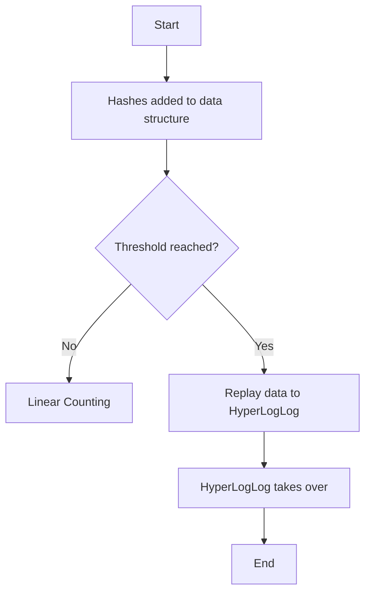

# Introduction

The <SwmToken path="server/src/main/java/org/elasticsearch/search/aggregations/metrics/HyperLogLogPlusPlus.java" pos="25:3:3" line-data=" * Hyperloglog++ counter, implemented based on pseudo code from">`Hyperloglog`</SwmToken> algorithm is used for approximating the number of distinct elements in a dataset, known as cardinality estimation. This document will guide you through getting started with the <SwmToken path="server/src/main/java/org/elasticsearch/search/aggregations/metrics/HyperLogLogPlusPlus.java" pos="25:3:3" line-data=" * Hyperloglog++ counter, implemented based on pseudo code from">`Hyperloglog`</SwmToken> algorithm in metrics, including its implementation, main functions, and how it is used in the codebase.

# <SwmToken path="server/src/main/java/org/elasticsearch/search/aggregations/metrics/HyperLogLogPlusPlus.java" pos="25:3:3" line-data=" * Hyperloglog++ counter, implemented based on pseudo code from">`Hyperloglog`</SwmToken> Algorithm

In the implementation, the <SwmToken path="server/src/main/java/org/elasticsearch/search/aggregations/metrics/HyperLogLogPlusPlus.java" pos="25:3:3" line-data=" * Hyperloglog++ counter, implemented based on pseudo code from">`Hyperloglog`</SwmToken> algorithm is combined with linear counting to improve performance and accuracy. Initially, hashes added to the data structure are processed using linear counting until a threshold defined by the precision is reached. Once the threshold is reached, the data is replayed to the <SwmToken path="server/src/main/java/org/elasticsearch/search/aggregations/metrics/HyperLogLogPlusPlus.java" pos="25:3:3" line-data=" * Hyperloglog++ counter, implemented based on pseudo code from">`Hyperloglog`</SwmToken> algorithm, which then takes over the counting process. This approach allows for faster processing initially with linear counting and then switches to the more space-efficient <SwmToken path="server/src/main/java/org/elasticsearch/search/aggregations/metrics/HyperLogLogPlusPlus.java" pos="25:3:3" line-data=" * Hyperloglog++ counter, implemented based on pseudo code from">`Hyperloglog`</SwmToken> algorithm for larger datasets. The implementation supports storing several <SwmToken path="server/src/main/java/org/elasticsearch/search/aggregations/metrics/HyperLogLogPlusPlus.java" pos="25:3:3" line-data=" * Hyperloglog++ counter, implemented based on pseudo code from">`Hyperloglog`</SwmToken> structures identified by a bucket number, allowing for efficient management of multiple datasets.

<SwmSnippet path="/server/src/main/java/org/elasticsearch/search/aggregations/metrics/HyperLogLogPlusPlus.java" line="24">

---

The <SwmToken path="server/src/main/java/org/elasticsearch/search/aggregations/metrics/HyperLogLogPlusPlus.java" pos="34:5:5" line-data=" * The HyperLogLogPlusPlus contains two algorithms, one for linear counting and the HyperLogLog algorithm. Initially hashes added to the">`HyperLogLogPlusPlus`</SwmToken> class contains two algorithms: one for linear counting and the <SwmToken path="server/src/main/java/org/elasticsearch/search/aggregations/metrics/HyperLogLogPlusPlus.java" pos="25:3:3" line-data=" * Hyperloglog++ counter, implemented based on pseudo code from">`Hyperloglog`</SwmToken> algorithm. Initially, hashes added to the data structure are processed using linear counting until a threshold defined by the precision is reached, at which point the data is replayed to the <SwmToken path="server/src/main/java/org/elasticsearch/search/aggregations/metrics/HyperLogLogPlusPlus.java" pos="25:3:3" line-data=" * Hyperloglog++ counter, implemented based on pseudo code from">`Hyperloglog`</SwmToken> algorithm.

```java
/**
 * Hyperloglog++ counter, implemented based on pseudo code from
 * <a href="http://static.googleusercontent.com/media/research.google.com/fr//pubs/archive/40671.pdf">this paper</a> and
 * <a href="https://docs.google.com/document/d/1gyjfMHy43U9OWBXxfaeG-3MjGzejW1dlpyMwEYAAWEI/view?fullscreen">its appendix</a>
 *
 * This implementation is different from the original implementation in that it uses a hash table instead of a sorted list for linear
 * counting. Although this requires more space and makes hyperloglog (which is less accurate) used sooner, this is also considerably faster.
 *
 * Trying to understand what this class does without having read the paper is considered adventurous.
 *
 * The HyperLogLogPlusPlus contains two algorithms, one for linear counting and the HyperLogLog algorithm. Initially hashes added to the
 * data structure are processed using the linear counting until a threshold defined by the precision is reached where the data is replayed
 * to the HyperLogLog algorithm and then this is used.
 *
 * It supports storing several HyperLogLogPlusPlus structures which are identified by a bucket number.
 */
```

---

</SwmSnippet>

# Main Functions

The main functions of the <SwmToken path="server/src/main/java/org/elasticsearch/search/aggregations/metrics/HyperLogLogPlusPlus.java" pos="25:3:3" line-data=" * Hyperloglog++ counter, implemented based on pseudo code from">`Hyperloglog`</SwmToken> algorithm implementation include <SwmToken path="server/src/main/java/org/elasticsearch/search/aggregations/metrics/HyperLogLogPlusPlus.java" pos="53:7:7" line-data="    public static int precisionFromThreshold(long count) {">`precisionFromThreshold`</SwmToken>, <SwmToken path="server/src/main/java/org/elasticsearch/search/aggregations/metrics/HyperLogLogPlusPlus.java" pos="64:7:7" line-data="    public static long memoryUsage(int precision) {">`memoryUsage`</SwmToken>, <SwmToken path="server/src/main/java/org/elasticsearch/search/aggregations/metrics/HyperLogLogPlusPlus.java" pos="119:5:5" line-data="    public void collect(long bucket, long hash) {">`collect`</SwmToken>, and <SwmToken path="server/src/main/java/org/elasticsearch/search/aggregations/metrics/HyperLogLogPlusPlus.java" pos="167:5:5" line-data="    public void merge(long thisBucket, AbstractHyperLogLogPlusPlus other, long otherBucket) {">`merge`</SwmToken>. Each function plays a crucial role in the algorithm's operation and efficiency.

## <SwmToken path="server/src/main/java/org/elasticsearch/search/aggregations/metrics/HyperLogLogPlusPlus.java" pos="53:7:7" line-data="    public static int precisionFromThreshold(long count) {">`precisionFromThreshold`</SwmToken>

The <SwmToken path="server/src/main/java/org/elasticsearch/search/aggregations/metrics/HyperLogLogPlusPlus.java" pos="53:7:7" line-data="    public static int precisionFromThreshold(long count) {">`precisionFromThreshold`</SwmToken> function computes the required precision so that a given number of distinct entries would be counted with linear counting. It ensures the precision is within the minimum and maximum bounds.

## <SwmToken path="server/src/main/java/org/elasticsearch/search/aggregations/metrics/HyperLogLogPlusPlus.java" pos="64:7:7" line-data="    public static long memoryUsage(int precision) {">`memoryUsage`</SwmToken>

The <SwmToken path="server/src/main/java/org/elasticsearch/search/aggregations/metrics/HyperLogLogPlusPlus.java" pos="64:7:7" line-data="    public static long memoryUsage(int precision) {">`memoryUsage`</SwmToken> function returns the expected <SwmToken path="server/src/main/java/org/elasticsearch/search/aggregations/metrics/HyperLogLogPlusPlus.java" pos="62:9:11" line-data="     * Return the expected per-bucket memory usage for the given precision.">`per-bucket`</SwmToken> memory usage for a given precision. This helps in estimating the memory requirements for storing the <SwmToken path="server/src/main/java/org/elasticsearch/search/aggregations/metrics/HyperLogLogPlusPlus.java" pos="25:3:3" line-data=" * Hyperloglog++ counter, implemented based on pseudo code from">`Hyperloglog`</SwmToken> structures.

<SwmSnippet path="/server/src/main/java/org/elasticsearch/search/aggregations/metrics/HyperLogLogPlusPlus.java" line="61">

---

The <SwmToken path="server/src/main/java/org/elasticsearch/search/aggregations/metrics/HyperLogLogPlusPlus.java" pos="64:7:7" line-data="    public static long memoryUsage(int precision) {">`memoryUsage`</SwmToken> function provides an estimate of the memory usage per bucket based on the given precision.

```java
    /**
     * Return the expected per-bucket memory usage for the given precision.
     */
    public static long memoryUsage(int precision) {
        return 1L << precision;
    }
```

---

</SwmSnippet>

<SwmSnippet path="/server/src/main/java/org/elasticsearch/search/aggregations/metrics/HyperLogLogPlusPlus.java" line="119">

---

The <SwmToken path="server/src/main/java/org/elasticsearch/search/aggregations/metrics/HyperLogLogPlusPlus.java" pos="119:5:5" line-data="    public void collect(long bucket, long hash) {">`collect`</SwmToken> function handles the addition of hashes to the data structure, switching from linear counting to <SwmToken path="server/src/main/java/org/elasticsearch/search/aggregations/metrics/HyperLogLogPlusPlus.java" pos="25:3:3" line-data=" * Hyperloglog++ counter, implemented based on pseudo code from">`Hyperloglog`</SwmToken> when the threshold is exceeded.

```java
    public void collect(long bucket, long hash) {
        hll.ensureCapacity(bucket + 1);
        if (algorithm.get(bucket) == LINEAR_COUNTING) {
            final int newSize = lc.collect(bucket, hash);
            if (newSize > lc.threshold) {
                upgradeToHll(bucket);
            }
        } else {
            hll.collect(bucket, hash);
        }
    }
```

---

</SwmSnippet>

## merge

The <SwmToken path="server/src/main/java/org/elasticsearch/search/aggregations/metrics/HyperLogLogPlusPlus.java" pos="167:5:5" line-data="    public void merge(long thisBucket, AbstractHyperLogLogPlusPlus other, long otherBucket) {">`merge`</SwmToken> function combines the data from another <SwmToken path="server/src/main/java/org/elasticsearch/search/aggregations/metrics/HyperLogLogPlusPlus.java" pos="34:5:5" line-data=" * The HyperLogLogPlusPlus contains two algorithms, one for linear counting and the HyperLogLog algorithm. Initially hashes added to the">`HyperLogLogPlusPlus`</SwmToken> structure into the current one. It ensures that the precision matches and merges the data based on the algorithm used by the other structure.

<SwmSnippet path="/server/src/main/java/org/elasticsearch/search/aggregations/metrics/HyperLogLogPlusPlus.java" line="167">

---

The <SwmToken path="server/src/main/java/org/elasticsearch/search/aggregations/metrics/HyperLogLogPlusPlus.java" pos="167:5:5" line-data="    public void merge(long thisBucket, AbstractHyperLogLogPlusPlus other, long otherBucket) {">`merge`</SwmToken> function merges data from another <SwmToken path="server/src/main/java/org/elasticsearch/search/aggregations/metrics/HyperLogLogPlusPlus.java" pos="34:5:5" line-data=" * The HyperLogLogPlusPlus contains two algorithms, one for linear counting and the HyperLogLog algorithm. Initially hashes added to the">`HyperLogLogPlusPlus`</SwmToken> structure, ensuring precision consistency and merging based on the algorithm used.

```java
    public void merge(long thisBucket, AbstractHyperLogLogPlusPlus other, long otherBucket) {
        if (precision() != other.precision()) {
            throw new IllegalArgumentException();
        }
        hll.ensureCapacity(thisBucket + 1);
        if (other.getAlgorithm(otherBucket) == LINEAR_COUNTING) {
            merge(thisBucket, other.getLinearCounting(otherBucket));
        } else {
            merge(thisBucket, other.getHyperLogLog(otherBucket));
        }
    }
```

---

</SwmSnippet>

&nbsp;

*This is an auto-generated document by Swimm AI 🌊 and has not yet been verified by a human*

<SwmMeta version="3.0.0" repo-id="Z2l0aHViJTNBJTNBZWxhc3RpY3NlYXJjaCUzQSUzQVN3aW1tLURlbW8=" repo-name="elasticsearch" doc-type="overview"><sup>Powered by [Swimm](/)</sup></SwmMeta>
