```mermaid
classDiagram
    class Profilers {
        QueryProfiler QueryProfiler
        AggregationProfiler aggProfiler
        DfsProfiler DfsProfiler
        +Profilers(ContextIndexSearcher searcher)
        +QueryProfiler getCurrentQueryProfiler()
        +AggregationProfiler getAggregationProfiler()
    }
    class SearchProfileQueryPhaseResult {
        +SearchProfileQueryPhaseResult(List<QueryProfileShardResult> queryResults, AggregationProfileShardResult aggResults)
    }
    class QueryProfileShardResult {
        +QueryProfileShardResult(Object tree, long rewriteTime, Object collectorResult, Object other)
    }
    class AggregationProfileShardResult {
        +AggregationProfileShardResult(Object tree)
    }
    Profilers --> QueryProfiler
    Profilers --> AggregationProfiler
    Profilers --> DfsProfiler
    SearchProfileQueryPhaseResult --> QueryProfileShardResult
    SearchProfileQueryPhaseResult --> AggregationProfileShardResult

%% Swimm:
%% classDiagram
%%     class Profilers {
%%         <SwmToken path="server/src/main/java/org/elasticsearch/search/profile/Profilers.java" pos="24:5:5" line-data="    private final QueryProfiler queryProfiler;">`QueryProfiler`</SwmToken> <SwmToken path="server/src/main/java/org/elasticsearch/search/profile/Profilers.java" pos="24:5:5" line-data="    private final QueryProfiler queryProfiler;">`QueryProfiler`</SwmToken>
%%         <SwmToken path="server/src/main/java/org/elasticsearch/search/profile/Profilers.java" pos="25:5:5" line-data="    private final AggregationProfiler aggProfiler = new AggregationProfiler();">`AggregationProfiler`</SwmToken> <SwmToken path="server/src/main/java/org/elasticsearch/search/profile/Profilers.java" pos="25:7:7" line-data="    private final AggregationProfiler aggProfiler = new AggregationProfiler();">`aggProfiler`</SwmToken>
%%         <SwmToken path="server/src/main/java/org/elasticsearch/search/profile/Profilers.java" pos="26:3:3" line-data="    private DfsProfiler dfsProfiler;">`DfsProfiler`</SwmToken> <SwmToken path="server/src/main/java/org/elasticsearch/search/profile/Profilers.java" pos="26:3:3" line-data="    private DfsProfiler dfsProfiler;">`DfsProfiler`</SwmToken>
%%         +Profilers(ContextIndexSearcher searcher)
%%         +QueryProfiler <SwmToken path="server/src/main/java/org/elasticsearch/search/profile/Profilers.java" pos="36:5:7" line-data="    public QueryProfiler getCurrentQueryProfiler() {">`getCurrentQueryProfiler()`</SwmToken>
%%         +AggregationProfiler <SwmToken path="server/src/main/java/org/elasticsearch/search/profile/Profilers.java" pos="40:5:7" line-data="    public AggregationProfiler getAggregationProfiler() {">`getAggregationProfiler()`</SwmToken>
%%     }
%%     class <SwmToken path="server/src/main/java/org/elasticsearch/search/profile/Profilers.java" pos="64:3:3" line-data="    public SearchProfileQueryPhaseResult buildQueryPhaseResults() {">`SearchProfileQueryPhaseResult`</SwmToken> {
%%         +SearchProfileQueryPhaseResult(List<QueryProfileShardResult> queryResults, <SwmToken path="server/src/main/java/org/elasticsearch/search/profile/Profilers.java" pos="71:1:1" line-data="        AggregationProfileShardResult aggResults = new AggregationProfileShardResult(aggProfiler.getTree());">`AggregationProfileShardResult`</SwmToken> <SwmToken path="server/src/main/java/org/elasticsearch/search/profile/Profilers.java" pos="71:3:3" line-data="        AggregationProfileShardResult aggResults = new AggregationProfileShardResult(aggProfiler.getTree());">`aggResults`</SwmToken>)
%%     }
%%     class <SwmToken path="server/src/main/java/org/elasticsearch/search/profile/Profilers.java" pos="65:1:1" line-data="        QueryProfileShardResult result = new QueryProfileShardResult(">`QueryProfileShardResult`</SwmToken> {
%%         +QueryProfileShardResult(Object tree, long rewriteTime, Object collectorResult, Object other)
%%     }
%%     class <SwmToken path="server/src/main/java/org/elasticsearch/search/profile/Profilers.java" pos="71:1:1" line-data="        AggregationProfileShardResult aggResults = new AggregationProfileShardResult(aggProfiler.getTree());">`AggregationProfileShardResult`</SwmToken> {
%%         +AggregationProfileShardResult(Object tree)
%%     }
%%     Profilers --> <SwmToken path="server/src/main/java/org/elasticsearch/search/profile/Profilers.java" pos="24:5:5" line-data="    private final QueryProfiler queryProfiler;">`QueryProfiler`</SwmToken>
%%     Profilers --> <SwmToken path="server/src/main/java/org/elasticsearch/search/profile/Profilers.java" pos="25:5:5" line-data="    private final AggregationProfiler aggProfiler = new AggregationProfiler();">`AggregationProfiler`</SwmToken>
%%     Profilers --> <SwmToken path="server/src/main/java/org/elasticsearch/search/profile/Profilers.java" pos="26:3:3" line-data="    private DfsProfiler dfsProfiler;">`DfsProfiler`</SwmToken>
%%     <SwmToken path="server/src/main/java/org/elasticsearch/search/profile/Profilers.java" pos="64:3:3" line-data="    public SearchProfileQueryPhaseResult buildQueryPhaseResults() {">`SearchProfileQueryPhaseResult`</SwmToken> --> <SwmToken path="server/src/main/java/org/elasticsearch/search/profile/Profilers.java" pos="65:1:1" line-data="        QueryProfileShardResult result = new QueryProfileShardResult(">`QueryProfileShardResult`</SwmToken>
%%     <SwmToken path="server/src/main/java/org/elasticsearch/search/profile/Profilers.java" pos="64:3:3" line-data="    public SearchProfileQueryPhaseResult buildQueryPhaseResults() {">`SearchProfileQueryPhaseResult`</SwmToken> --> <SwmToken path="server/src/main/java/org/elasticsearch/search/profile/Profilers.java" pos="71:1:1" line-data="        AggregationProfileShardResult aggResults = new AggregationProfileShardResult(aggProfiler.getTree());">`AggregationProfileShardResult`</SwmToken>
```

# Getting Started with Search Profiling

Search Profiling in Elasticsearch refers to the collection of profiling data during the execution of search queries. It is used to analyze and optimize the performance of search operations. The profiling data includes detailed information about the time spent in different phases of the search, such as query execution, fetching, and aggregation.

# Profilers Class

The <SwmToken path="server/src/main/java/org/elasticsearch/search/profile/Profilers.java" pos="21:10:10" line-data="/** Wrapper around all the profilers that makes management easier. */">`profilers`</SwmToken> class acts as a wrapper around all the profilers, making management easier. It includes profilers for different phases like query, aggregation, and fetch. This class is essential for managing the different profiling components in a unified manner.

<SwmSnippet path="/server/src/main/java/org/elasticsearch/search/profile/Profilers.java" line="21">

---

The <SwmToken path="server/src/main/java/org/elasticsearch/search/profile/Profilers.java" pos="21:10:10" line-data="/** Wrapper around all the profilers that makes management easier. */">`profilers`</SwmToken> class initializes the different profilers and sets up the query profiler with the searcher.

```java
/** Wrapper around all the profilers that makes management easier. */
public final class Profilers {

    private final QueryProfiler queryProfiler;
    private final AggregationProfiler aggProfiler = new AggregationProfiler();
    private DfsProfiler dfsProfiler;

    public Profilers(ContextIndexSearcher searcher) {
        this.queryProfiler = new QueryProfiler();
        searcher.setProfiler(this.queryProfiler);
    }
```

---

</SwmSnippet>

<SwmSnippet path="/server/src/main/java/org/elasticsearch/search/profile/Profilers.java" line="33">

---

The <SwmToken path="server/src/main/java/org/elasticsearch/search/profile/Profilers.java" pos="36:5:5" line-data="    public QueryProfiler getCurrentQueryProfiler() {">`getCurrentQueryProfiler`</SwmToken> method returns the current query profiler, and the <SwmToken path="server/src/main/java/org/elasticsearch/search/profile/Profilers.java" pos="40:5:5" line-data="    public AggregationProfiler getAggregationProfiler() {">`getAggregationProfiler`</SwmToken> method returns the aggregation profiler.

```java
    /**
     * Get the profiler for the query we are currently processing.
     */
    public QueryProfiler getCurrentQueryProfiler() {
        return queryProfiler;
    }

    public AggregationProfiler getAggregationProfiler() {
        return aggProfiler;
```

---

</SwmSnippet>

# Profiling Results

Profiling results are collected and structured in classes like `SearchProfileResults` and <SwmToken path="server/src/main/java/org/elasticsearch/search/profile/Profilers.java" pos="64:3:3" line-data="    public SearchProfileQueryPhaseResult buildQueryPhaseResults() {">`SearchProfileQueryPhaseResult`</SwmToken>. These classes are used to generate detailed reports that help in identifying bottlenecks and understanding the performance characteristics of search queries.

<SwmSnippet path="/server/src/main/java/org/elasticsearch/search/profile/Profilers.java" line="64">

---

The <SwmToken path="server/src/main/java/org/elasticsearch/search/profile/Profilers.java" pos="64:5:5" line-data="    public SearchProfileQueryPhaseResult buildQueryPhaseResults() {">`buildQueryPhaseResults`</SwmToken> method in the <SwmToken path="server/src/main/java/org/elasticsearch/search/profile/Profilers.java" pos="21:10:10" line-data="/** Wrapper around all the profilers that makes management easier. */">`profilers`</SwmToken> class constructs the profiling results for the query phase, including both query and aggregation results.

```java
    public SearchProfileQueryPhaseResult buildQueryPhaseResults() {
        QueryProfileShardResult result = new QueryProfileShardResult(
            queryProfiler.getTree(),
            queryProfiler.getRewriteTime(),
            queryProfiler.getCollectorResult(),
            null
        );
        AggregationProfileShardResult aggResults = new AggregationProfileShardResult(aggProfiler.getTree());
        return new SearchProfileQueryPhaseResult(Collections.singletonList(result), aggResults);
    }
```

---

</SwmSnippet>

# Performance Optimization

The detailed reports generated from profiling results are crucial for identifying bottlenecks and optimizing the performance of search queries. By analyzing these reports, developers can make informed decisions to enhance the efficiency of their search operations.

&nbsp;

*This is an auto-generated document by Swimm AI 🌊 and has not yet been verified by a human*

<SwmMeta version="3.0.0" repo-id="Z2l0aHViJTNBJTNBZWxhc3RpY3NlYXJjaCUzQSUzQVN3aW1tLURlbW8=" repo-name="elasticsearch" doc-type="overview"><sup>Powered by [Swimm](/)</sup></SwmMeta>
