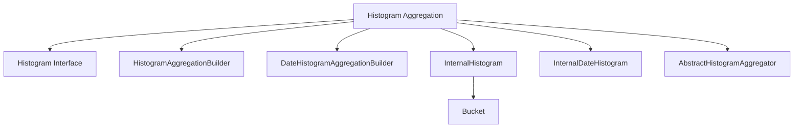

# Introduction to Histogram Aggregation

A Histogram in Elasticsearch is a type of aggregation that organizes data into buckets based on intervals. Each bucket represents a range of values and contains a count of documents that fall within that range. This allows for the analysis of data distribution over these intervals.

# Histogram Interface

The <SwmToken path="server/src/main/java/org/elasticsearch/search/aggregations/bucket/histogram/Histogram.java" pos="14:9:9" line-data=" * A {@code histogram} aggregation. Defines multiple buckets, each representing an interval in a histogram.">`histogram`</SwmToken> interface defines the structure and behavior of histogram aggregations. It includes fields for interval, offset, order, and other parameters that control the aggregation's behavior.

<SwmSnippet path="/server/src/main/java/org/elasticsearch/search/aggregations/bucket/histogram/Histogram.java" line="13">

---

The <SwmToken path="server/src/main/java/org/elasticsearch/search/aggregations/bucket/histogram/Histogram.java" pos="14:9:9" line-data=" * A {@code histogram} aggregation. Defines multiple buckets, each representing an interval in a histogram.">`histogram`</SwmToken> interface defines multiple buckets, each representing an interval in a histogram. It includes fields such as <SwmToken path="server/src/main/java/org/elasticsearch/search/aggregations/bucket/histogram/Histogram.java" pos="14:28:28" line-data=" * A {@code histogram} aggregation. Defines multiple buckets, each representing an interval in a histogram.">`interval`</SwmToken>, <SwmToken path="server/src/main/java/org/elasticsearch/search/aggregations/bucket/histogram/Histogram.java" pos="19:12:12" line-data="    ParseField OFFSET_FIELD = new ParseField(&quot;offset&quot;);">`offset`</SwmToken>, <SwmToken path="server/src/main/java/org/elasticsearch/search/aggregations/bucket/histogram/Histogram.java" pos="20:12:12" line-data="    ParseField ORDER_FIELD = new ParseField(&quot;order&quot;);">`order`</SwmToken>, <SwmToken path="server/src/main/java/org/elasticsearch/search/aggregations/bucket/histogram/Histogram.java" pos="21:12:12" line-data="    ParseField KEYED_FIELD = new ParseField(&quot;keyed&quot;);">`keyed`</SwmToken>, <SwmToken path="server/src/main/java/org/elasticsearch/search/aggregations/bucket/histogram/Histogram.java" pos="22:12:12" line-data="    ParseField MIN_DOC_COUNT_FIELD = new ParseField(&quot;min_doc_count&quot;);">`min_doc_count`</SwmToken>, <SwmToken path="server/src/main/java/org/elasticsearch/search/aggregations/bucket/histogram/Histogram.java" pos="23:12:12" line-data="    ParseField EXTENDED_BOUNDS_FIELD = new ParseField(&quot;extended_bounds&quot;);">`extended_bounds`</SwmToken>, and <SwmToken path="server/src/main/java/org/elasticsearch/search/aggregations/bucket/histogram/Histogram.java" pos="24:12:12" line-data="    ParseField HARD_BOUNDS_FIELD = new ParseField(&quot;hard_bounds&quot;);">`hard_bounds`</SwmToken>.

```java
/**
 * A {@code histogram} aggregation. Defines multiple buckets, each representing an interval in a histogram.
 */
public interface Histogram extends MultiBucketsAggregation {

    ParseField INTERVAL_FIELD = new ParseField("interval");
    ParseField OFFSET_FIELD = new ParseField("offset");
    ParseField ORDER_FIELD = new ParseField("order");
    ParseField KEYED_FIELD = new ParseField("keyed");
    ParseField MIN_DOC_COUNT_FIELD = new ParseField("min_doc_count");
    ParseField EXTENDED_BOUNDS_FIELD = new ParseField("extended_bounds");
    ParseField HARD_BOUNDS_FIELD = new ParseField("hard_bounds");
```

---

</SwmSnippet>

# Histogram Aggregation Builder

The `HistogramAggregationBuilder` class is responsible for parsing and building histogram aggregations. It uses the fields defined in the <SwmToken path="server/src/main/java/org/elasticsearch/search/aggregations/bucket/histogram/Histogram.java" pos="14:9:9" line-data=" * A {@code histogram} aggregation. Defines multiple buckets, each representing an interval in a histogram.">`histogram`</SwmToken> interface to configure the aggregation.

# Date Histogram Aggregation

The `DateHistogramAggregationBuilder` class extends the functionality of histogram aggregations to handle date intervals. It allows for the grouping of documents based on calendar intervals, such as days, months, or years.

<SwmSnippet path="/server/src/main/java/org/elasticsearch/search/aggregations/bucket/histogram/DateHistogramAggregator.java" line="340">

---

The <SwmToken path="server/src/main/java/org/elasticsearch/search/aggregations/bucket/histogram/DateHistogramAggregator.java" pos="56:20:20" line-data=" * {@link FromDateRange} is faster than {@link DateHistogramAggregator}">`DateHistogramAggregator`</SwmToken> class builds aggregations for variable buckets and ensures that shards return buckets ordered by key in ascending order.

```java
        return buildAggregationsForVariableBuckets(owningBucketOrds, bucketOrds, (bucketValue, docCount, subAggregationResults) -> {
            return new InternalDateHistogram.Bucket(bucketValue, docCount, keyed, formatter, subAggregationResults);
        }, (owningBucketOrd, buckets) -> {
            // the contract of the histogram aggregation is that shards must return buckets ordered by key in ascending order
            CollectionUtil.introSort(buckets, BucketOrder.key(true).comparator());

            InternalDateHistogram.EmptyBucketInfo emptyBucketInfo = minDocCount == 0
                ? new InternalDateHistogram.EmptyBucketInfo(rounding.withoutOffset(), buildEmptySubAggregations(), extendedBounds)
                : null;
            return new InternalDateHistogram(
```

---

</SwmSnippet>

# Internal Histogram

The <SwmToken path="server/src/main/java/org/elasticsearch/search/aggregations/bucket/histogram/AbstractHistogramAggregator.java" pos="20:14:14" line-data="import org.elasticsearch.search.aggregations.bucket.histogram.InternalHistogram.EmptyBucketInfo;">`InternalHistogram`</SwmToken> class represents the results of histogram aggregations. It contains the buckets and provides methods to access the aggregated data.

# Bucket Class

The <SwmToken path="server/src/main/java/org/elasticsearch/search/aggregations/bucket/histogram/DateHistogramAggregator.java" pos="341:7:7" line-data="            return new InternalDateHistogram.Bucket(bucketValue, docCount, keyed, formatter, subAggregationResults);">`Bucket`</SwmToken> class within the <SwmToken path="server/src/main/java/org/elasticsearch/search/aggregations/bucket/histogram/AbstractHistogramAggregator.java" pos="20:14:14" line-data="import org.elasticsearch.search.aggregations.bucket.histogram.InternalHistogram.EmptyBucketInfo;">`InternalHistogram`</SwmToken> and <SwmToken path="server/src/main/java/org/elasticsearch/search/aggregations/bucket/histogram/DateHistogramAggregator.java" pos="341:5:5" line-data="            return new InternalDateHistogram.Bucket(bucketValue, docCount, keyed, formatter, subAggregationResults);">`InternalDateHistogram`</SwmToken> classes represents individual buckets in the histogram. Each bucket contains a key (the interval value), a document count, and any sub-aggregations.

# Abstract Histogram Aggregator

The <SwmToken path="server/src/main/java/org/elasticsearch/search/aggregations/bucket/histogram/AbstractHistogramAggregator.java" pos="36:6:6" line-data="public abstract class AbstractHistogramAggregator extends BucketsAggregator {">`AbstractHistogramAggregator`</SwmToken> class provides the base functionality for histogram aggregators. It handles the creation and management of buckets, as well as the aggregation of document counts.

<SwmSnippet path="/server/src/main/java/org/elasticsearch/search/aggregations/bucket/histogram/AbstractHistogramAggregator.java" line="32">

---

The <SwmToken path="server/src/main/java/org/elasticsearch/search/aggregations/bucket/histogram/AbstractHistogramAggregator.java" pos="36:6:6" line-data="public abstract class AbstractHistogramAggregator extends BucketsAggregator {">`AbstractHistogramAggregator`</SwmToken> class is the base class for functionality shared between aggregators for histogram aggregation. It includes fields such as <SwmToken path="server/src/main/java/org/elasticsearch/search/aggregations/bucket/histogram/AbstractHistogramAggregator.java" pos="37:7:7" line-data="    protected final DocValueFormat formatter;">`formatter`</SwmToken>, <SwmToken path="server/src/main/java/org/elasticsearch/search/aggregations/bucket/histogram/AbstractHistogramAggregator.java" pos="38:7:7" line-data="    protected final double interval;">`interval`</SwmToken>, <SwmToken path="server/src/main/java/org/elasticsearch/search/aggregations/bucket/histogram/AbstractHistogramAggregator.java" pos="39:7:7" line-data="    protected final double offset;">`offset`</SwmToken>, <SwmToken path="server/src/main/java/org/elasticsearch/search/aggregations/bucket/histogram/AbstractHistogramAggregator.java" pos="40:7:7" line-data="    protected final BucketOrder order;">`order`</SwmToken>, <SwmToken path="server/src/main/java/org/elasticsearch/search/aggregations/bucket/histogram/AbstractHistogramAggregator.java" pos="41:7:7" line-data="    protected final boolean keyed;">`keyed`</SwmToken>, <SwmToken path="server/src/main/java/org/elasticsearch/search/aggregations/bucket/histogram/AbstractHistogramAggregator.java" pos="42:7:7" line-data="    protected final long minDocCount;">`minDocCount`</SwmToken>, <SwmToken path="server/src/main/java/org/elasticsearch/search/aggregations/bucket/histogram/AbstractHistogramAggregator.java" pos="43:7:7" line-data="    protected final DoubleBounds extendedBounds;">`extendedBounds`</SwmToken>, and <SwmToken path="server/src/main/java/org/elasticsearch/search/aggregations/bucket/histogram/AbstractHistogramAggregator.java" pos="44:7:7" line-data="    protected final DoubleBounds hardBounds;">`hardBounds`</SwmToken>.

```java
/**
 * Base class for functionality shared between aggregators for this
 * {@code histogram} aggregation.
 */
public abstract class AbstractHistogramAggregator extends BucketsAggregator {
    protected final DocValueFormat formatter;
    protected final double interval;
    protected final double offset;
    protected final BucketOrder order;
    protected final boolean keyed;
    protected final long minDocCount;
    protected final DoubleBounds extendedBounds;
    protected final DoubleBounds hardBounds;
    protected final LongKeyedBucketOrds bucketOrds;

    @SuppressWarnings("this-escape")
    public AbstractHistogramAggregator(
        String name,
        AggregatorFactories factories,
        double interval,
        double offset,
```

---

</SwmSnippet>

&nbsp;

*This is an auto-generated document by Swimm AI 🌊 and has not yet been verified by a human*

<SwmMeta version="3.0.0" repo-id="Z2l0aHViJTNBJTNBZWxhc3RpY3NlYXJjaCUzQSUzQVN3aW1tLURlbW8=" repo-name="elasticsearch" doc-type="overview"><sup>Powered by [Swimm](/)</sup></SwmMeta>
