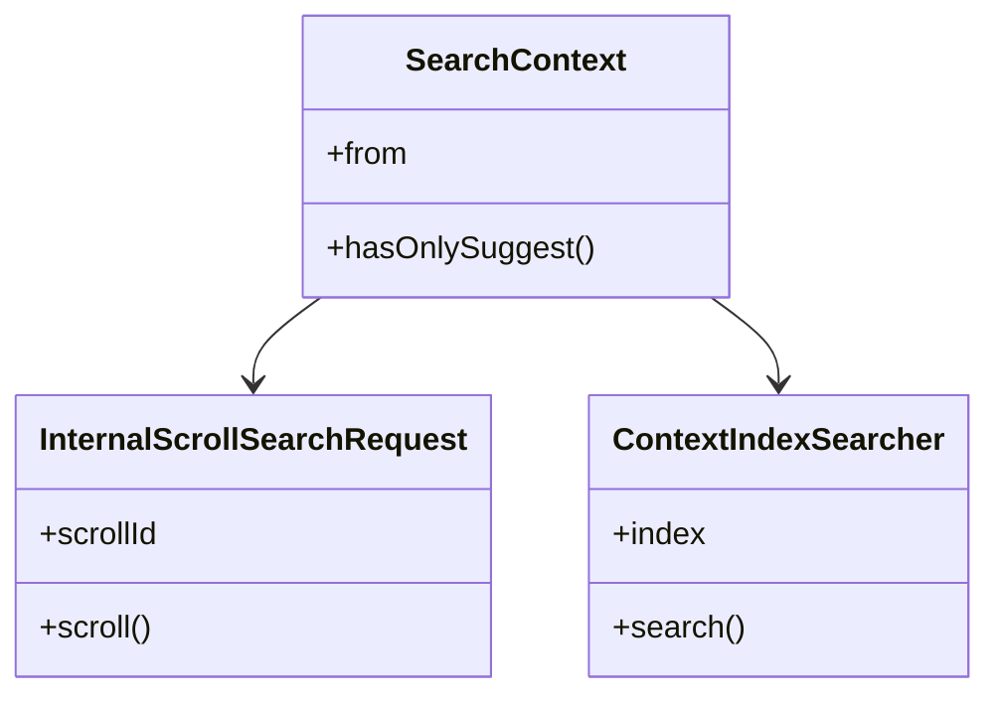

# Overview

This document provides an introduction to the internal components used within the search functionality of Elasticsearch. These components are essential for the efficient execution and management of search queries.

# SearchContext

The `SearchContext` class manages the context of a search request. It includes parameters like `from` and methods such as `hasOnlySuggest`. This class is pivotal in handling the specifics of each search request, ensuring that the correct parameters are used and the appropriate methods are called.

# InternalScrollSearchRequest

The `InternalScrollSearchRequest` class deals with scroll search requests. Scroll search requests are used to retrieve large sets of search results in chunks, making it easier to handle and process large volumes of data.

The `InternalScrollSearchRequest` class handles scroll search requests, which are used to retrieve large sets of search results in chunks.

The `ContextIndexSearcher` class is responsible for searching within a specific index context.

# Conclusion

Understanding these internal components is essential for anyone looking to delve deeper into the search functionality of Elasticsearch. Each component plays a crucial role in ensuring that search operations are executed efficiently and effectively.

&nbsp;

*This is an auto-generated document by Swimm AI 🌊 and has not yet been verified by a human*

<SwmMeta version="3.0.0" repo-id="Z2l0aHViJTNBJTNBZWxhc3RpY3NlYXJjaCUzQSUzQVN3aW1tLURlbW8=" repo-name="elasticsearch" doc-type="overview">Powered by [Swimm](/)</SwmMeta>
