```mermaid
classDiagram
 GlobalOrdCardinalityAggregator <|-- CompetitiveIterator
 GlobalOrdCardinalityAggregator : +NumericMetricsAggregator.SingleValue
 GlobalOrdCardinalityAggregator : +ValuesSource.Bytes.WithOrdinals ValuesSource
 GlobalOrdCardinalityAggregator : +String field
 GlobalOrdCardinalityAggregator : +BigArrays BigArrays
 GlobalOrdCardinalityAggregator : +int maxOrd
 GlobalOrdCardinalityAggregator : +int precision
 GlobalOrdCardinalityAggregator : +int dynamicPruningAttempts
 GlobalOrdCardinalityAggregator : +int dynamicPruningSuccess
 GlobalOrdCardinalityAggregator : +int bruteForce
 GlobalOrdCardinalityAggregator : +int noData
 GlobalOrdCardinalityAggregator : +HyperLogLogPlusPlus counts
 GlobalOrdCardinalityAggregator : +ObjectArray<BitArray> visitedOrds
 GlobalOrdCardinalityAggregator : +SortedSetDocValues values
 CompetitiveIterator : +BitArray visitedOrds
 CompetitiveIterator : +long numNonVisitedOrds
 CompetitiveIterator : +TermsEnum indexTerms
 CompetitiveIterator : +DocIdSetIterator docsWithField
 CompetitiveIterator : +Map<Long, PostingsEnum> nonVisitedOrds
 CompetitiveIterator : +PriorityQueue<PostingsEnum> nonVisitedPostings
 CompetitiveIterator : +int doc

%% Swimm:
%% classDiagram
%%  <SwmToken path="server/src/main/java/org/elasticsearch/search/aggregations/metrics/GlobalOrdCardinalityAggregator.java" pos="47:4:4" line-data="public class GlobalOrdCardinalityAggregator extends NumericMetricsAggregator.SingleValue {">`GlobalOrdCardinalityAggregator`</SwmToken> <|-- <SwmToken path="server/src/main/java/org/elasticsearch/search/aggregations/metrics/GlobalOrdCardinalityAggregator.java" pos="107:5:5" line-data="    private class CompetitiveIterator extends DocIdSetIterator {">`CompetitiveIterator`</SwmToken>
%%  <SwmToken path="server/src/main/java/org/elasticsearch/search/aggregations/metrics/GlobalOrdCardinalityAggregator.java" pos="47:4:4" line-data="public class GlobalOrdCardinalityAggregator extends NumericMetricsAggregator.SingleValue {">`GlobalOrdCardinalityAggregator`</SwmToken> : +NumericMetricsAggregator.SingleValue
%%  <SwmToken path="server/src/main/java/org/elasticsearch/search/aggregations/metrics/GlobalOrdCardinalityAggregator.java" pos="47:4:4" line-data="public class GlobalOrdCardinalityAggregator extends NumericMetricsAggregator.SingleValue {">`GlobalOrdCardinalityAggregator`</SwmToken> : +ValuesSource.Bytes.WithOrdinals <SwmToken path="server/src/main/java/org/elasticsearch/search/aggregations/metrics/GlobalOrdCardinalityAggregator.java" pos="35:12:12" line-data="import org.elasticsearch.search.aggregations.support.ValuesSource;">`ValuesSource`</SwmToken>
%%  <SwmToken path="server/src/main/java/org/elasticsearch/search/aggregations/metrics/GlobalOrdCardinalityAggregator.java" pos="47:4:4" line-data="public class GlobalOrdCardinalityAggregator extends NumericMetricsAggregator.SingleValue {">`GlobalOrdCardinalityAggregator`</SwmToken> : +String field
%%  <SwmToken path="server/src/main/java/org/elasticsearch/search/aggregations/metrics/GlobalOrdCardinalityAggregator.java" pos="47:4:4" line-data="public class GlobalOrdCardinalityAggregator extends NumericMetricsAggregator.SingleValue {">`GlobalOrdCardinalityAggregator`</SwmToken> : +BigArrays <SwmToken path="server/src/main/java/org/elasticsearch/search/aggregations/metrics/GlobalOrdCardinalityAggregator.java" pos="24:10:10" line-data="import org.elasticsearch.common.util.BigArrays;">`BigArrays`</SwmToken>
%%  <SwmToken path="server/src/main/java/org/elasticsearch/search/aggregations/metrics/GlobalOrdCardinalityAggregator.java" pos="47:4:4" line-data="public class GlobalOrdCardinalityAggregator extends NumericMetricsAggregator.SingleValue {">`GlobalOrdCardinalityAggregator`</SwmToken> : +int <SwmToken path="server/src/main/java/org/elasticsearch/search/aggregations/metrics/GlobalOrdCardinalityAggregator.java" pos="61:7:7" line-data="    private final int maxOrd;">`maxOrd`</SwmToken>
%%  <SwmToken path="server/src/main/java/org/elasticsearch/search/aggregations/metrics/GlobalOrdCardinalityAggregator.java" pos="47:4:4" line-data="public class GlobalOrdCardinalityAggregator extends NumericMetricsAggregator.SingleValue {">`GlobalOrdCardinalityAggregator`</SwmToken> : +int precision
%%  <SwmToken path="server/src/main/java/org/elasticsearch/search/aggregations/metrics/GlobalOrdCardinalityAggregator.java" pos="47:4:4" line-data="public class GlobalOrdCardinalityAggregator extends NumericMetricsAggregator.SingleValue {">`GlobalOrdCardinalityAggregator`</SwmToken> : +int <SwmToken path="server/src/main/java/org/elasticsearch/search/aggregations/metrics/GlobalOrdCardinalityAggregator.java" pos="63:5:5" line-data="    private int dynamicPruningAttempts;">`dynamicPruningAttempts`</SwmToken>
%%  <SwmToken path="server/src/main/java/org/elasticsearch/search/aggregations/metrics/GlobalOrdCardinalityAggregator.java" pos="47:4:4" line-data="public class GlobalOrdCardinalityAggregator extends NumericMetricsAggregator.SingleValue {">`GlobalOrdCardinalityAggregator`</SwmToken> : +int <SwmToken path="server/src/main/java/org/elasticsearch/search/aggregations/metrics/GlobalOrdCardinalityAggregator.java" pos="64:5:5" line-data="    private int dynamicPruningSuccess;">`dynamicPruningSuccess`</SwmToken>
%%  <SwmToken path="server/src/main/java/org/elasticsearch/search/aggregations/metrics/GlobalOrdCardinalityAggregator.java" pos="47:4:4" line-data="public class GlobalOrdCardinalityAggregator extends NumericMetricsAggregator.SingleValue {">`GlobalOrdCardinalityAggregator`</SwmToken> : +int <SwmToken path="server/src/main/java/org/elasticsearch/search/aggregations/metrics/GlobalOrdCardinalityAggregator.java" pos="65:5:5" line-data="    private int bruteForce;">`bruteForce`</SwmToken>
%%  <SwmToken path="server/src/main/java/org/elasticsearch/search/aggregations/metrics/GlobalOrdCardinalityAggregator.java" pos="47:4:4" line-data="public class GlobalOrdCardinalityAggregator extends NumericMetricsAggregator.SingleValue {">`GlobalOrdCardinalityAggregator`</SwmToken> : +int <SwmToken path="server/src/main/java/org/elasticsearch/search/aggregations/metrics/GlobalOrdCardinalityAggregator.java" pos="66:5:5" line-data="    private int noData;">`noData`</SwmToken>
%%  <SwmToken path="server/src/main/java/org/elasticsearch/search/aggregations/metrics/GlobalOrdCardinalityAggregator.java" pos="47:4:4" line-data="public class GlobalOrdCardinalityAggregator extends NumericMetricsAggregator.SingleValue {">`GlobalOrdCardinalityAggregator`</SwmToken> : +HyperLogLogPlusPlus counts
%%  <SwmToken path="server/src/main/java/org/elasticsearch/search/aggregations/metrics/GlobalOrdCardinalityAggregator.java" pos="47:4:4" line-data="public class GlobalOrdCardinalityAggregator extends NumericMetricsAggregator.SingleValue {">`GlobalOrdCardinalityAggregator`</SwmToken> : +ObjectArray<BitArray> <SwmToken path="server/src/main/java/org/elasticsearch/search/aggregations/metrics/GlobalOrdCardinalityAggregator.java" pos="109:7:7" line-data="        private final BitArray visitedOrds;">`visitedOrds`</SwmToken>
%%  <SwmToken path="server/src/main/java/org/elasticsearch/search/aggregations/metrics/GlobalOrdCardinalityAggregator.java" pos="47:4:4" line-data="public class GlobalOrdCardinalityAggregator extends NumericMetricsAggregator.SingleValue {">`GlobalOrdCardinalityAggregator`</SwmToken> : +SortedSetDocValues values
%%  <SwmToken path="server/src/main/java/org/elasticsearch/search/aggregations/metrics/GlobalOrdCardinalityAggregator.java" pos="107:5:5" line-data="    private class CompetitiveIterator extends DocIdSetIterator {">`CompetitiveIterator`</SwmToken> : +BitArray <SwmToken path="server/src/main/java/org/elasticsearch/search/aggregations/metrics/GlobalOrdCardinalityAggregator.java" pos="109:7:7" line-data="        private final BitArray visitedOrds;">`visitedOrds`</SwmToken>
%%  <SwmToken path="server/src/main/java/org/elasticsearch/search/aggregations/metrics/GlobalOrdCardinalityAggregator.java" pos="107:5:5" line-data="    private class CompetitiveIterator extends DocIdSetIterator {">`CompetitiveIterator`</SwmToken> : +long <SwmToken path="server/src/main/java/org/elasticsearch/search/aggregations/metrics/GlobalOrdCardinalityAggregator.java" pos="110:5:5" line-data="        private long numNonVisitedOrds;">`numNonVisitedOrds`</SwmToken>
%%  <SwmToken path="server/src/main/java/org/elasticsearch/search/aggregations/metrics/GlobalOrdCardinalityAggregator.java" pos="107:5:5" line-data="    private class CompetitiveIterator extends DocIdSetIterator {">`CompetitiveIterator`</SwmToken> : +TermsEnum <SwmToken path="server/src/main/java/org/elasticsearch/search/aggregations/metrics/GlobalOrdCardinalityAggregator.java" pos="111:7:7" line-data="        private final TermsEnum indexTerms;">`indexTerms`</SwmToken>
%%  <SwmToken path="server/src/main/java/org/elasticsearch/search/aggregations/metrics/GlobalOrdCardinalityAggregator.java" pos="107:5:5" line-data="    private class CompetitiveIterator extends DocIdSetIterator {">`CompetitiveIterator`</SwmToken> : +DocIdSetIterator <SwmToken path="server/src/main/java/org/elasticsearch/search/aggregations/metrics/GlobalOrdCardinalityAggregator.java" pos="112:7:7" line-data="        private final DocIdSetIterator docsWithField;">`docsWithField`</SwmToken>
%%  <SwmToken path="server/src/main/java/org/elasticsearch/search/aggregations/metrics/GlobalOrdCardinalityAggregator.java" pos="107:5:5" line-data="    private class CompetitiveIterator extends DocIdSetIterator {">`CompetitiveIterator`</SwmToken> : +Map<Long, <SwmToken path="server/src/main/java/org/elasticsearch/search/aggregations/metrics/GlobalOrdCardinalityAggregator.java" pos="122:8:9" line-data="        private Map&lt;Long, PostingsEnum&gt; nonVisitedOrds;">`PostingsEnum>`</SwmToken> <SwmToken path="server/src/main/java/org/elasticsearch/search/aggregations/metrics/GlobalOrdCardinalityAggregator.java" pos="122:11:11" line-data="        private Map&lt;Long, PostingsEnum&gt; nonVisitedOrds;">`nonVisitedOrds`</SwmToken>
%%  <SwmToken path="server/src/main/java/org/elasticsearch/search/aggregations/metrics/GlobalOrdCardinalityAggregator.java" pos="107:5:5" line-data="    private class CompetitiveIterator extends DocIdSetIterator {">`CompetitiveIterator`</SwmToken> : +PriorityQueue<PostingsEnum> <SwmToken path="server/src/main/java/org/elasticsearch/search/aggregations/metrics/GlobalOrdCardinalityAggregator.java" pos="123:8:8" line-data="        private PriorityQueue&lt;PostingsEnum&gt; nonVisitedPostings;">`nonVisitedPostings`</SwmToken>
%%  <SwmToken path="server/src/main/java/org/elasticsearch/search/aggregations/metrics/GlobalOrdCardinalityAggregator.java" pos="107:5:5" line-data="    private class CompetitiveIterator extends DocIdSetIterator {">`CompetitiveIterator`</SwmToken> : +int doc
```

# Introduction to Metrics in Aggregations

Metrics in aggregations refer to the calculations performed on the data to produce numerical results. These metrics are used to summarize and analyze the data in various ways.

The `NumericMetricsAggregation` interface defines the structure for metric aggregations that return numerical values. It includes sub-interfaces for single-value and multi-value metrics.

Single-value metrics, represented by the `NumericMetricsAggregation.SingleValue` interface, return a single numerical result. This is useful for aggregations like average, sum, or maximum.

Multi-value metrics, represented by the `NumericMetricsAggregation.MultiValue` interface, return multiple numerical results. This is useful for aggregations like percentiles or statistical summaries.

# Metrics API

The metrics API is available in the server's package `org.elasticsearch.telemetry.metric`. This package contains base classes and interfaces for creating and working with metrics.

# Naming Guidelines

Metrics should follow specific naming guidelines to ensure consistency. For example, use <SwmToken path="server/src/main/java/org/elasticsearch/search/aggregations/metrics/GlobalOrdCardinalityAggregator.java" pos="142:10:10" line-data="            } else if (nonVisitedPostings.size() == 0) {">`size`</SwmToken> to represent the overall size of the resource measured and `utilisation` to represent a fraction of usage out of the overall size.

# Example Usage

An example of how to use metrics in Elasticsearch can be found in the `MeterRegistry` class, which serves as the entry point for working with metrics.

<SwmSnippet path="/server/src/main/java/org/elasticsearch/search/aggregations/metrics/GlobalOrdCardinalityAggregator.java" line="43">

---

## <SwmToken path="server/src/main/java/org/elasticsearch/search/aggregations/metrics/GlobalOrdCardinalityAggregator.java" pos="47:4:4" line-data="public class GlobalOrdCardinalityAggregator extends NumericMetricsAggregator.SingleValue {">`GlobalOrdCardinalityAggregator`</SwmToken>

The <SwmToken path="server/src/main/java/org/elasticsearch/search/aggregations/metrics/GlobalOrdCardinalityAggregator.java" pos="47:4:4" line-data="public class GlobalOrdCardinalityAggregator extends NumericMetricsAggregator.SingleValue {">`GlobalOrdCardinalityAggregator`</SwmToken> class is an aggregator that computes approximate counts of unique values using global ords.

```java
/**
 * An aggregator that computes approximate counts of unique values
 * using global ords.
 */
public class GlobalOrdCardinalityAggregator extends NumericMetricsAggregator.SingleValue {
```

---

</SwmSnippet>

<SwmSnippet path="/server/src/main/java/org/elasticsearch/search/aggregations/metrics/GlobalOrdCardinalityAggregator.java" line="107">

---

## <SwmToken path="server/src/main/java/org/elasticsearch/search/aggregations/metrics/GlobalOrdCardinalityAggregator.java" pos="107:5:5" line-data="    private class CompetitiveIterator extends DocIdSetIterator {">`CompetitiveIterator`</SwmToken>

The <SwmToken path="server/src/main/java/org/elasticsearch/search/aggregations/metrics/GlobalOrdCardinalityAggregator.java" pos="107:5:5" line-data="    private class CompetitiveIterator extends DocIdSetIterator {">`CompetitiveIterator`</SwmToken> class within <SwmToken path="server/src/main/java/org/elasticsearch/search/aggregations/metrics/GlobalOrdCardinalityAggregator.java" pos="47:4:4" line-data="public class GlobalOrdCardinalityAggregator extends NumericMetricsAggregator.SingleValue {">`GlobalOrdCardinalityAggregator`</SwmToken> helps collect values that have not been collected so far, optimizing the aggregation process.

```java
    private class CompetitiveIterator extends DocIdSetIterator {

        private final BitArray visitedOrds;
        private long numNonVisitedOrds;
        private final TermsEnum indexTerms;
        private final DocIdSetIterator docsWithField;

        CompetitiveIterator(int numNonVisitedOrds, BitArray visitedOrds, Terms indexTerms, DocIdSetIterator docsWithField)
            throws IOException {
            this.visitedOrds = visitedOrds;
            this.numNonVisitedOrds = numNonVisitedOrds;
            this.indexTerms = Objects.requireNonNull(indexTerms).iterator();
            this.docsWithField = docsWithField;
        }

        private Map<Long, PostingsEnum> nonVisitedOrds;
        private PriorityQueue<PostingsEnum> nonVisitedPostings;

        private int doc = -1;

        @Override
```

---

</SwmSnippet>

&nbsp;

*This is an auto-generated document by Swimm AI 🌊 and has not yet been verified by a human*

<SwmMeta version="3.0.0" repo-id="Z2l0aHViJTNBJTNBZWxhc3RpY3NlYXJjaCUzQSUzQVN3aW1tLURlbW8=" repo-name="elasticsearch" doc-type="overview"><sup>Powered by [Swimm](/)</sup></SwmMeta>
