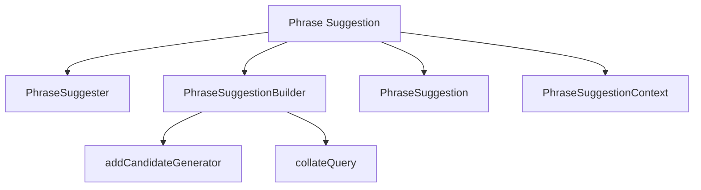

# Introduction to Phrase Suggestion

Phrase suggestion in Elasticsearch is a feature used to provide phrase suggestions based on the input text. This feature is particularly useful for correcting user queries and improving search relevance.

# Core Components

Several classes are involved in the implementation of phrase suggestions in Elasticsearch:

## PhraseSuggester

The `PhraseSuggester` class is responsible for executing the suggestion logic. It processes the input text and generates phrase suggestions.

<SwmSnippet path="/server/src/main/java/org/elasticsearch/search/suggest/phrase/PhraseSuggestionBuilder.java" line="47">

---

The <SwmToken path="server/src/main/java/org/elasticsearch/search/suggest/phrase/PhraseSuggestionBuilder.java" pos="50:4:4" line-data="public class PhraseSuggestionBuilder extends SuggestionBuilder&lt;PhraseSuggestionBuilder&gt; {">`PhraseSuggestionBuilder`</SwmToken> class defines the actual suggest command for phrase suggestions. It includes fields such as <SwmToken path="server/src/main/java/org/elasticsearch/search/suggest/phrase/PhraseSuggestionBuilder.java" pos="70:5:5" line-data="    private float maxErrors = PhraseSuggestionContext.DEFAULT_MAX_ERRORS;">`maxErrors`</SwmToken>, <SwmToken path="server/src/main/java/org/elasticsearch/search/suggest/phrase/PhraseSuggestionBuilder.java" pos="56:18:18" line-data="    protected static final ParseField SEPARATOR_FIELD = new ParseField(&quot;separator&quot;);">`separator`</SwmToken>, <SwmToken path="server/src/main/java/org/elasticsearch/search/suggest/phrase/PhraseSuggestionBuilder.java" pos="72:5:5" line-data="    private float realWordErrorLikelihood = PhraseSuggestionContext.DEFAULT_RWE_ERRORLIKELIHOOD;">`realWordErrorLikelihood`</SwmToken>, and methods to set these fields.

```java
/**
 * Defines the actual suggest command for phrase suggestions ( {@code phrase}).
 */
public class PhraseSuggestionBuilder extends SuggestionBuilder<PhraseSuggestionBuilder> {

    public static final String SUGGESTION_NAME = "phrase";

    protected static final ParseField MAXERRORS_FIELD = new ParseField("max_errors");
    protected static final ParseField RWE_LIKELIHOOD_FIELD = new ParseField("real_word_error_likelihood");
    protected static final ParseField SEPARATOR_FIELD = new ParseField("separator");
    protected static final ParseField CONFIDENCE_FIELD = new ParseField("confidence");
    protected static final ParseField GRAMSIZE_FIELD = new ParseField("gram_size");
    protected static final ParseField SMOOTHING_MODEL_FIELD = new ParseField("smoothing");
    protected static final ParseField FORCE_UNIGRAM_FIELD = new ParseField("force_unigrams");
    protected static final ParseField TOKEN_LIMIT_FIELD = new ParseField("token_limit");
    protected static final ParseField HIGHLIGHT_FIELD = new ParseField("highlight");
    protected static final ParseField PRE_TAG_FIELD = new ParseField("pre_tag");
    protected static final ParseField POST_TAG_FIELD = new ParseField("post_tag");
    protected static final ParseField COLLATE_FIELD = new ParseField("collate");
    protected static final ParseField COLLATE_QUERY_FIELD = new ParseField("query");
    protected static final ParseField COLLATE_QUERY_PARAMS = new ParseField("params");
```

---

</SwmSnippet>

## <SwmToken path="server/src/internalClusterTest/java/org/elasticsearch/search/suggest/SuggestSearchIT.java" pos="219:3:3" line-data="        PhraseSuggestionBuilder phraseSuggestion = phraseSuggestion(&quot;name.shingled&quot;).addCandidateGenerator(generator).gramSize(3);">`phraseSuggestion`</SwmToken>

The <SwmToken path="server/src/internalClusterTest/java/org/elasticsearch/search/suggest/SuggestSearchIT.java" pos="219:3:3" line-data="        PhraseSuggestionBuilder phraseSuggestion = phraseSuggestion(&quot;name.shingled&quot;).addCandidateGenerator(generator).gramSize(3);">`phraseSuggestion`</SwmToken> class represents the suggestion results returned from the `PhraseSuggester`. It encapsulates the suggested phrases and their associated metadata.

## <SwmToken path="server/src/main/java/org/elasticsearch/search/suggest/phrase/PhraseSuggestionBuilder.java" pos="30:12:12" line-data="import org.elasticsearch.search.suggest.phrase.PhraseSuggestionContext.DirectCandidateGenerator;">`PhraseSuggestionContext`</SwmToken>

The <SwmToken path="server/src/main/java/org/elasticsearch/search/suggest/phrase/PhraseSuggestionBuilder.java" pos="30:12:12" line-data="import org.elasticsearch.search.suggest.phrase.PhraseSuggestionContext.DirectCandidateGenerator;">`PhraseSuggestionContext`</SwmToken> class holds the context and configuration for generating phrase suggestions. It includes settings and parameters that influence the suggestion generation process.

# Using <SwmToken path="server/src/main/java/org/elasticsearch/search/suggest/phrase/PhraseSuggestionBuilder.java" pos="50:4:4" line-data="public class PhraseSuggestionBuilder extends SuggestionBuilder&lt;PhraseSuggestionBuilder&gt; {">`PhraseSuggestionBuilder`</SwmToken>

The <SwmToken path="server/src/main/java/org/elasticsearch/search/suggest/phrase/PhraseSuggestionBuilder.java" pos="50:4:4" line-data="public class PhraseSuggestionBuilder extends SuggestionBuilder&lt;PhraseSuggestionBuilder&gt; {">`PhraseSuggestionBuilder`</SwmToken> class is used to create a phrase suggestion with specific parameters. For example, you can set the <SwmToken path="server/src/internalClusterTest/java/org/elasticsearch/search/suggest/SuggestSearchIT.java" pos="219:21:21" line-data="        PhraseSuggestionBuilder phraseSuggestion = phraseSuggestion(&quot;name.shingled&quot;).addCandidateGenerator(generator).gramSize(3);">`gramSize`</SwmToken> and add a candidate generator.

<SwmSnippet path="/server/src/internalClusterTest/java/org/elasticsearch/search/suggest/SuggestSearchIT.java" line="218">

---

An example of using <SwmToken path="server/src/internalClusterTest/java/org/elasticsearch/search/suggest/SuggestSearchIT.java" pos="219:1:1" line-data="        PhraseSuggestionBuilder phraseSuggestion = phraseSuggestion(&quot;name.shingled&quot;).addCandidateGenerator(generator).gramSize(3);">`PhraseSuggestionBuilder`</SwmToken> to create a phrase suggestion with specific parameters like <SwmToken path="server/src/internalClusterTest/java/org/elasticsearch/search/suggest/SuggestSearchIT.java" pos="219:21:21" line-data="        PhraseSuggestionBuilder phraseSuggestion = phraseSuggestion(&quot;name.shingled&quot;).addCandidateGenerator(generator).gramSize(3);">`gramSize`</SwmToken> and adding a candidate generator.

```java
            .maxEdits(2);
        PhraseSuggestionBuilder phraseSuggestion = phraseSuggestion("name.shingled").addCandidateGenerator(generator).gramSize(3);
        Suggest searchSuggest = searchSuggest("ice tea", "did_you_mean", phraseSuggestion);
```

---

</SwmSnippet>

# Adding Candidate Generators

The <SwmToken path="server/src/main/java/org/elasticsearch/search/suggest/phrase/PhraseSuggestionBuilder.java" pos="278:5:5" line-data="    public PhraseSuggestionBuilder addCandidateGenerator(CandidateGenerator generator) {">`addCandidateGenerator`</SwmToken> method in <SwmToken path="server/src/main/java/org/elasticsearch/search/suggest/phrase/PhraseSuggestionBuilder.java" pos="50:4:4" line-data="public class PhraseSuggestionBuilder extends SuggestionBuilder&lt;PhraseSuggestionBuilder&gt; {">`PhraseSuggestionBuilder`</SwmToken> allows adding candidate generators. These generators are used to draw candidates for each individual phrase term before scoring.

<SwmSnippet path="/server/src/main/java/org/elasticsearch/search/suggest/phrase/PhraseSuggestionBuilder.java" line="273">

---

The <SwmToken path="server/src/main/java/org/elasticsearch/search/suggest/phrase/PhraseSuggestionBuilder.java" pos="278:5:5" line-data="    public PhraseSuggestionBuilder addCandidateGenerator(CandidateGenerator generator) {">`addCandidateGenerator`</SwmToken> method in <SwmToken path="server/src/main/java/org/elasticsearch/search/suggest/phrase/PhraseSuggestionBuilder.java" pos="278:3:3" line-data="    public PhraseSuggestionBuilder addCandidateGenerator(CandidateGenerator generator) {">`PhraseSuggestionBuilder`</SwmToken> allows adding candidate generators, which are used to draw candidates for each individual phrase term before scoring.

```java
    /**
     * Adds a {@link CandidateGenerator} to this suggester. The
     * {@link CandidateGenerator} is used to draw candidates for each individual
     * phrase term before the candidates are scored.
     */
    public PhraseSuggestionBuilder addCandidateGenerator(CandidateGenerator generator) {
        this.generators.computeIfAbsent(generator.getType(), k -> new ArrayList<>()).add(generator);
        return this;
    }
```

---

</SwmSnippet>

<SwmSnippet path="/server/src/main/java/org/elasticsearch/search/suggest/phrase/PhraseSuggestionBuilder.java" line="372">

---

The <SwmToken path="server/src/main/java/org/elasticsearch/search/suggest/phrase/PhraseSuggestionBuilder.java" pos="375:5:5" line-data="    public PhraseSuggestionBuilder collateQuery(String collateQuery) {">`collateQuery`</SwmToken> method sets a query used for filtering out suggested phrases, enhancing the relevance of the suggestions.

```java
    /**
     * Sets a query used for filtering out suggested phrases (collation).
     */
    public PhraseSuggestionBuilder collateQuery(String collateQuery) {
        this.collateQuery = new Script(ScriptType.INLINE, "mustache", collateQuery, Collections.emptyMap());
        return this;
    }
```

---

</SwmSnippet>

&nbsp;

*This is an auto-generated document by Swimm AI 🌊 and has not yet been verified by a human*

<SwmMeta version="3.0.0" repo-id="Z2l0aHViJTNBJTNBZWxhc3RpY3NlYXJjaCUzQSUzQVN3aW1tLURlbW8=" repo-name="elasticsearch" doc-type="overview"><sup>Powered by [Swimm](/)</sup></SwmMeta>
