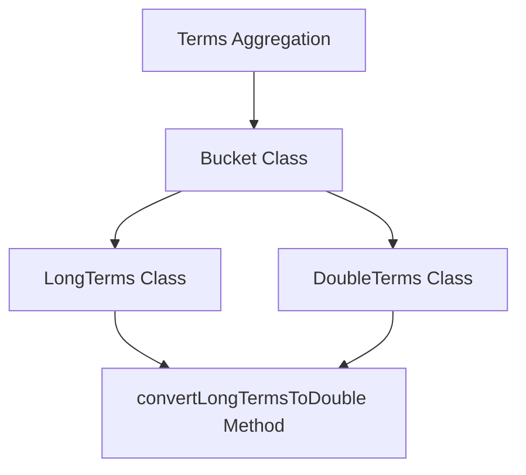

# Terms Aggregation

The <SwmToken path="server/src/main/java/org/elasticsearch/search/aggregations/bucket/terms/Terms.java" pos="31:21:21" line-data="     * Return the sorted list of the buckets in this terms aggregation.">`terms`</SwmToken> interface defines a terms aggregation, which creates multiple buckets, each associated with a unique term for a specific field. All documents in a bucket share the bucket's term in that field.

# Bucket Class

The <SwmToken path="server/src/main/java/org/elasticsearch/search/aggregations/bucket/terms/Terms.java" pos="23:3:3" line-data="    interface Bucket extends MultiBucketsAggregation.Bucket {">`Bucket`</SwmToken> class in <SwmToken path="server/src/main/java/org/elasticsearch/search/aggregations/bucket/terms/LongTerms.java" pos="266:22:22" line-data="     * Converts a {@link LongTerms} into a {@link DoubleTerms}, returning the value of the specified long terms as doubles.">`DoubleTerms`</SwmToken> and <SwmToken path="server/src/main/java/org/elasticsearch/search/aggregations/bucket/terms/LongTerms.java" pos="266:11:11" line-data="     * Converts a {@link LongTerms} into a {@link DoubleTerms}, returning the value of the specified long terms as doubles.">`LongTerms`</SwmToken> encapsulates terms and their associated document counts, along with other metadata such as aggregations and formatting information. It provides methods to read and write terms to streams, compare terms, and format terms as strings.

<SwmSnippet path="/server/src/main/java/org/elasticsearch/search/aggregations/bucket/terms/Terms.java" line="23">

---

The <SwmToken path="server/src/main/java/org/elasticsearch/search/aggregations/bucket/terms/Terms.java" pos="23:3:3" line-data="    interface Bucket extends MultiBucketsAggregation.Bucket {">`Bucket`</SwmToken> interface within <SwmToken path="server/src/main/java/org/elasticsearch/search/aggregations/bucket/terms/Terms.java" pos="31:21:21" line-data="     * Return the sorted list of the buckets in this terms aggregation.">`terms`</SwmToken> represents a single bucket associated with a unique term. It provides methods to retrieve the term as a number and to get the document count error.

```java
    interface Bucket extends MultiBucketsAggregation.Bucket {

        Number getKeyAsNumber();

        long getDocCountError();
    }
```

---

</SwmSnippet>

<SwmSnippet path="/server/src/main/java/org/elasticsearch/search/aggregations/bucket/terms/Terms.java" line="30">

---

The <SwmToken path="server/src/main/java/org/elasticsearch/search/aggregations/bucket/terms/Terms.java" pos="34:9:9" line-data="    List&lt;? extends Bucket&gt; getBuckets();">`getBuckets`</SwmToken> method returns a sorted list of buckets, and the <SwmToken path="server/src/main/java/org/elasticsearch/search/aggregations/bucket/terms/Terms.java" pos="39:3:3" line-data="    Bucket getBucketByKey(String term);">`getBucketByKey`</SwmToken> method retrieves a bucket for a given term.

```java
    /**
     * Return the sorted list of the buckets in this terms aggregation.
     */
    @Override
    List<? extends Bucket> getBuckets();

    /**
     * Get the bucket for the given term, or null if there is no such bucket.
     */
    Bucket getBucketByKey(String term);
```

---

</SwmSnippet>

# <SwmToken path="server/src/main/java/org/elasticsearch/search/aggregations/bucket/terms/LongTerms.java" pos="266:11:11" line-data="     * Converts a {@link LongTerms} into a {@link DoubleTerms}, returning the value of the specified long terms as doubles.">`LongTerms`</SwmToken> Class

The <SwmToken path="server/src/main/java/org/elasticsearch/search/aggregations/bucket/terms/LongTerms.java" pos="266:11:11" line-data="     * Converts a {@link LongTerms} into a {@link DoubleTerms}, returning the value of the specified long terms as doubles.">`LongTerms`</SwmToken> class represents the result of a terms aggregation when the field is a whole number like an integer, long, or date.

# Converting <SwmToken path="server/src/main/java/org/elasticsearch/search/aggregations/bucket/terms/LongTerms.java" pos="266:11:11" line-data="     * Converts a {@link LongTerms} into a {@link DoubleTerms}, returning the value of the specified long terms as doubles.">`LongTerms`</SwmToken> to <SwmToken path="server/src/main/java/org/elasticsearch/search/aggregations/bucket/terms/LongTerms.java" pos="266:22:22" line-data="     * Converts a {@link LongTerms} into a {@link DoubleTerms}, returning the value of the specified long terms as doubles.">`DoubleTerms`</SwmToken>

The <SwmToken path="server/src/main/java/org/elasticsearch/search/aggregations/bucket/terms/LongTerms.java" pos="268:7:7" line-data="    public static DoubleTerms convertLongTermsToDouble(LongTerms longTerms, DocValueFormat decimalFormat) {">`convertLongTermsToDouble`</SwmToken> method converts a <SwmToken path="server/src/main/java/org/elasticsearch/search/aggregations/bucket/terms/LongTerms.java" pos="266:11:11" line-data="     * Converts a {@link LongTerms} into a {@link DoubleTerms}, returning the value of the specified long terms as doubles.">`LongTerms`</SwmToken> aggregation into a <SwmToken path="server/src/main/java/org/elasticsearch/search/aggregations/bucket/terms/LongTerms.java" pos="266:22:22" line-data="     * Converts a {@link LongTerms} into a {@link DoubleTerms}, returning the value of the specified long terms as doubles.">`DoubleTerms`</SwmToken> aggregation, allowing the terms to be represented as doubles.

<SwmSnippet path="/server/src/main/java/org/elasticsearch/search/aggregations/bucket/terms/LongTerms.java" line="265">

---

The <SwmToken path="server/src/main/java/org/elasticsearch/search/aggregations/bucket/terms/LongTerms.java" pos="268:7:7" line-data="    public static DoubleTerms convertLongTermsToDouble(LongTerms longTerms, DocValueFormat decimalFormat) {">`convertLongTermsToDouble`</SwmToken> method converts a <SwmToken path="server/src/main/java/org/elasticsearch/search/aggregations/bucket/terms/LongTerms.java" pos="266:11:11" line-data="     * Converts a {@link LongTerms} into a {@link DoubleTerms}, returning the value of the specified long terms as doubles.">`LongTerms`</SwmToken> aggregation into a <SwmToken path="server/src/main/java/org/elasticsearch/search/aggregations/bucket/terms/LongTerms.java" pos="266:22:22" line-data="     * Converts a {@link LongTerms} into a {@link DoubleTerms}, returning the value of the specified long terms as doubles.">`DoubleTerms`</SwmToken> aggregation.

```java
    /**
     * Converts a {@link LongTerms} into a {@link DoubleTerms}, returning the value of the specified long terms as doubles.
     */
    public static DoubleTerms convertLongTermsToDouble(LongTerms longTerms, DocValueFormat decimalFormat) {
        List<LongTerms.Bucket> buckets = longTerms.getBuckets();
        List<DoubleTerms.Bucket> newBuckets = new ArrayList<>();
        for (Terms.Bucket bucket : buckets) {
            newBuckets.add(
                new DoubleTerms.Bucket(
                    bucket.getKeyAsNumber().doubleValue(),
                    bucket.getDocCount(),
                    bucket.getAggregations(),
                    longTerms.showTermDocCountError,
                    longTerms.showTermDocCountError ? bucket.getDocCountError() : 0,
                    decimalFormat
                )
            );
        }
        return new DoubleTerms(
            longTerms.getName(),
            longTerms.reduceOrder,
```

---

</SwmSnippet>

&nbsp;

*This is an auto-generated document by Swimm AI 🌊 and has not yet been verified by a human*

<SwmMeta version="3.0.0" repo-id="Z2l0aHViJTNBJTNBZWxhc3RpY3NlYXJjaCUzQSUzQVN3aW1tLURlbW8=" repo-name="elasticsearch" doc-type="overview"><sup>Powered by [Swimm](/)</sup></SwmMeta>
