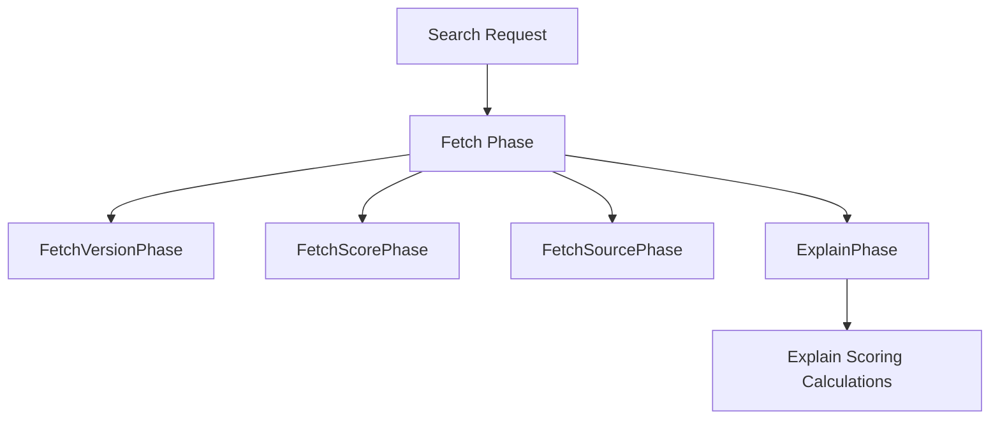

# Overview of Fetch Subphase

The fetch phase in Elasticsearch is a critical part of the search request process. It is divided into multiple subphases, each responsible for fetching specific parts of the document, such as matched queries, document scores, or specific fields.

# Built-in Fetch Subphases

The <SwmToken path="server/src/main/java/org/elasticsearch/search/fetch/subphase/ExplainPhase.java" pos="8:2:10" line-data="package org.elasticsearch.search.fetch.subphase;">`org.elasticsearch.search.fetch.subphase`</SwmToken> package contains various built-in fetch subphases like `FetchVersionPhase`, `FetchScorePhase`, and `FetchSourcePhase`. These subphases are implemented to handle different aspects of the fetch process, ensuring that the required data is retrieved efficiently and accurately.

# FetchSourcePhase

The `FetchSourcePhase` is responsible for fetching the `_source` field of the document. This subphase ensures that the original JSON document is retrieved as part of the search results.

# FetchScorePhase

The `FetchScorePhase` retrieves the score of the document. This score indicates how well the document matches the search query, which is crucial for ranking the search results.

# Example of <SwmToken path="server/src/main/java/org/elasticsearch/search/fetch/subphase/ExplainPhase.java" pos="24:6:6" line-data="public final class ExplainPhase implements FetchSubPhase {">`ExplainPhase`</SwmToken>

The <SwmToken path="server/src/main/java/org/elasticsearch/search/fetch/subphase/ExplainPhase.java" pos="24:6:6" line-data="public final class ExplainPhase implements FetchSubPhase {">`ExplainPhase`</SwmToken> class is an example of a fetch subphase that explains the scoring calculations for the top hits. It implements the <SwmToken path="server/src/main/java/org/elasticsearch/search/fetch/subphase/ExplainPhase.java" pos="13:10:10" line-data="import org.elasticsearch.search.fetch.FetchSubPhase;">`FetchSubPhase`</SwmToken> interface and provides a processor that handles the explanation logic.

<SwmSnippet path="/server/src/main/java/org/elasticsearch/search/fetch/subphase/ExplainPhase.java" line="1">

---

The <SwmToken path="server/src/main/java/org/elasticsearch/search/fetch/subphase/ExplainPhase.java" pos="24:6:6" line-data="public final class ExplainPhase implements FetchSubPhase {">`ExplainPhase`</SwmToken> class provides detailed explanations of the scoring calculations for the top hits. This is useful for debugging and understanding why certain documents are ranked higher than others.

```java
/*
 * Copyright Elasticsearch B.V. and/or licensed to Elasticsearch B.V. under one
 * or more contributor license agreements. Licensed under the Elastic License
 * 2.0 and the Server Side Public License, v 1; you may not use this file except
 * in compliance with, at your election, the Elastic License 2.0 or the Server
 * Side Public License, v 1.
 */
package org.elasticsearch.search.fetch.subphase;

import org.apache.lucene.index.LeafReaderContext;
import org.apache.lucene.search.Explanation;
import org.elasticsearch.search.fetch.FetchContext;
import org.elasticsearch.search.fetch.FetchSubPhase;
import org.elasticsearch.search.fetch.FetchSubPhaseProcessor;
import org.elasticsearch.search.fetch.StoredFieldsSpec;
import org.elasticsearch.search.rescore.RescoreContext;

import java.io.IOException;
import java.util.List;

/**
```

---

</SwmSnippet>

&nbsp;

*This is an auto-generated document by Swimm AI 🌊 and has not yet been verified by a human*

<SwmMeta version="3.0.0" repo-id="Z2l0aHViJTNBJTNBZWxhc3RpY3NlYXJjaCUzQSUzQVN3aW1tLURlbW8=" repo-name="elasticsearch" doc-type="overview"><sup>Powered by [Swimm](/)</sup></SwmMeta>
