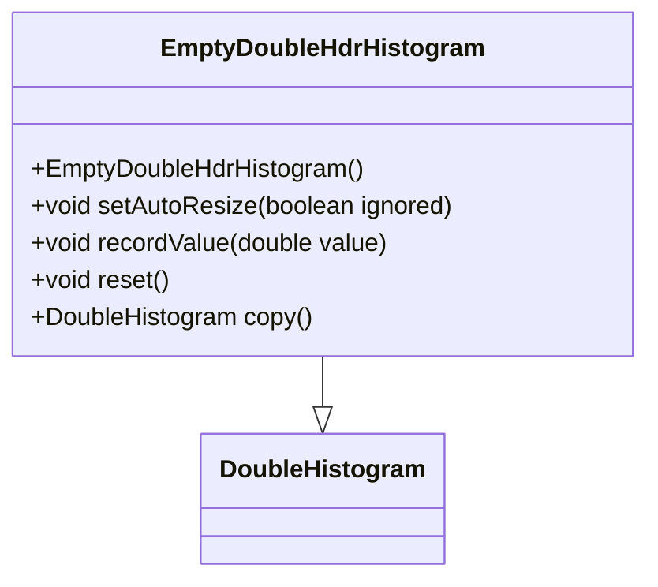

# Overview

The <SwmToken path="server/src/main/java/org/elasticsearch/search/aggregations/metrics/EmptyDoubleHdrHistogram.java" pos="15:6:6" line-data="public final class EmptyDoubleHdrHistogram extends DoubleHistogram {">`EmptyDoubleHdrHistogram`</SwmToken> is a specialized version of the <SwmToken path="server/src/main/java/org/elasticsearch/search/aggregations/metrics/EmptyDoubleHdrHistogram.java" pos="49:3:3" line-data="    public DoubleHistogram copy() {">`DoubleHistogram`</SwmToken> class. It is designed to be immutable and does not support any operations that modify its state. This class is used to represent an empty state in metrics aggregation without allowing any modifications.

# Initialization

The constructor initializes the histogram with a significant value of zero and disables auto-resizing.

# Unsupported Operations

Any attempt to record values, reset, or copy the histogram will result in an <SwmToken path="server/src/main/java/org/elasticsearch/search/aggregations/metrics/EmptyDoubleHdrHistogram.java" pos="29:5:5" line-data="        throw new UnsupportedOperationException(&quot;Immutable Empty HdrHistogram&quot;);">`UnsupportedOperationException`</SwmToken>.

<SwmSnippet path="/server/src/main/java/org/elasticsearch/search/aggregations/metrics/EmptyDoubleHdrHistogram.java" line="27">

---

The <SwmToken path="server/src/main/java/org/elasticsearch/search/aggregations/metrics/EmptyDoubleHdrHistogram.java" pos="28:5:5" line-data="    public void recordValue(double value) throws ArrayIndexOutOfBoundsException {">`recordValue`</SwmToken> function is overridden to throw an <SwmToken path="server/src/main/java/org/elasticsearch/search/aggregations/metrics/EmptyDoubleHdrHistogram.java" pos="29:5:5" line-data="        throw new UnsupportedOperationException(&quot;Immutable Empty HdrHistogram&quot;);">`UnsupportedOperationException`</SwmToken>, indicating that the histogram is immutable and cannot record values.

```java
    @Override
    public void recordValue(double value) throws ArrayIndexOutOfBoundsException {
        throw new UnsupportedOperationException("Immutable Empty HdrHistogram");
    }
```

---

</SwmSnippet>

<SwmSnippet path="/server/src/main/java/org/elasticsearch/search/aggregations/metrics/EmptyDoubleHdrHistogram.java" line="43">

---

The <SwmToken path="server/src/main/java/org/elasticsearch/search/aggregations/metrics/EmptyDoubleHdrHistogram.java" pos="44:5:5" line-data="    public void reset() {">`reset`</SwmToken> function is overridden to throw an <SwmToken path="server/src/main/java/org/elasticsearch/search/aggregations/metrics/EmptyDoubleHdrHistogram.java" pos="45:5:5" line-data="        throw new UnsupportedOperationException(&quot;Immutable Empty HdrHistogram&quot;);">`UnsupportedOperationException`</SwmToken>, ensuring that the histogram cannot be reset.

```java
    @Override
    public void reset() {
        throw new UnsupportedOperationException("Immutable Empty HdrHistogram");
    }
```

---

</SwmSnippet>

<SwmSnippet path="/server/src/main/java/org/elasticsearch/search/aggregations/metrics/EmptyDoubleHdrHistogram.java" line="48">

---

The <SwmToken path="server/src/main/java/org/elasticsearch/search/aggregations/metrics/EmptyDoubleHdrHistogram.java" pos="49:5:5" line-data="    public DoubleHistogram copy() {">`copy`</SwmToken> function is overridden to throw an <SwmToken path="server/src/main/java/org/elasticsearch/search/aggregations/metrics/EmptyDoubleHdrHistogram.java" pos="50:5:5" line-data="        throw new UnsupportedOperationException(&quot;Immutable Empty HdrHistogram&quot;);">`UnsupportedOperationException`</SwmToken>, preventing the creation of a copy of the histogram.

```java
    @Override
    public DoubleHistogram copy() {
        throw new UnsupportedOperationException("Immutable Empty HdrHistogram");
    }
```

---

</SwmSnippet>

# Main Functions

The main functions of the <SwmToken path="server/src/main/java/org/elasticsearch/search/aggregations/metrics/EmptyDoubleHdrHistogram.java" pos="15:6:6" line-data="public final class EmptyDoubleHdrHistogram extends DoubleHistogram {">`EmptyDoubleHdrHistogram`</SwmToken> include <SwmToken path="server/src/main/java/org/elasticsearch/search/aggregations/metrics/EmptyDoubleHdrHistogram.java" pos="23:5:5" line-data="    public void setAutoResize(boolean ignored) {">`setAutoResize`</SwmToken>, <SwmToken path="server/src/main/java/org/elasticsearch/search/aggregations/metrics/EmptyDoubleHdrHistogram.java" pos="28:5:5" line-data="    public void recordValue(double value) throws ArrayIndexOutOfBoundsException {">`recordValue`</SwmToken>, <SwmToken path="server/src/main/java/org/elasticsearch/search/aggregations/metrics/EmptyDoubleHdrHistogram.java" pos="44:5:5" line-data="    public void reset() {">`reset`</SwmToken>, and <SwmToken path="server/src/main/java/org/elasticsearch/search/aggregations/metrics/EmptyDoubleHdrHistogram.java" pos="49:5:5" line-data="    public DoubleHistogram copy() {">`copy`</SwmToken>. Each of these functions is overridden to maintain the immutability of the histogram.

<SwmSnippet path="/server/src/main/java/org/elasticsearch/search/aggregations/metrics/EmptyDoubleHdrHistogram.java" line="22">

---

The <SwmToken path="server/src/main/java/org/elasticsearch/search/aggregations/metrics/EmptyDoubleHdrHistogram.java" pos="23:5:5" line-data="    public void setAutoResize(boolean ignored) {">`setAutoResize`</SwmToken> function is overridden to prevent any changes to the auto-resize setting of the histogram.

```java
    @Override
    public void setAutoResize(boolean ignored) {
        // DO NOT CHANGE 'autoResize'
    }
```

---

</SwmSnippet>

&nbsp;

*This is an auto-generated document by Swimm AI 🌊 and has not yet been verified by a human*

<SwmMeta version="3.0.0" repo-id="Z2l0aHViJTNBJTNBZWxhc3RpY3NlYXJjaCUzQSUzQVN3aW1tLURlbW8=" repo-name="elasticsearch" doc-type="overview"><sup>Powered by [Swimm](/)</sup></SwmMeta>
