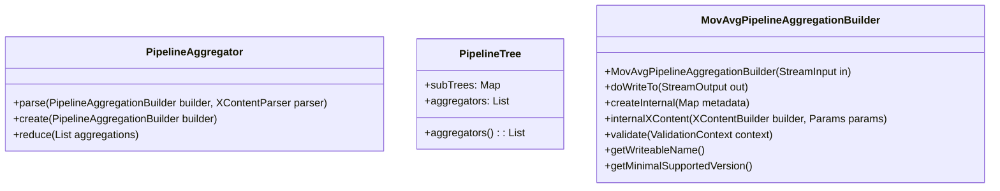

# Overview of Pipeline Aggregations

Pipeline aggregations are a type of aggregation that takes the output of other aggregations as their input. They are used to perform operations on the results of other aggregations, such as calculating the moving average of a series of values.

<SwmSnippet path="/server/src/main/java/org/elasticsearch/search/aggregations/pipeline/PipelineAggregator.java" line="24">

---

## PipelineAggregator Class

The `PipelineAggregator` class is used to define and manage pipeline aggregations. It includes methods for parsing pipeline aggregation builders, creating pipeline aggregators, and reducing aggregation results.

```java
public abstract class PipelineAggregator {
    /**
     * Parse the {@link PipelineAggregationBuilder} from a {@link XContentParser}.
     */
    @FunctionalInterface
    public interface Parser {
        ParseField BUCKETS_PATH = new ParseField("buckets_path");
        ParseField FORMAT = new ParseField("format");
        ParseField GAP_POLICY = new ParseField("gap_policy");

        /**
         * Returns the pipeline aggregator factory with which this parser is
         * associated.
         *
         * @param pipelineAggregatorName
         *            The name of the pipeline aggregation
         * @param parser the parser
         * @return The resolved pipeline aggregator factory
         * @throws java.io.IOException
         *             When parsing fails
         */
```

---

</SwmSnippet>

<SwmSnippet path="/server/src/main/java/org/elasticsearch/search/aggregations/pipeline/PipelineAggregator.java" line="48">

---

## PipelineTree Class

The `PipelineTree` class represents a tree of pipeline aggregations. It allows for complex nested operations on aggregation results and includes methods for accessing sub-trees and checking for sub-trees.

```java
    /**
     * Tree of {@link PipelineAggregator}s to modify a tree of aggregations
     * after their final reduction.
     */
    public static class PipelineTree {
        /**
         * An empty tree of {@link PipelineAggregator}s.
         */
        public static final PipelineTree EMPTY = new PipelineTree(emptyMap(), emptyList());

        private final Map<String, PipelineTree> subTrees;
        private final List<PipelineAggregator> aggregators;

        public PipelineTree(Map<String, PipelineTree> subTrees, List<PipelineAggregator> aggregators) {
            this.subTrees = subTrees;
            this.aggregators = aggregators;
        }

        /**
         * The {@link PipelineAggregator}s for the aggregation at this
         * position in the tree.
```

---

</SwmSnippet>

<SwmSnippet path="/server/src/main/java/org/elasticsearch/search/aggregations/pipeline/MovAvgPipelineAggregationBuilder.java" line="35">

---

## MovAvgPipelineAggregationBuilder Class

The `MovAvgPipelineAggregationBuilder` class is used to handle the moving average pipeline aggregation. This class is deprecated and exists to provide a friendly error message if someone attempts to use the moving average aggregation via the compatible-with=7 mechanism.

```java
public class MovAvgPipelineAggregationBuilder extends AbstractPipelineAggregationBuilder<MovAvgPipelineAggregationBuilder> {
    private static final DeprecationLogger deprecationLogger = DeprecationLogger.getLogger(CommonTermsQueryBuilder.class);
    public static final String MOVING_AVG_AGG_DEPRECATION_MSG = "Moving Average aggregation usage is not supported. "
        + "Use the [moving_fn] aggregation instead.";

    public static final ParseField NAME_V7 = new ParseField("moving_avg").withAllDeprecated(MOVING_AVG_AGG_DEPRECATION_MSG)
        .forRestApiVersion(RestApiVersion.equalTo(RestApiVersion.V_7));

    public static final ContextParser<String, MovAvgPipelineAggregationBuilder> PARSER = (parser, name) -> {
        deprecationLogger.compatibleCritical("moving_avg_aggregation", MOVING_AVG_AGG_DEPRECATION_MSG);
        throw new ParsingException(parser.getTokenLocation(), MOVING_AVG_AGG_DEPRECATION_MSG);
    };

    public MovAvgPipelineAggregationBuilder(StreamInput in) throws IOException {
        super(in, NAME_V7.getPreferredName());
        throw new UnsupportedOperationException("moving_avg is not meant to be used.");
    }

    @Override
    protected void doWriteTo(StreamOutput out) throws IOException {
        throw new UnsupportedOperationException("moving_avg is not meant to be used.");
```

---

</SwmSnippet>

&nbsp;

*This is an auto-generated document by Swimm AI 🌊 and has not yet been verified by a human*

<SwmMeta version="3.0.0" repo-id="Z2l0aHViJTNBJTNBZWxhc3RpY3NlYXJjaCUzQSUzQVN3aW1tLURlbW8=" repo-name="elasticsearch" doc-type="overview"><sup>Powered by [Swimm](https://app.swimm.io/)</sup></SwmMeta>
