```mermaid
classDiagram
    QueryProfiler --|> AbstractProfiler
    QueryProfileShardResult --|> Writeable
    QueryProfileShardResult --|> ToXContentObject
    QueryProfileBreakdown --|> AbstractProfileBreakdown
    class QueryProfiler {
        +QueryProfiler()
        +Timer startRewriteTime()
        +long stopAndAddRewriteTime(Timer rewriteTimer)
        +long getRewriteTime()
    }
    class QueryProfileShardResult {
        +QueryProfileShardResult()
    }
    class QueryProfileBreakdown {
        +QueryProfileBreakdown()
    }
    class AbstractProfiler
    class Writeable
    class ToXContentObject
    class AbstractProfileBreakdown

%% Swimm:
%% classDiagram
%%     <SwmToken path="server/src/main/java/org/elasticsearch/search/profile/query/QueryProfiler.java" pos="37:3:3" line-data="    public QueryProfiler() {">`QueryProfiler`</SwmToken> --|> <SwmToken path="server/src/main/java/org/elasticsearch/search/profile/query/QueryProfiler.java" pos="12:10:10" line-data="import org.elasticsearch.search.profile.AbstractProfiler;">`AbstractProfiler`</SwmToken>
%%     <SwmToken path="server/src/main/java/org/elasticsearch/search/profile/query/QueryProfileShardResult.java" pos="31:6:6" line-data="public final class QueryProfileShardResult implements Writeable, ToXContentObject {">`QueryProfileShardResult`</SwmToken> --|> Writeable
%%     <SwmToken path="server/src/main/java/org/elasticsearch/search/profile/query/QueryProfileShardResult.java" pos="31:6:6" line-data="public final class QueryProfileShardResult implements Writeable, ToXContentObject {">`QueryProfileShardResult`</SwmToken> --|> <SwmToken path="server/src/main/java/org/elasticsearch/search/profile/query/QueryProfileShardResult.java" pos="31:13:13" line-data="public final class QueryProfileShardResult implements Writeable, ToXContentObject {">`ToXContentObject`</SwmToken>
%%     <SwmToken path="server/src/main/java/org/elasticsearch/search/profile/query/QueryProfileBreakdown.java" pos="18:6:6" line-data="public final class QueryProfileBreakdown extends AbstractProfileBreakdown&lt;QueryTimingType&gt; {">`QueryProfileBreakdown`</SwmToken> --|> <SwmToken path="server/src/main/java/org/elasticsearch/search/profile/query/QueryProfileBreakdown.java" pos="18:10:10" line-data="public final class QueryProfileBreakdown extends AbstractProfileBreakdown&lt;QueryTimingType&gt; {">`AbstractProfileBreakdown`</SwmToken>
%%     class <SwmToken path="server/src/main/java/org/elasticsearch/search/profile/query/QueryProfiler.java" pos="37:3:3" line-data="    public QueryProfiler() {">`QueryProfiler`</SwmToken> {
%%         +QueryProfiler()
%%         +Timer <SwmToken path="server/src/main/java/org/elasticsearch/search/profile/query/QueryProfiler.java" pos="61:5:7" line-data="    public Timer startRewriteTime() {">`startRewriteTime()`</SwmToken>
%%         +long <SwmToken path="server/src/main/java/org/elasticsearch/search/profile/query/QueryProfiler.java" pos="71:5:7" line-data="    public long stopAndAddRewriteTime(Timer rewriteTimer) {">`stopAndAddRewriteTime(Timer`</SwmToken> <SwmToken path="server/src/main/java/org/elasticsearch/search/profile/query/QueryProfiler.java" pos="71:9:9" line-data="    public long stopAndAddRewriteTime(Timer rewriteTimer) {">`rewriteTimer`</SwmToken>)
%%         +long <SwmToken path="server/src/main/java/org/elasticsearch/search/profile/query/QueryProfiler.java" pos="78:5:7" line-data="    public long getRewriteTime() {">`getRewriteTime()`</SwmToken>
%%     }
%%     class <SwmToken path="server/src/main/java/org/elasticsearch/search/profile/query/QueryProfileShardResult.java" pos="31:6:6" line-data="public final class QueryProfileShardResult implements Writeable, ToXContentObject {">`QueryProfileShardResult`</SwmToken> {
%%         +QueryProfileShardResult()
%%     }
%%     class <SwmToken path="server/src/main/java/org/elasticsearch/search/profile/query/QueryProfileBreakdown.java" pos="18:6:6" line-data="public final class QueryProfileBreakdown extends AbstractProfileBreakdown&lt;QueryTimingType&gt; {">`QueryProfileBreakdown`</SwmToken> {
%%         +QueryProfileBreakdown()
%%     }
%%     class <SwmToken path="server/src/main/java/org/elasticsearch/search/profile/query/QueryProfiler.java" pos="12:10:10" line-data="import org.elasticsearch.search.profile.AbstractProfiler;">`AbstractProfiler`</SwmToken>
%%     class Writeable
%%     class <SwmToken path="server/src/main/java/org/elasticsearch/search/profile/query/QueryProfileShardResult.java" pos="31:13:13" line-data="public final class QueryProfileShardResult implements Writeable, ToXContentObject {">`ToXContentObject`</SwmToken>
%%     class <SwmToken path="server/src/main/java/org/elasticsearch/search/profile/query/QueryProfileBreakdown.java" pos="18:10:10" line-data="public final class QueryProfileBreakdown extends AbstractProfileBreakdown&lt;QueryTimingType&gt; {">`AbstractProfileBreakdown`</SwmToken>
```

# Overview of Query Profiling

Query profiling in Elasticsearch is a mechanism to analyze the performance of search queries. It helps in understanding the time taken by different phases of query execution, thereby aiding in performance optimization.

# <SwmToken path="server/src/main/java/org/elasticsearch/search/profile/query/QueryProfiler.java" pos="37:3:3" line-data="    public QueryProfiler() {">`QueryProfiler`</SwmToken> Class

The <SwmToken path="server/src/main/java/org/elasticsearch/search/profile/query/QueryProfiler.java" pos="37:3:3" line-data="    public QueryProfiler() {">`QueryProfiler`</SwmToken> class acts as a <SwmToken path="server/src/main/java/org/elasticsearch/search/profile/query/QueryProfiler.java" pos="18:13:15" line-data=" * This class acts as a thread-local storage for profiling a query.  It also">`thread-local`</SwmToken> storage for profiling a query and builds a representation of the query tree. It is associated with every search, not per search request, meaning a request may execute multiple searches, and each search will have its own profiler.

<SwmSnippet path="/server/src/main/java/org/elasticsearch/search/profile/query/QueryProfiler.java" line="17">

---

The <SwmToken path="server/src/main/java/org/elasticsearch/search/profile/query/QueryProfiler.java" pos="37:3:3" line-data="    public QueryProfiler() {">`QueryProfiler`</SwmToken> class is designed to act as a <SwmToken path="server/src/main/java/org/elasticsearch/search/profile/query/QueryProfiler.java" pos="18:13:15" line-data=" * This class acts as a thread-local storage for profiling a query.  It also">`thread-local`</SwmToken> storage for profiling a query. It builds a representation of the query tree, which is constructed online as the weights are wrapped by <SwmToken path="server/src/main/java/org/elasticsearch/search/profile/query/QueryProfiler.java" pos="20:19:19" line-data=" * &quot;online&quot; as the weights are wrapped by ContextIndexSearcher.  This allows us">`ContextIndexSearcher`</SwmToken>. This allows understanding the relationship between nodes in the tree without explicitly walking the tree or <SwmToken path="server/src/main/java/org/elasticsearch/search/profile/query/QueryProfiler.java" pos="22:11:13" line-data=" * walking the tree or pre-wrapping everything">`pre-wrapping`</SwmToken> everything.

```java
/**
 * This class acts as a thread-local storage for profiling a query.  It also
 * builds a representation of the query tree which is built constructed
 * "online" as the weights are wrapped by ContextIndexSearcher.  This allows us
 * to know the relationship between nodes in tree without explicitly
 * walking the tree or pre-wrapping everything
 *
 * A Profiler is associated with every Search, not per Search-Request. E.g. a
 * request may execute two searches (query + global agg).  A Profiler just
 * represents one of those
 */
```

---

</SwmSnippet>

<SwmSnippet path="/server/src/main/java/org/elasticsearch/search/profile/query/QueryProfiler.java" line="37">

---

The constructor of the <SwmToken path="server/src/main/java/org/elasticsearch/search/profile/query/QueryProfiler.java" pos="37:3:3" line-data="    public QueryProfiler() {">`QueryProfiler`</SwmToken> class initializes the profiler with a new <SwmToken path="server/src/main/java/org/elasticsearch/search/profile/query/QueryProfiler.java" pos="38:5:5" line-data="        super(new InternalQueryProfileTree());">`InternalQueryProfileTree`</SwmToken>.

```java
    public QueryProfiler() {
        super(new InternalQueryProfileTree());
    }
```

---

</SwmSnippet>

<SwmSnippet path="/server/src/main/java/org/elasticsearch/search/profile/query/QueryProfiler.java" line="61">

---

The <SwmToken path="server/src/main/java/org/elasticsearch/search/profile/query/QueryProfiler.java" pos="61:5:5" line-data="    public Timer startRewriteTime() {">`startRewriteTime`</SwmToken> method begins timing the rewrite phase of a request.

```java
    public Timer startRewriteTime() {
        return ((InternalQueryProfileTree) profileTree).startRewriteTime();
    }
```

---

</SwmSnippet>

<SwmSnippet path="/server/src/main/java/org/elasticsearch/search/profile/query/QueryProfiler.java" line="71">

---

The <SwmToken path="server/src/main/java/org/elasticsearch/search/profile/query/QueryProfiler.java" pos="71:5:5" line-data="    public long stopAndAddRewriteTime(Timer rewriteTimer) {">`stopAndAddRewriteTime`</SwmToken> method stops recording the current rewrite and adds its time to the total tally, returning the cumulative time so far.

```java
    public long stopAndAddRewriteTime(Timer rewriteTimer) {
        return ((InternalQueryProfileTree) profileTree).stopAndAddRewriteTime(requireNonNull(rewriteTimer));
    }
```

---

</SwmSnippet>

<SwmSnippet path="/server/src/main/java/org/elasticsearch/search/profile/query/QueryProfiler.java" line="78">

---

The <SwmToken path="server/src/main/java/org/elasticsearch/search/profile/query/QueryProfiler.java" pos="78:5:5" line-data="    public long getRewriteTime() {">`getRewriteTime`</SwmToken> method returns the total time taken to rewrite all queries in this profile.

```java
    public long getRewriteTime() {
        return ((InternalQueryProfileTree) profileTree).getRewriteTime();
    }
```

---

</SwmSnippet>

# <SwmToken path="server/src/main/java/org/elasticsearch/search/profile/query/QueryProfileShardResult.java" pos="31:6:6" line-data="public final class QueryProfileShardResult implements Writeable, ToXContentObject {">`QueryProfileShardResult`</SwmToken> Class

The <SwmToken path="server/src/main/java/org/elasticsearch/search/profile/query/QueryProfileShardResult.java" pos="31:6:6" line-data="public final class QueryProfileShardResult implements Writeable, ToXContentObject {">`QueryProfileShardResult`</SwmToken> class is a container to hold the profile results for a single shard in the request. It contains a list of query profiles, a collector tree, and a total rewrite tree. It provides methods to read from a stream, write to a stream, and retrieve query results.

<SwmSnippet path="/server/src/main/java/org/elasticsearch/search/profile/query/QueryProfileShardResult.java" line="27">

---

The <SwmToken path="server/src/main/java/org/elasticsearch/search/profile/query/QueryProfileShardResult.java" pos="31:6:6" line-data="public final class QueryProfileShardResult implements Writeable, ToXContentObject {">`QueryProfileShardResult`</SwmToken> class holds the profile results for a single shard in the request. It includes a list of query profiles, a collector tree, and a total rewrite tree.

```java
/**
 * A container class to hold the profile results for a single shard in the request.
 * Contains a list of query profiles, a collector tree and a total rewrite tree.
 */
public final class QueryProfileShardResult implements Writeable, ToXContentObject {

    public static final String COLLECTOR = "collector";
    public static final String REWRITE_TIME = "rewrite_time";
    public static final String QUERY_ARRAY = "query";

    public static final String VECTOR_OPERATIONS_COUNT = "vector_operations_count";

    private final List<ProfileResult> queryProfileResults;

    private final CollectorResult profileCollector;

    private final long rewriteTime;

    private final Long vectorOperationsCount;

    public QueryProfileShardResult(
```

---

</SwmSnippet>

# <SwmToken path="server/src/main/java/org/elasticsearch/search/profile/query/QueryProfileBreakdown.java" pos="18:6:6" line-data="public final class QueryProfileBreakdown extends AbstractProfileBreakdown&lt;QueryTimingType&gt; {">`QueryProfileBreakdown`</SwmToken> Class

The <SwmToken path="server/src/main/java/org/elasticsearch/search/profile/query/QueryProfileBreakdown.java" pos="18:6:6" line-data="public final class QueryProfileBreakdown extends AbstractProfileBreakdown&lt;QueryTimingType&gt; {">`QueryProfileBreakdown`</SwmToken> class records timings for various operations that may happen during query execution. A node's time may be composed of several internal attributes such as rewriting, weighting, and scoring.

<SwmSnippet path="/server/src/main/java/org/elasticsearch/search/profile/query/QueryProfileBreakdown.java" line="14">

---

The <SwmToken path="server/src/main/java/org/elasticsearch/search/profile/query/QueryProfileBreakdown.java" pos="18:6:6" line-data="public final class QueryProfileBreakdown extends AbstractProfileBreakdown&lt;QueryTimingType&gt; {">`QueryProfileBreakdown`</SwmToken> class is used to break down the timing information for different phases of query execution. It records timings for various operations that may happen during query execution, such as rewriting, weighting, and scoring.

```java
 * A record of timings for the various operations that may happen during query execution.
 * A node's time may be composed of several internal attributes (rewriting, weighting,
 * scoring, etc).
 */
public final class QueryProfileBreakdown extends AbstractProfileBreakdown<QueryTimingType> {

    /** Sole constructor. */
    public QueryProfileBreakdown() {
        super(QueryTimingType.class);
    }
}
```

---

</SwmSnippet>

&nbsp;

*This is an auto-generated document by Swimm AI 🌊 and has not yet been verified by a human*

<SwmMeta version="3.0.0" repo-id="Z2l0aHViJTNBJTNBZWxhc3RpY3NlYXJjaCUzQSUzQVN3aW1tLURlbW8=" repo-name="elasticsearch" doc-type="overview"><sup>Powered by [Swimm](/)</sup></SwmMeta>
