```mermaid
classDiagram
    class RankSearchContext {
        - SearchContext parent
        - Query rankQuery
        - int rankWindowSize
        - QuerySearchResult QuerySearchResult
        + RankSearchContext(SearchContext parent, Query rankQuery, int rankWindowSize)
        + Query query()
    }
    class RankBuilder {
        - int rankWindowSize
        + RankBuilder(int rankWindowSize)
        + RankBuilder(StreamInput in)
        + void writeTo(StreamOutput out)
    }
    class RankFeatureDoc {
        - String featureData
        + RankFeatureDoc(int doc, float score, int shardIndex)
        + RankFeatureDoc(StreamInput in)
        + Explanation explain()
    }
    RankSearchContext --> SearchContext
    RankFeatureDoc --> RankDoc

%% Swimm:
%% classDiagram
%%     class <SwmToken path="server/src/main/java/org/elasticsearch/search/rank/RankSearchContext.java" pos="57:4:4" line-data="public class RankSearchContext extends SearchContext {">`RankSearchContext`</SwmToken> {
%%         - <SwmToken path="server/src/main/java/org/elasticsearch/search/rank/RankSearchContext.java" pos="57:8:8" line-data="public class RankSearchContext extends SearchContext {">`SearchContext`</SwmToken> parent
%%         - Query <SwmToken path="server/src/main/java/org/elasticsearch/search/rank/RankSearchContext.java" pos="60:7:7" line-data="    private final Query rankQuery;">`rankQuery`</SwmToken>
%%         - int <SwmToken path="server/src/main/java/org/elasticsearch/search/rank/RankSearchContext.java" pos="61:7:7" line-data="    private final int rankWindowSize;">`rankWindowSize`</SwmToken>
%%         - <SwmToken path="server/src/main/java/org/elasticsearch/search/rank/RankSearchContext.java" pos="62:5:5" line-data="    private final QuerySearchResult querySearchResult;">`QuerySearchResult`</SwmToken> <SwmToken path="server/src/main/java/org/elasticsearch/search/rank/RankSearchContext.java" pos="62:5:5" line-data="    private final QuerySearchResult querySearchResult;">`QuerySearchResult`</SwmToken>
%%         + <SwmToken path="server/src/main/java/org/elasticsearch/search/rank/RankSearchContext.java" pos="65:3:5" line-data="    public RankSearchContext(SearchContext parent, Query rankQuery, int rankWindowSize) {">`RankSearchContext(SearchContext`</SwmToken> parent, Query <SwmToken path="server/src/main/java/org/elasticsearch/search/rank/RankSearchContext.java" pos="60:7:7" line-data="    private final Query rankQuery;">`rankQuery`</SwmToken>, int <SwmToken path="server/src/main/java/org/elasticsearch/search/rank/RankSearchContext.java" pos="61:7:7" line-data="    private final int rankWindowSize;">`rankWindowSize`</SwmToken>)
%%         + Query query()
%%     }
%%     class <SwmToken path="server/src/main/java/org/elasticsearch/search/rank/RankBuilder.java" pos="32:7:7" line-data=" * {@code RankBuilder} is used as a base class to manage input, parsing, and subsequent generation of appropriate contexts">`RankBuilder`</SwmToken> {
%%         - int <SwmToken path="server/src/main/java/org/elasticsearch/search/rank/RankSearchContext.java" pos="61:7:7" line-data="    private final int rankWindowSize;">`rankWindowSize`</SwmToken>
%%         + <SwmToken path="server/src/main/java/org/elasticsearch/search/rank/RankBuilder.java" pos="43:3:5" line-data="    public RankBuilder(int rankWindowSize) {">`RankBuilder(int`</SwmToken> <SwmToken path="server/src/main/java/org/elasticsearch/search/rank/RankSearchContext.java" pos="61:7:7" line-data="    private final int rankWindowSize;">`rankWindowSize`</SwmToken>)
%%         + <SwmToken path="server/src/main/java/org/elasticsearch/search/rank/RankBuilder.java" pos="47:3:5" line-data="    public RankBuilder(StreamInput in) throws IOException {">`RankBuilder(StreamInput`</SwmToken> in)
%%         + void <SwmToken path="server/src/main/java/org/elasticsearch/search/rank/RankBuilder.java" pos="51:7:9" line-data="    public final void writeTo(StreamOutput out) throws IOException {">`writeTo(StreamOutput`</SwmToken> out)
%%     }
%%     class <SwmToken path="server/src/main/java/org/elasticsearch/search/rank/feature/RankFeatureDoc.java" pos="23:4:4" line-data="public class RankFeatureDoc extends RankDoc {">`RankFeatureDoc`</SwmToken> {
%%         - String <SwmToken path="server/src/main/java/org/elasticsearch/search/rank/feature/RankFeatureDoc.java" pos="28:5:5" line-data="    public String featureData;">`featureData`</SwmToken>
%%         + <SwmToken path="server/src/main/java/org/elasticsearch/search/rank/feature/RankFeatureDoc.java" pos="30:3:5" line-data="    public RankFeatureDoc(int doc, float score, int shardIndex) {">`RankFeatureDoc(int`</SwmToken> doc, float score, int <SwmToken path="server/src/main/java/org/elasticsearch/search/rank/feature/RankFeatureDoc.java" pos="30:17:17" line-data="    public RankFeatureDoc(int doc, float score, int shardIndex) {">`shardIndex`</SwmToken>)
%%         + <SwmToken path="server/src/main/java/org/elasticsearch/search/rank/feature/RankFeatureDoc.java" pos="34:3:5" line-data="    public RankFeatureDoc(StreamInput in) throws IOException {">`RankFeatureDoc(StreamInput`</SwmToken> in)
%%         + Explanation explain()
%%     }
%%     <SwmToken path="server/src/main/java/org/elasticsearch/search/rank/RankSearchContext.java" pos="57:4:4" line-data="public class RankSearchContext extends SearchContext {">`RankSearchContext`</SwmToken> --> <SwmToken path="server/src/main/java/org/elasticsearch/search/rank/RankSearchContext.java" pos="57:8:8" line-data="public class RankSearchContext extends SearchContext {">`SearchContext`</SwmToken>
%%     <SwmToken path="server/src/main/java/org/elasticsearch/search/rank/feature/RankFeatureDoc.java" pos="23:4:4" line-data="public class RankFeatureDoc extends RankDoc {">`RankFeatureDoc`</SwmToken> --> <SwmToken path="server/src/main/java/org/elasticsearch/search/rank/feature/RankFeatureDoc.java" pos="21:9:9" line-data=" * A {@link RankDoc} that contains field data to be used later by the reranker on the coordinator node.">`RankDoc`</SwmToken>
```

# Overview of Ranking in Search

Ranking in search refers to the process of ordering search results based on their relevance to a given query. This document provides an overview of the key components involved in ranking within Elasticsearch, including <SwmToken path="server/src/main/java/org/elasticsearch/search/rank/RankSearchContext.java" pos="57:4:4" line-data="public class RankSearchContext extends SearchContext {">`RankSearchContext`</SwmToken>, <SwmToken path="server/src/main/java/org/elasticsearch/search/rank/RankBuilder.java" pos="32:7:7" line-data=" * {@code RankBuilder} is used as a base class to manage input, parsing, and subsequent generation of appropriate contexts">`RankBuilder`</SwmToken>, and <SwmToken path="server/src/main/java/org/elasticsearch/search/rank/feature/RankFeatureDoc.java" pos="23:4:4" line-data="public class RankFeatureDoc extends RankDoc {">`RankFeatureDoc`</SwmToken>.

<SwmSnippet path="/server/src/main/java/org/elasticsearch/search/rank/RankSearchContext.java" line="53">

---

## <SwmToken path="server/src/main/java/org/elasticsearch/search/rank/RankSearchContext.java" pos="57:4:4" line-data="public class RankSearchContext extends SearchContext {">`RankSearchContext`</SwmToken>

The <SwmToken path="server/src/main/java/org/elasticsearch/search/rank/RankSearchContext.java" pos="57:4:4" line-data="public class RankSearchContext extends SearchContext {">`RankSearchContext`</SwmToken> class manages the appropriate values when executing multiple queries on behalf of ranking for a single ranking query. It extends the <SwmToken path="server/src/main/java/org/elasticsearch/search/rank/RankSearchContext.java" pos="57:8:8" line-data="public class RankSearchContext extends SearchContext {">`SearchContext`</SwmToken> class and overrides several methods to customize the behavior for ranking queries. For instance, ranking does not allow scrolling, sorting, or collapsing, and these features are disabled in the <SwmToken path="server/src/main/java/org/elasticsearch/search/rank/RankSearchContext.java" pos="57:4:4" line-data="public class RankSearchContext extends SearchContext {">`RankSearchContext`</SwmToken>.

```java
/**
 * Manages the appropriate values when executing multiple queries
 * on behalf of ranking for a single ranking query.
 */
public class RankSearchContext extends SearchContext {

    private final SearchContext parent;
    private final Query rankQuery;
    private final int rankWindowSize;
    private final QuerySearchResult querySearchResult;

    @SuppressWarnings("this-escape")
    public RankSearchContext(SearchContext parent, Query rankQuery, int rankWindowSize) {
        this.parent = parent;
        this.rankQuery = parent.buildFilteredQuery(rankQuery);
        this.rankWindowSize = rankWindowSize;
        this.querySearchResult = new QuerySearchResult(parent.readerContext().id(), parent.shardTarget(), parent.request());
```

---

</SwmSnippet>

<SwmSnippet path="/server/src/main/java/org/elasticsearch/search/rank/RankSearchContext.java" line="171">

---

The <SwmToken path="server/src/main/java/org/elasticsearch/search/rank/RankSearchContext.java" pos="172:11:11" line-data="     * Use a single rank query.">`query`</SwmToken> method in <SwmToken path="server/src/main/java/org/elasticsearch/search/rank/RankSearchContext.java" pos="57:4:4" line-data="public class RankSearchContext extends SearchContext {">`RankSearchContext`</SwmToken> is used to execute a single rank query, returning the <SwmToken path="server/src/main/java/org/elasticsearch/search/rank/RankSearchContext.java" pos="176:3:3" line-data="        return rankQuery;">`rankQuery`</SwmToken> that was built.

```java
    /**
     * Use a single rank query.
     */
    @Override
    public Query query() {
        return rankQuery;
    }
```

---

</SwmSnippet>

<SwmSnippet path="/server/src/main/java/org/elasticsearch/search/rank/RankBuilder.java" line="31">

---

## <SwmToken path="server/src/main/java/org/elasticsearch/search/rank/RankBuilder.java" pos="32:7:7" line-data=" * {@code RankBuilder} is used as a base class to manage input, parsing, and subsequent generation of appropriate contexts">`RankBuilder`</SwmToken>

The <SwmToken path="server/src/main/java/org/elasticsearch/search/rank/RankBuilder.java" pos="32:7:7" line-data=" * {@code RankBuilder} is used as a base class to manage input, parsing, and subsequent generation of appropriate contexts">`RankBuilder`</SwmToken> class is used as a base class to manage input, parsing, and subsequent generation of appropriate contexts for handling searches that require multiple queries <SwmToken path="server/src/main/java/org/elasticsearch/search/rank/RankBuilder.java" pos="33:17:19" line-data=" * for handling searches that require multiple queries and/or ranking steps for global rank relevance.">`and/or`</SwmToken> ranking steps for global rank relevance.

```java
/**
 * {@code RankBuilder} is used as a base class to manage input, parsing, and subsequent generation of appropriate contexts
 * for handling searches that require multiple queries and/or ranking steps for global rank relevance.
 */
public abstract class RankBuilder implements VersionedNamedWriteable, ToXContentObject {

    public static final ParseField RANK_WINDOW_SIZE_FIELD = new ParseField("rank_window_size");

    public static final int DEFAULT_RANK_WINDOW_SIZE = SearchService.DEFAULT_SIZE;

    private final int rankWindowSize;

    public RankBuilder(int rankWindowSize) {
        this.rankWindowSize = rankWindowSize;
    }

    public RankBuilder(StreamInput in) throws IOException {
        rankWindowSize = in.readVInt();
    }

    public final void writeTo(StreamOutput out) throws IOException {
```

---

</SwmSnippet>

<SwmSnippet path="/server/src/main/java/org/elasticsearch/search/rank/feature/RankFeatureDoc.java" line="20">

---

## <SwmToken path="server/src/main/java/org/elasticsearch/search/rank/feature/RankFeatureDoc.java" pos="23:4:4" line-data="public class RankFeatureDoc extends RankDoc {">`RankFeatureDoc`</SwmToken>

The <SwmToken path="server/src/main/java/org/elasticsearch/search/rank/feature/RankFeatureDoc.java" pos="23:4:4" line-data="public class RankFeatureDoc extends RankDoc {">`RankFeatureDoc`</SwmToken> class holds the result of a rank feature search phase, including the `RankFeatureShardResult` and associated references. This class is used in various parts of the codebase to handle the results of ranking queries.

```java
/**
 * A {@link RankDoc} that contains field data to be used later by the reranker on the coordinator node.
 */
public class RankFeatureDoc extends RankDoc {

    public static final String NAME = "rank_feature_doc";

    // TODO: update to support more than 1 fields; and not restrict to string data
    public String featureData;

    public RankFeatureDoc(int doc, float score, int shardIndex) {
        super(doc, score, shardIndex);
    }

    public RankFeatureDoc(StreamInput in) throws IOException {
        super(in);
        featureData = in.readOptionalString();
    }

    @Override
    public Explanation explain() {
```

---

</SwmSnippet>

&nbsp;

*This is an auto-generated document by Swimm AI 🌊 and has not yet been verified by a human*

<SwmMeta version="3.0.0" repo-id="Z2l0aHViJTNBJTNBZWxhc3RpY3NlYXJjaCUzQSUzQVN3aW1tLURlbW8=" repo-name="elasticsearch" doc-type="overview"><sup>Powered by [Swimm](/)</sup></SwmMeta>
