```mermaid
classDiagram
    RestController --> BaseRestHandler
    BaseRestHandler --> RestRequest
    RestRequest --> RestUtils
    RestUtils --> RestStatus
    RestController : +registerHandlerNoWrap()
    BaseRestHandler : +getRestHeaders()
    RestRequest : +params
    RestUtils : +decodeQueryString()
    RestStatus : +OK
    RestStatus : +CREATED
    RestStatus : +NO_CONTENT

%% Swimm:
%% classDiagram
%%     <SwmToken path="server/src/main/java/org/elasticsearch/rest/RestController.java" pos="121:3:3" line-data="    public RestController(">`RestController`</SwmToken> --> <SwmToken path="server/src/main/java/org/elasticsearch/rest/BaseRestHandler.java" pos="44:6:6" line-data="public abstract class BaseRestHandler implements RestHandler {">`BaseRestHandler`</SwmToken>
%%     <SwmToken path="server/src/main/java/org/elasticsearch/rest/BaseRestHandler.java" pos="44:6:6" line-data="public abstract class BaseRestHandler implements RestHandler {">`BaseRestHandler`</SwmToken> --> <SwmToken path="server/src/main/java/org/elasticsearch/rest/RestController.java" pos="138:3:3" line-data="        registerHandlerNoWrap(RestRequest.Method.GET, &quot;/favicon.ico&quot;, RestApiVersion.current(), new RestFavIconHandler());">`RestRequest`</SwmToken>
%%     <SwmToken path="server/src/main/java/org/elasticsearch/rest/RestController.java" pos="138:3:3" line-data="        registerHandlerNoWrap(RestRequest.Method.GET, &quot;/favicon.ico&quot;, RestApiVersion.current(), new RestFavIconHandler());">`RestRequest`</SwmToken> --> <SwmToken path="server/src/main/java/org/elasticsearch/rest/RestUtils.java" pos="28:4:4" line-data="public class RestUtils {">`RestUtils`</SwmToken>
%%     <SwmToken path="server/src/main/java/org/elasticsearch/rest/RestUtils.java" pos="28:4:4" line-data="public class RestUtils {">`RestUtils`</SwmToken> --> <SwmToken path="server/src/main/java/org/elasticsearch/rest/RestResponse.java" pos="101:1:1" line-data="        RestStatus status,">`RestStatus`</SwmToken>
%%     <SwmToken path="server/src/main/java/org/elasticsearch/rest/RestController.java" pos="121:3:3" line-data="    public RestController(">`RestController`</SwmToken> : +registerHandlerNoWrap()
%%     <SwmToken path="server/src/main/java/org/elasticsearch/rest/BaseRestHandler.java" pos="44:6:6" line-data="public abstract class BaseRestHandler implements RestHandler {">`BaseRestHandler`</SwmToken> : +getRestHeaders()
%%     <SwmToken path="server/src/main/java/org/elasticsearch/rest/RestController.java" pos="138:3:3" line-data="        registerHandlerNoWrap(RestRequest.Method.GET, &quot;/favicon.ico&quot;, RestApiVersion.current(), new RestFavIconHandler());">`RestRequest`</SwmToken> : +params
%%     <SwmToken path="server/src/main/java/org/elasticsearch/rest/RestUtils.java" pos="28:4:4" line-data="public class RestUtils {">`RestUtils`</SwmToken> : +decodeQueryString()
%%     <SwmToken path="server/src/main/java/org/elasticsearch/rest/RestResponse.java" pos="101:1:1" line-data="        RestStatus status,">`RestStatus`</SwmToken> : +OK
%%     <SwmToken path="server/src/main/java/org/elasticsearch/rest/RestResponse.java" pos="101:1:1" line-data="        RestStatus status,">`RestStatus`</SwmToken> : +CREATED
%%     <SwmToken path="server/src/main/java/org/elasticsearch/rest/RestResponse.java" pos="101:1:1" line-data="        RestStatus status,">`RestStatus`</SwmToken> : +NO_CONTENT
```

# Overview of Rest API Functionality

The RESTful API functionality within the Server Core of Elasticsearch is essential for handling HTTP requests and responses. This document provides an overview of the key classes and their roles in managing RESTful interactions.

<SwmSnippet path="/server/src/main/java/org/elasticsearch/rest/RestController.java" line="121">

---

# <SwmToken path="server/src/main/java/org/elasticsearch/rest/RestController.java" pos="121:3:3" line-data="    public RestController(">`RestController`</SwmToken>

The <SwmToken path="server/src/main/java/org/elasticsearch/rest/RestController.java" pos="121:3:3" line-data="    public RestController(">`RestController`</SwmToken> class is central to handling REST requests. It manages the registration of REST handlers and processes incoming requests. The constructor initializes various services and registers default handlers.

```java
    public RestController(
        RestInterceptor restInterceptor,
        NodeClient client,
        CircuitBreakerService circuitBreakerService,
        UsageService usageService,
        TelemetryProvider telemetryProvider
    ) {
        this.usageService = usageService;
        this.tracer = telemetryProvider.getTracer();
        this.requestsCounter = telemetryProvider.getMeterRegistry()
            .registerLongCounter(METRIC_REQUESTS_TOTAL, "The total number of rest requests/responses processed", "unit");
        if (restInterceptor == null) {
            restInterceptor = (request, channel, targetHandler, listener) -> listener.onResponse(Boolean.TRUE);
        }
        this.interceptor = restInterceptor;
        this.client = client;
        this.circuitBreakerService = circuitBreakerService;
        registerHandlerNoWrap(RestRequest.Method.GET, "/favicon.ico", RestApiVersion.current(), new RestFavIconHandler());
        this.apiProtections = new ServerlessApiProtections(false);
    }
```

---

</SwmSnippet>

<SwmSnippet path="/server/src/main/java/org/elasticsearch/rest/BaseRestHandler.java" line="38">

---

# <SwmToken path="server/src/main/java/org/elasticsearch/rest/BaseRestHandler.java" pos="44:6:6" line-data="public abstract class BaseRestHandler implements RestHandler {">`BaseRestHandler`</SwmToken>

The <SwmToken path="server/src/main/java/org/elasticsearch/rest/BaseRestHandler.java" pos="44:6:6" line-data="public abstract class BaseRestHandler implements RestHandler {">`BaseRestHandler`</SwmToken> class serves as a base for creating REST request handlers. It ensures that headers and context from <SwmToken path="server/src/main/java/org/elasticsearch/rest/BaseRestHandler.java" pos="39:33:33" line-data=" * This handler makes sure that the headers &amp;amp; context of the handled {@link RestRequest requests} are copied over to">`RestRequest`</SwmToken> objects are properly managed and copied over to transport requests.

```java
 * <p>
 * This handler makes sure that the headers &amp; context of the handled {@link RestRequest requests} are copied over to
 * the transport requests executed by the associated client. While the context is fully copied over, not all the headers
 * are copied, but a selected few. It is possible to control what headers are copied over by returning them in
 * {@link ActionPlugin#getRestHeaders()}.
 */
public abstract class BaseRestHandler implements RestHandler {

    /**
     * Parameter that controls whether certain REST apis should include type names in their requests or responses.
     * Note: This parameter is only available through compatible rest api for {@link RestApiVersion#V_7}.
     */
    public static final String INCLUDE_TYPE_NAME_PARAMETER = "include_type_name";
    public static final boolean DEFAULT_INCLUDE_TYPE_NAME_POLICY = false;

    public static final Setting<Boolean> MULTI_ALLOW_EXPLICIT_INDEX = Setting.boolSetting(
        "rest.action.multi.allow_explicit_index",
        true,
        Property.NodeScope
    );
```

---

</SwmSnippet>

<SwmSnippet path="/server/src/main/java/org/elasticsearch/rest/RestRequest.java" line="49">

---

# <SwmToken path="server/src/main/java/org/elasticsearch/rest/RestRequest.java" pos="49:4:4" line-data="public class RestRequest implements ToXContent.Params, Traceable {">`RestRequest`</SwmToken>

The <SwmToken path="server/src/main/java/org/elasticsearch/rest/RestRequest.java" pos="49:4:4" line-data="public class RestRequest implements ToXContent.Params, Traceable {">`RestRequest`</SwmToken> class encapsulates details of an HTTP request, including parameters, headers, and the request path. It provides methods to access and manipulate these details.

```java
public class RestRequest implements ToXContent.Params, Traceable {

    public static final String PATH_RESTRICTED = "pathRestricted";
    // tchar pattern as defined by RFC7230 section 3.2.6
    private static final Pattern TCHAR_PATTERN = Pattern.compile("[a-zA-Z0-9!#$%&'*+\\-.\\^_`|~]+");

    private static final AtomicLong requestIdGenerator = new AtomicLong();

    private final XContentParserConfiguration parserConfig;
    private final Map<String, String> params;
    private final Map<String, List<String>> headers;
    private final String rawPath;
    private final Set<String> consumedParams = new HashSet<>();
    private final SetOnce<XContentType> xContentType = new SetOnce<>();
    private final HttpChannel httpChannel;
    private final ParsedMediaType parsedAccept;
    private final ParsedMediaType parsedContentType;
    private final Optional<RestApiVersion> restApiVersion;
    private HttpRequest httpRequest;

    private boolean contentConsumed = false;
```

---

</SwmSnippet>

<SwmSnippet path="/server/src/main/java/org/elasticsearch/rest/RestUtils.java" line="28">

---

# <SwmToken path="server/src/main/java/org/elasticsearch/rest/RestUtils.java" pos="28:4:4" line-data="public class RestUtils {">`RestUtils`</SwmToken>

The <SwmToken path="server/src/main/java/org/elasticsearch/rest/RestUtils.java" pos="28:4:4" line-data="public class RestUtils {">`RestUtils`</SwmToken> class contains utility methods for handling and decoding REST-related data, such as query strings and URL components.

```java
public class RestUtils {

    /**
     * Sets whether we decode a '+' in an url as a space or not.
     */
    private static final boolean DECODE_PLUS_AS_SPACE = Booleans.parseBoolean(System.getProperty("es.rest.url_plus_as_space", "false"));

    public static final UnaryOperator<String> REST_DECODER = RestUtils::decodeComponent;

    public static void decodeQueryString(String s, int fromIndex, Map<String, String> params) {
        if (fromIndex < 0) {
            return;
        }
        if (fromIndex >= s.length()) {
            return;
        }

        int queryStringLength = s.contains("#") ? s.indexOf('#') : s.length();

        String name = null;
        int pos = fromIndex; // Beginning of the unprocessed region
```

---

</SwmSnippet>

<SwmSnippet path="/server/src/main/java/org/elasticsearch/rest/RestResponse.java" line="97">

---

# <SwmToken path="server/src/main/java/org/elasticsearch/rest/RestResponse.java" pos="101:1:1" line-data="        RestStatus status,">`RestStatus`</SwmToken>

The <SwmToken path="server/src/main/java/org/elasticsearch/rest/RestResponse.java" pos="101:1:1" line-data="        RestStatus status,">`RestStatus`</SwmToken> enum defines various HTTP status codes used in REST responses, such as OK, CREATED, and NO_CONTENT.

```java
    /**
     * Creates a binary response.
     */
    private RestResponse(
        RestStatus status,
        String responseMediaType,
        @Nullable BytesReference content,
        @Nullable ChunkedRestResponseBodyPart chunkedResponseBody,
        @Nullable Releasable releasable
    ) {
        this.status = status;
        this.content = content;
        this.responseMediaType = responseMediaType;
        this.chunkedResponseBody = chunkedResponseBody;
        this.releasable = releasable;
        assert (content == null) != (chunkedResponseBody == null);
    }
```

---

</SwmSnippet>

# Document <SwmToken path="server/src/main/java/org/elasticsearch/rest/BaseRestHandler.java" pos="47:15:15" line-data="     * Parameter that controls whether certain REST apis should include type names in their requests or responses.">`apis`</SwmToken>

Document <SwmToken path="server/src/main/java/org/elasticsearch/rest/BaseRestHandler.java" pos="47:15:15" line-data="     * Parameter that controls whether certain REST apis should include type names in their requests or responses.">`apis`</SwmToken> in Elasticsearch handle various operations related to documents, such as retrieving and updating documents by their ID.

<SwmSnippet path="/server/src/main/java/org/elasticsearch/rest/action/document/RestGetAction.java" line="32">

---

## <SwmToken path="server/src/main/java/org/elasticsearch/rest/action/document/RestGetAction.java" pos="33:4:4" line-data="public class RestGetAction extends BaseRestHandler {">`RestGetAction`</SwmToken>

The <SwmToken path="server/src/main/java/org/elasticsearch/rest/action/document/RestGetAction.java" pos="33:4:4" line-data="public class RestGetAction extends BaseRestHandler {">`RestGetAction`</SwmToken> class handles GET requests to retrieve a document by its ID. It defines routes for both GET and HEAD methods, supporting deprecated paths for backward compatibility. The <SwmToken path="server/src/main/java/org/elasticsearch/rest/action/document/RestUpdateAction.java" pos="52:5:5" line-data="    public RestChannelConsumer prepareRequest(final RestRequest request, final NodeClient client) throws IOException {">`prepareRequest`</SwmToken> method constructs a <SwmToken path="server/src/main/java/org/elasticsearch/rest/action/document/RestGetAction.java" pos="11:10:10" line-data="import org.elasticsearch.action.get.GetRequest;">`GetRequest`</SwmToken> object using parameters from the <SwmToken path="server/src/main/java/org/elasticsearch/rest/RestController.java" pos="138:3:3" line-data="        registerHandlerNoWrap(RestRequest.Method.GET, &quot;/favicon.ico&quot;, RestApiVersion.current(), new RestFavIconHandler());">`RestRequest`</SwmToken>, such as index, ID, routing, and preference. It then executes the request using the <SwmToken path="server/src/main/java/org/elasticsearch/rest/RestController.java" pos="123:1:1" line-data="        NodeClient client,">`NodeClient`</SwmToken> and sends the response back to the client.

```java
@ServerlessScope(Scope.PUBLIC)
public class RestGetAction extends BaseRestHandler {
    static final String TYPES_DEPRECATION_MESSAGE = "[types removal] Specifying types in "
        + "document get requests is deprecated, use the /{index}/_doc/{id} endpoint instead.";

    @Override
    public String getName() {
        return "document_get_action";
    }

    @Override
    public List<Route> routes() {
        return List.of(
            new Route(GET, "/{index}/_doc/{id}"),
            new Route(HEAD, "/{index}/_doc/{id}"),
            Route.builder(GET, "/{index}/{type}/{id}").deprecated(TYPES_DEPRECATION_MESSAGE, RestApiVersion.V_7).build(),
            Route.builder(HEAD, "/{index}/{type}/{id}").deprecated(TYPES_DEPRECATION_MESSAGE, RestApiVersion.V_7).build()
        );
    }

    @Override
```

---

</SwmSnippet>

<SwmSnippet path="/server/src/main/java/org/elasticsearch/rest/action/document/RestUpdateAction.java" line="33">

---

## <SwmToken path="server/src/main/java/org/elasticsearch/rest/action/document/RestUpdateAction.java" pos="34:4:4" line-data="public class RestUpdateAction extends BaseRestHandler {">`RestUpdateAction`</SwmToken>

The <SwmToken path="server/src/main/java/org/elasticsearch/rest/action/document/RestUpdateAction.java" pos="34:4:4" line-data="public class RestUpdateAction extends BaseRestHandler {">`RestUpdateAction`</SwmToken> class handles POST requests to update a document by its ID. It defines routes for the POST method, supporting deprecated paths for backward compatibility. The <SwmToken path="server/src/main/java/org/elasticsearch/rest/action/document/RestUpdateAction.java" pos="52:5:5" line-data="    public RestChannelConsumer prepareRequest(final RestRequest request, final NodeClient client) throws IOException {">`prepareRequest`</SwmToken> method constructs an <SwmToken path="server/src/main/java/org/elasticsearch/rest/action/document/RestUpdateAction.java" pos="15:10:10" line-data="import org.elasticsearch.action.update.UpdateRequest;">`UpdateRequest`</SwmToken> object using parameters from the <SwmToken path="server/src/main/java/org/elasticsearch/rest/action/document/RestUpdateAction.java" pos="52:9:9" line-data="    public RestChannelConsumer prepareRequest(final RestRequest request, final NodeClient client) throws IOException {">`RestRequest`</SwmToken>, such as index, ID, routing, and timeout. It also parses the request content to update the document. The request is then executed using the <SwmToken path="server/src/main/java/org/elasticsearch/rest/action/document/RestUpdateAction.java" pos="52:16:16" line-data="    public RestChannelConsumer prepareRequest(final RestRequest request, final NodeClient client) throws IOException {">`NodeClient`</SwmToken>, and the response is sent back to the client.

```java
@ServerlessScope(Scope.PUBLIC)
public class RestUpdateAction extends BaseRestHandler {
    public static final String TYPES_DEPRECATION_MESSAGE = "[types removal] Specifying types in "
        + "document update requests is deprecated, use the endpoint /{index}/_update/{id} instead.";

    @Override
    public List<Route> routes() {
        return List.of(
            new Route(POST, "/{index}/_update/{id}"),
            Route.builder(POST, "/{index}/{type}/{id}/_update").deprecated(TYPES_DEPRECATION_MESSAGE, RestApiVersion.V_7).build()
        );
    }

    @Override
    public String getName() {
        return "document_update_action";
    }

    @Override
    public RestChannelConsumer prepareRequest(final RestRequest request, final NodeClient client) throws IOException {
        if (request.getRestApiVersion() == RestApiVersion.V_7 && request.hasParam("type")) {
```

---

</SwmSnippet>

&nbsp;

*This is an auto-generated document by Swimm AI 🌊 and has not yet been verified by a human*

<SwmMeta version="3.0.0" repo-id="Z2l0aHViJTNBJTNBZWxhc3RpY3NlYXJjaCUzQSUzQVN3aW1tLURlbW8=" repo-name="elasticsearch" doc-type="overview"><sup>Powered by [Swimm](/)</sup></SwmMeta>
