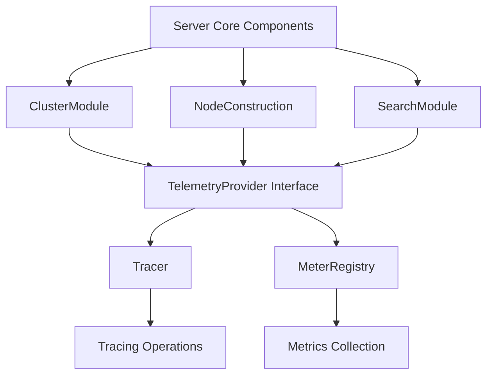

# Overview of Telemetry in Server Core

Telemetry refers to the collection and transmission of data for monitoring and analysis purposes. In Server Core, telemetry is implemented through the `TelemetryProvider` interface, which provides methods to obtain a `Tracer` and a `MeterRegistry`.

The `Tracer` is used for tracing operations, allowing the tracking of requests as they flow through the system. The `MeterRegistry` is used for collecting and managing metrics, such as counters and gauges, which provide insights into the system's performance and resource usage.

Telemetry is integrated into various components of Server Core, such as the `ClusterModule`, `NodeConstruction`, `SearchModule`, and others, to provide comprehensive monitoring and tracing capabilities.

## Telemetry Configuration

To enable telemetry, you must supply configuration and credentials for the APM server. In your `elasticsearch.yml`, add the following configuration: `telemetry.tracing.enabled: true` and `telemetry.agent.server_url: https://<your-apm-server>:443`. When using a secret token to authenticate with the APM server, add it to the Elasticsearch keystore under `telemetry.secret_token`.

<SwmSnippet path="/server/src/main/java/org/elasticsearch/telemetry/TelemetryProvider.java" line="14">

---

## TelemetryProvider Interface

The `TelemetryProvider` interface provides methods to obtain a `Tracer` and a `MeterRegistry`. It includes a `NOOP` implementation that performs no operations, which can be used as a default or fallback.

```java
public interface TelemetryProvider {

    Tracer getTracer();

    MeterRegistry getMeterRegistry();

    TelemetryProvider NOOP = new TelemetryProvider() {

        @Override
        public Tracer getTracer() {
            return Tracer.NOOP;
        }

        @Override
        public MeterRegistry getMeterRegistry() {
            return MeterRegistry.NOOP;
        }
    };
}
```

---

</SwmSnippet>

<SwmSnippet path="/server/src/main/java/org/elasticsearch/cluster/ClusterModule.java" line="82">

---

## Integration with Server Core

Telemetry is integrated into various components of Server Core, such as the `ClusterModule`, to provide comprehensive monitoring and tracing capabilities.

```java
import org.elasticsearch.tasks.TaskResultsService;
import org.elasticsearch.telemetry.TelemetryProvider;
import org.elasticsearch.threadpool.ThreadPool;
import org.elasticsearch.upgrades.FeatureMigrationResults;
import org.elasticsearch.xcontent.NamedXContentRegistry;
import org.elasticsearch.xcontent.ParseField;

import java.util.ArrayList;
import java.util.Collection;
import java.util.HashMap;
import java.util.LinkedHashMap;
import java.util.List;
import java.util.Map;
import java.util.Objects;
import java.util.function.Function;
import java.util.function.Supplier;

/**
 * Configures classes and services that affect the entire cluster.
 */
public class ClusterModule extends AbstractModule {
```

---

</SwmSnippet>

## Main Functions

There are several main functions in this folder. Some of them are `getTracer` and `getMeterRegistry`. We will dive a little into `getTracer` and `getMeterRegistry`.

<SwmSnippet path="/server/src/main/java/org/elasticsearch/telemetry/TelemetryProvider.java" line="16">

---

### getTracer

The `getTracer` function is used to obtain a `Tracer` instance, which is responsible for tracing operations within the system. It allows tracking of requests as they flow through the system, providing insights into the performance and behavior of various components.

```java
    Tracer getTracer();
```

---

</SwmSnippet>

<SwmSnippet path="/server/src/main/java/org/elasticsearch/telemetry/TelemetryProvider.java" line="18">

---

### getMeterRegistry

The `getMeterRegistry` function is used to obtain a `MeterRegistry` instance, which is responsible for collecting and managing metrics such as counters and gauges. These metrics provide insights into the system's performance and resource usage.

```java
    MeterRegistry getMeterRegistry();
```

---

</SwmSnippet>

<SwmSnippet path="/server/src/main/java/org/elasticsearch/telemetry/tracing/Tracer.java" line="35">

---

### startTrace

The `startTrace` method is used to initiate a new span in the tracing system. It can be called with a `TraceContext` and `Traceable` to establish a parent-child relationship between spans, or with just a name and attributes to start a new span.

```java
    /**
     * Called when a span starts.
     * @param traceContext the current context. Required for tracing parent/child span activity.
     * @param traceable provides a unique identifier for the activity, and will not be sent to the tracing system. Add the ID
     *                  to the attributes if it is important
     * @param name the name of the span. Used to filter out spans, but also sent to the tracing system
     * @param attributes arbitrary key/value data for the span. Sent to the tracing system
     */
    void startTrace(TraceContext traceContext, Traceable traceable, String name, Map<String, Object> attributes);

    /**
     * Called when a span starts. This version of the method relies on context to assign the span a parent.
     * @param name the name of the span. Sent to the tracing system
     */
    void startTrace(String name, Map<String, Object> attributes);
```

---

</SwmSnippet>

<SwmSnippet path="/server/src/main/java/org/elasticsearch/telemetry/tracing/Tracer.java" line="51">

---

### stopTrace

The `stopTrace` method is used to end an active span. It can be called with a `Traceable` to identify the specific span to stop, or without parameters to stop the current span in context.

```java
    /**
     * Called when a span ends.
     * @param traceable provides an identifier for the span
     */
    void stopTrace(Traceable traceable);

    /**
     * Called when a span ends. This version of the method relies on context to select the span to stop.
     */
    void stopTrace();
```

---

</SwmSnippet>

&nbsp;

*This is an auto-generated document by Swimm AI 🌊 and has not yet been verified by a human*

<SwmMeta version="3.0.0" repo-id="Z2l0aHViJTNBJTNBZWxhc3RpY3NlYXJjaCUzQSUzQVN3aW1tLURlbW8=" repo-name="elasticsearch" doc-type="overview"><sup>Powered by [Swimm](https://app.swimm.io/)</sup></SwmMeta>
