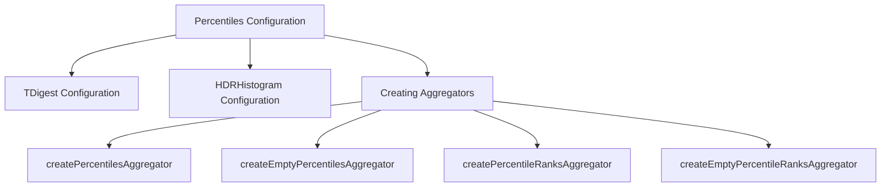

# Percentiles Configuration

Percentiles Configuration is used to define the settings for calculating percentiles in Elasticsearch. It allows the selection of different algorithms, such as <SwmToken path="server/src/main/java/org/elasticsearch/search/aggregations/metrics/PercentilesConfig.java" pos="110:9:9" line-data="    public static final class TDigest extends PercentilesConfig {">`TDigest`</SwmToken> and HDRHistogram, for percentile calculations.

# <SwmToken path="server/src/main/java/org/elasticsearch/search/aggregations/metrics/PercentilesConfig.java" pos="110:9:9" line-data="    public static final class TDigest extends PercentilesConfig {">`TDigest`</SwmToken> Configuration

The <SwmToken path="server/src/main/java/org/elasticsearch/search/aggregations/metrics/PercentilesConfig.java" pos="110:9:9" line-data="    public static final class TDigest extends PercentilesConfig {">`TDigest`</SwmToken> algorithm is configured with a compression factor, which affects the accuracy and performance of the percentile calculations.

<SwmSnippet path="/server/src/main/java/org/elasticsearch/search/aggregations/metrics/PercentilesConfig.java" line="110">

---

The <SwmToken path="server/src/main/java/org/elasticsearch/search/aggregations/metrics/PercentilesConfig.java" pos="110:9:9" line-data="    public static final class TDigest extends PercentilesConfig {">`TDigest`</SwmToken> configuration includes a default compression factor and constructors to set the compression factor and execution hint.

```java
    public static final class TDigest extends PercentilesConfig {
        static final double DEFAULT_COMPRESSION = 100.0;
        private double compression;

        private TDigestExecutionHint executionHint;

        public TDigest() {
            this(DEFAULT_COMPRESSION);
        }

        public TDigest(double compression) {
            this(compression, null);
        }

        public TDigest(double compression, TDigestExecutionHint executionHint) {
            super(PercentilesMethod.TDIGEST);
            this.executionHint = executionHint;
            setCompression(compression);
        }

        TDigest(StreamInput in) throws IOException {
```

---

</SwmSnippet>

# HDRHistogram Configuration

The HDRHistogram algorithm is configured with the number of significant value digits, which determines the precision of the recorded values.

<SwmSnippet path="/server/src/main/java/org/elasticsearch/search/aggregations/metrics/PercentilesConfig.java" line="270">

---

The HDRHistogram configuration includes a default number of significant value digits and methods to set this value, ensuring it is within a valid range.

```java
    public static final class Hdr extends PercentilesConfig {
        static final int DEFAULT_NUMBER_SIG_FIGS = 3;
        private int numberOfSignificantValueDigits;

        public Hdr() {
            this(DEFAULT_NUMBER_SIG_FIGS);
        }

        public Hdr(int numberOfSignificantValueDigits) {
            super(PercentilesMethod.HDR);
            setNumberOfSignificantValueDigits(numberOfSignificantValueDigits);
        }

        Hdr(StreamInput in) throws IOException {
            this(in.readVInt());
        }

        public void setNumberOfSignificantValueDigits(int numberOfSignificantValueDigits) {
            if (numberOfSignificantValueDigits < 0 || numberOfSignificantValueDigits > 5) {
                throw new IllegalArgumentException("[numberOfSignificantValueDigits] must be between 0 and 5");
            }
```

---

</SwmSnippet>

# Creating Aggregators

These configurations are used to create aggregators that compute percentiles and percentile ranks based on the selected algorithm and its settings.

<SwmSnippet path="/server/src/main/java/org/elasticsearch/search/aggregations/metrics/PercentilesConfig.java" line="53">

---

The <SwmToken path="server/src/main/java/org/elasticsearch/search/aggregations/metrics/PercentilesConfig.java" pos="53:7:7" line-data="    public abstract Aggregator createPercentilesAggregator(">`createPercentilesAggregator`</SwmToken> function is used to create an aggregator for calculating percentiles based on the provided configuration and context.

```java
    public abstract Aggregator createPercentilesAggregator(
        String name,
        ValuesSourceConfig config,
        AggregationContext context,
        Aggregator parent,
        double[] values,
        boolean keyed,
        DocValueFormat formatter,
        Map<String, Object> metadata
    ) throws IOException;
```

---

</SwmSnippet>

<SwmSnippet path="/server/src/main/java/org/elasticsearch/search/aggregations/metrics/PercentilesConfig.java" line="64">

---

The <SwmToken path="server/src/main/java/org/elasticsearch/search/aggregations/metrics/PercentilesConfig.java" pos="64:9:9" line-data="    public abstract InternalNumericMetricsAggregation.MultiValue createEmptyPercentilesAggregator(">`createEmptyPercentilesAggregator`</SwmToken> function is used to create an empty aggregator for percentiles, which can be used when there is no data to aggregate.

```java
    public abstract InternalNumericMetricsAggregation.MultiValue createEmptyPercentilesAggregator(
        String name,
        double[] values,
        boolean keyed,
        DocValueFormat formatter,
        Map<String, Object> metadata
    );
```

---

</SwmSnippet>

<SwmSnippet path="/server/src/main/java/org/elasticsearch/search/aggregations/metrics/PercentilesConfig.java" line="72">

---

The <SwmToken path="server/src/main/java/org/elasticsearch/search/aggregations/metrics/PercentilesConfig.java" pos="72:5:5" line-data="    abstract Aggregator createPercentileRanksAggregator(">`createPercentileRanksAggregator`</SwmToken> function is used to create an aggregator for calculating percentile ranks based on the provided configuration and context.

```java
    abstract Aggregator createPercentileRanksAggregator(
        String name,
        ValuesSourceConfig config,
        AggregationContext context,
        Aggregator parent,
        double[] values,
        boolean keyed,
        DocValueFormat formatter,
        Map<String, Object> metadata
    ) throws IOException;
```

---

</SwmSnippet>

<SwmSnippet path="/server/src/main/java/org/elasticsearch/search/aggregations/metrics/PercentilesConfig.java" line="83">

---

The <SwmToken path="server/src/main/java/org/elasticsearch/search/aggregations/metrics/PercentilesConfig.java" pos="83:9:9" line-data="    public abstract InternalNumericMetricsAggregation.MultiValue createEmptyPercentileRanksAggregator(">`createEmptyPercentileRanksAggregator`</SwmToken> function is used to create an empty aggregator for percentile ranks, which can be used when there is no data to aggregate.

```java
    public abstract InternalNumericMetricsAggregation.MultiValue createEmptyPercentileRanksAggregator(
        String name,
        double[] values,
        boolean keyed,
        DocValueFormat formatter,
        Map<String, Object> metadata
    );
```

---

</SwmSnippet>

&nbsp;

*This is an auto-generated document by Swimm AI 🌊 and has not yet been verified by a human*

<SwmMeta version="3.0.0" repo-id="Z2l0aHViJTNBJTNBZWxhc3RpY3NlYXJjaCUzQSUzQVN3aW1tLURlbW8=" repo-name="elasticsearch" doc-type="overview"><sup>Powered by [Swimm](/)</sup></SwmMeta>
