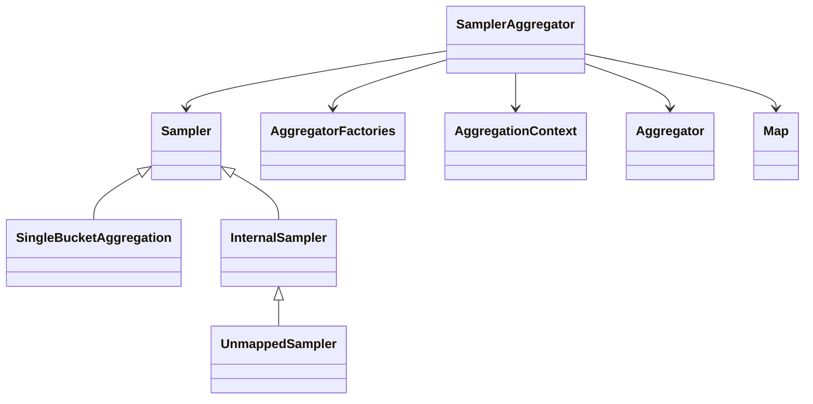

# Overview

The <SwmToken path="server/src/main/java/org/elasticsearch/search/aggregations/bucket/sampler/Sampler.java" pos="17:4:4" line-data="public interface Sampler extends SingleBucketAggregation {}">`Sampler`</SwmToken> aggregation in Elasticsearch is designed to create a single bucket that holds a sample of <SwmToken path="server/src/main/java/org/elasticsearch/search/aggregations/bucket/sampler/Sampler.java" pos="14:3:5" line-data=" * top-matching documents. Computation of child aggregations is deferred until">`top-matching`</SwmToken> documents. This is particularly useful for focusing on smaller sets of high-quality documents, which can improve performance and relevance. The computation of child aggregations is deferred until the <SwmToken path="server/src/main/java/org/elasticsearch/search/aggregations/bucket/sampler/Sampler.java" pos="14:3:5" line-data=" * top-matching documents. Computation of child aggregations is deferred until">`top-matching`</SwmToken> documents on a shard have been determined.

<SwmSnippet path="/server/src/main/java/org/elasticsearch/search/aggregations/bucket/sampler/Sampler.java" line="12">

---

# Sampler Interface

The <SwmToken path="server/src/main/java/org/elasticsearch/search/aggregations/bucket/sampler/Sampler.java" pos="17:4:4" line-data="public interface Sampler extends SingleBucketAggregation {}">`Sampler`</SwmToken> interface extends <SwmToken path="server/src/main/java/org/elasticsearch/search/aggregations/bucket/sampler/Sampler.java" pos="17:8:8" line-data="public interface Sampler extends SingleBucketAggregation {}">`SingleBucketAggregation`</SwmToken> and is used to define a single bucket that holds a sample of <SwmToken path="server/src/main/java/org/elasticsearch/search/aggregations/bucket/sampler/Sampler.java" pos="14:3:5" line-data=" * top-matching documents. Computation of child aggregations is deferred until">`top-matching`</SwmToken> documents. The computation of child aggregations is deferred until the <SwmToken path="server/src/main/java/org/elasticsearch/search/aggregations/bucket/sampler/Sampler.java" pos="14:3:5" line-data=" * top-matching documents. Computation of child aggregations is deferred until">`top-matching`</SwmToken> documents on a shard have been determined.

```java
/**
 * A {@code filter} aggregation that defines a single bucket to hold a sample of
 * top-matching documents. Computation of child aggregations is deferred until
 * the top-matching documents on a shard have been determined.
 */
public interface Sampler extends SingleBucketAggregation {}
```

---

</SwmSnippet>

<SwmSnippet path="/server/src/main/java/org/elasticsearch/search/aggregations/bucket/sampler/InternalSampler.java" line="17">

---

# <SwmToken path="server/src/main/java/org/elasticsearch/search/aggregations/bucket/sampler/InternalSampler.java" pos="17:4:4" line-data="public class InternalSampler extends InternalSingleBucketAggregation implements Sampler {">`InternalSampler`</SwmToken> Class

The <SwmToken path="server/src/main/java/org/elasticsearch/search/aggregations/bucket/sampler/InternalSampler.java" pos="17:4:4" line-data="public class InternalSampler extends InternalSingleBucketAggregation implements Sampler {">`InternalSampler`</SwmToken> class extends <SwmToken path="server/src/main/java/org/elasticsearch/search/aggregations/bucket/sampler/InternalSampler.java" pos="17:8:8" line-data="public class InternalSampler extends InternalSingleBucketAggregation implements Sampler {">`InternalSingleBucketAggregation`</SwmToken> and implements the <SwmToken path="server/src/main/java/org/elasticsearch/search/aggregations/bucket/sampler/InternalSampler.java" pos="17:12:12" line-data="public class InternalSampler extends InternalSingleBucketAggregation implements Sampler {">`Sampler`</SwmToken> interface. It includes constants for the aggregation name and parser name, and methods for creating new aggregations and getting the type and writeable name.

```java
public class InternalSampler extends InternalSingleBucketAggregation implements Sampler {
    public static final String NAME = "mapped_sampler";
    // InternalSampler and UnmappedSampler share the same parser name, so we use this when identifying the aggregation type
    public static final String PARSER_NAME = "sampler";

    InternalSampler(String name, long docCount, InternalAggregations subAggregations, Map<String, Object> metadata) {
        super(name, docCount, subAggregations, metadata);
    }

    /**
     * Read from a stream.
     */
    public InternalSampler(StreamInput in) throws IOException {
        super(in);
    }

    @Override
    public String getWriteableName() {
        return NAME;
    }
```

---

</SwmSnippet>

<SwmSnippet path="/server/src/main/java/org/elasticsearch/search/aggregations/bucket/sampler/UnmappedSampler.java" line="22">

---

# <SwmToken path="server/src/main/java/org/elasticsearch/search/aggregations/bucket/sampler/UnmappedSampler.java" pos="22:4:4" line-data="public class UnmappedSampler extends InternalSampler {">`UnmappedSampler`</SwmToken> Class

The <SwmToken path="server/src/main/java/org/elasticsearch/search/aggregations/bucket/sampler/UnmappedSampler.java" pos="22:4:4" line-data="public class UnmappedSampler extends InternalSampler {">`UnmappedSampler`</SwmToken> class extends <SwmToken path="server/src/main/java/org/elasticsearch/search/aggregations/bucket/sampler/UnmappedSampler.java" pos="22:8:8" line-data="public class UnmappedSampler extends InternalSampler {">`InternalSampler`</SwmToken> and represents an unmapped sampler aggregation. It includes methods for reading from a stream, getting the writeable name, and handling aggregation reduction.

```java
public class UnmappedSampler extends InternalSampler {
    public static final String NAME = "unmapped_sampler";

    UnmappedSampler(String name, Map<String, Object> metadata) {
        super(name, 0, InternalAggregations.EMPTY, metadata);
    }

    /**
     * Read from a stream.
     */
    public UnmappedSampler(StreamInput in) throws IOException {
        super(in);
    }

    @Override
    public String getWriteableName() {
        return NAME;
    }

    @Override
    protected AggregatorReducer getLeaderReducer(AggregationReduceContext reduceContext, int size) {
```

---

</SwmSnippet>

<SwmSnippet path="/server/src/main/java/org/elasticsearch/search/aggregations/bucket/sampler/SamplerAggregator.java" line="184">

---

# <SwmToken path="server/src/main/java/org/elasticsearch/search/aggregations/bucket/sampler/SamplerAggregator.java" pos="184:1:1" line-data="    SamplerAggregator(">`SamplerAggregator`</SwmToken> Constructor

The <SwmToken path="server/src/main/java/org/elasticsearch/search/aggregations/bucket/sampler/SamplerAggregator.java" pos="184:1:1" line-data="    SamplerAggregator(">`SamplerAggregator`</SwmToken> constructor initializes the sampler aggregator with the specified parameters. It ensures that the shard size does not exceed the maximum document count to prevent accidental out-of-memory errors.

```java
    SamplerAggregator(
        String name,
        int shardSize,
        AggregatorFactories factories,
        AggregationContext context,
        Aggregator parent,
        Map<String, Object> metadata
    ) throws IOException {
        super(name, factories, context, parent, metadata);
        // Make sure we do not allow size > maxDoc, to prevent accidental OOM
        this.shardSize = Math.min(shardSize, searcher().getIndexReader().maxDoc());
    }
```

---

</SwmSnippet>

&nbsp;

*This is an auto-generated document by Swimm AI 🌊 and has not yet been verified by a human*

<SwmMeta version="3.0.0" repo-id="Z2l0aHViJTNBJTNBZWxhc3RpY3NlYXJjaCUzQSUzQVN3aW1tLURlbW8=" repo-name="elasticsearch" doc-type="overview"><sup>Powered by [Swimm](/)</sup></SwmMeta>
