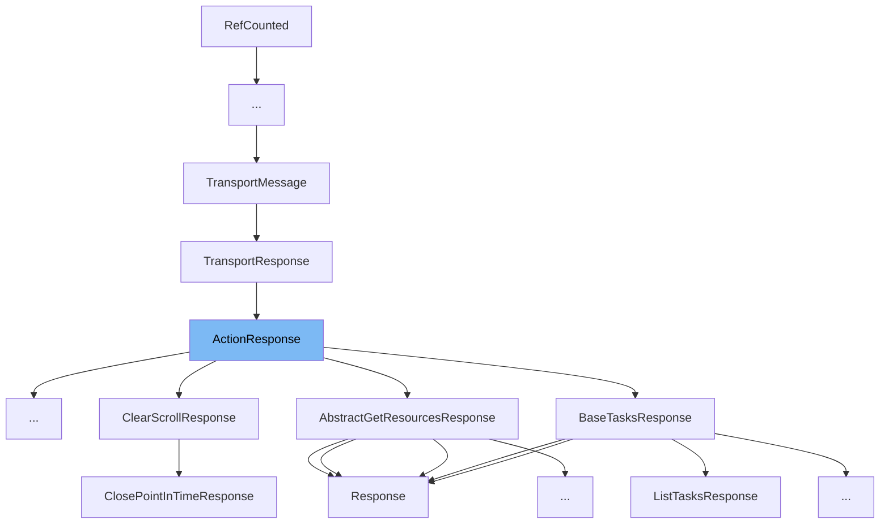

This document will cover the <SwmToken path="server/src/main/java/org/elasticsearch/action/ActionResponse.java" pos="24:3:3" line-data="    public ActionResponse() {}">`ActionResponse`</SwmToken> class. We will cover:

1. What <SwmToken path="server/src/main/java/org/elasticsearch/action/ActionResponse.java" pos="24:3:3" line-data="    public ActionResponse() {}">`ActionResponse`</SwmToken> is.
2. Variables and functions in <SwmToken path="server/src/main/java/org/elasticsearch/action/ActionResponse.java" pos="24:3:3" line-data="    public ActionResponse() {}">`ActionResponse`</SwmToken>.
3. Usage example of <SwmToken path="server/src/main/java/org/elasticsearch/action/ActionResponse.java" pos="24:3:3" line-data="    public ActionResponse() {}">`ActionResponse`</SwmToken>.



# What is <SwmToken path="server/src/main/java/org/elasticsearch/action/ActionResponse.java" pos="24:3:3" line-data="    public ActionResponse() {}">`ActionResponse`</SwmToken>

<SwmToken path="server/src/main/java/org/elasticsearch/action/ActionResponse.java" pos="24:3:3" line-data="    public ActionResponse() {}">`ActionResponse`</SwmToken> is an abstract base class for responses to action requests in Elasticsearch. It extends <SwmToken path="server/src/main/java/org/elasticsearch/action/ActionResponse.java" pos="13:8:8" line-data="import org.elasticsearch.transport.TransportResponse;">`TransportResponse`</SwmToken> and provides a foundation for creating specific response types for various actions within the Elasticsearch framework.

<SwmSnippet path="/server/src/main/java/org/elasticsearch/action/ActionResponse.java" line="24">

---

# Variables and functions

The default constructor <SwmToken path="server/src/main/java/org/elasticsearch/action/ActionResponse.java" pos="24:3:5" line-data="    public ActionResponse() {}">`ActionResponse()`</SwmToken> initializes a new instance of the <SwmToken path="server/src/main/java/org/elasticsearch/action/ActionResponse.java" pos="24:3:3" line-data="    public ActionResponse() {}">`ActionResponse`</SwmToken> class.

```java
    public ActionResponse() {}
```

---

</SwmSnippet>

<SwmSnippet path="/server/src/main/java/org/elasticsearch/action/ActionResponse.java" line="26">

---

The constructor <SwmToken path="server/src/main/java/org/elasticsearch/action/ActionResponse.java" pos="26:3:8" line-data="    public ActionResponse(StreamInput in) throws IOException {">`ActionResponse(StreamInput in)`</SwmToken> initializes a new instance of the <SwmToken path="server/src/main/java/org/elasticsearch/action/ActionResponse.java" pos="26:3:3" line-data="    public ActionResponse(StreamInput in) throws IOException {">`ActionResponse`</SwmToken> class by reading from a <SwmToken path="server/src/main/java/org/elasticsearch/action/ActionResponse.java" pos="26:5:5" line-data="    public ActionResponse(StreamInput in) throws IOException {">`StreamInput`</SwmToken>.

```java
    public ActionResponse(StreamInput in) throws IOException {
        super(in);
    }
```

---

</SwmSnippet>

<SwmSnippet path="/server/src/main/java/org/elasticsearch/action/ActionResponse.java" line="34">

---

The <SwmToken path="server/src/main/java/org/elasticsearch/action/ActionResponse.java" pos="34:5:5" line-data="        public String toString() {">`toString`</SwmToken> method in the <SwmToken path="server/src/main/java/org/elasticsearch/action/ActionResponse.java" pos="30:9:9" line-data="    public static final class Empty extends ActionResponse implements ToXContentObject {">`Empty`</SwmToken> class returns a string representation of the <SwmToken path="server/src/main/java/org/elasticsearch/action/ActionResponse.java" pos="35:4:4" line-data="            return &quot;EmptyActionResponse{}&quot;;">`EmptyActionResponse`</SwmToken>.

```java
        public String toString() {
            return "EmptyActionResponse{}";
        }
```

---

</SwmSnippet>

<SwmSnippet path="/server/src/main/java/org/elasticsearch/action/ActionResponse.java" line="38">

---

The <SwmToken path="server/src/main/java/org/elasticsearch/action/ActionResponse.java" pos="39:5:5" line-data="        public void writeTo(StreamOutput out) {}">`writeTo`</SwmToken> method in the <SwmToken path="server/src/main/java/org/elasticsearch/action/ActionResponse.java" pos="30:9:9" line-data="    public static final class Empty extends ActionResponse implements ToXContentObject {">`Empty`</SwmToken> class is overridden to write the response to a <SwmToken path="server/src/main/java/org/elasticsearch/action/ActionResponse.java" pos="39:7:7" line-data="        public void writeTo(StreamOutput out) {}">`StreamOutput`</SwmToken>. In this case, it does nothing.

```java
        @Override
        public void writeTo(StreamOutput out) {}
```

---

</SwmSnippet>

<SwmSnippet path="/server/src/main/java/org/elasticsearch/action/ActionResponse.java" line="41">

---

The <SwmToken path="server/src/main/java/org/elasticsearch/action/ActionResponse.java" pos="42:5:5" line-data="        public XContentBuilder toXContent(final XContentBuilder builder, final Params params) {">`toXContent`</SwmToken> method in the <SwmToken path="server/src/main/java/org/elasticsearch/action/ActionResponse.java" pos="30:9:9" line-data="    public static final class Empty extends ActionResponse implements ToXContentObject {">`Empty`</SwmToken> class is overridden to build an <SwmToken path="server/src/main/java/org/elasticsearch/action/ActionResponse.java" pos="42:3:3" line-data="        public XContentBuilder toXContent(final XContentBuilder builder, final Params params) {">`XContentBuilder`</SwmToken> with the response content. In this case, it returns the builder as is.

```java
        @Override
        public XContentBuilder toXContent(final XContentBuilder builder, final Params params) {
            return builder;
```

---

</SwmSnippet>

&nbsp;

*This is an auto-generated document by Swimm AI 🌊 and has not yet been verified by a human*

<SwmMeta version="3.0.0" repo-id="Z2l0aHViJTNBJTNBZWxhc3RpY3NlYXJjaCUzQSUzQVN3aW1tLURlbW8=" repo-name="elasticsearch" doc-type="class"><sup>Powered by [Swimm](/)</sup></SwmMeta>
