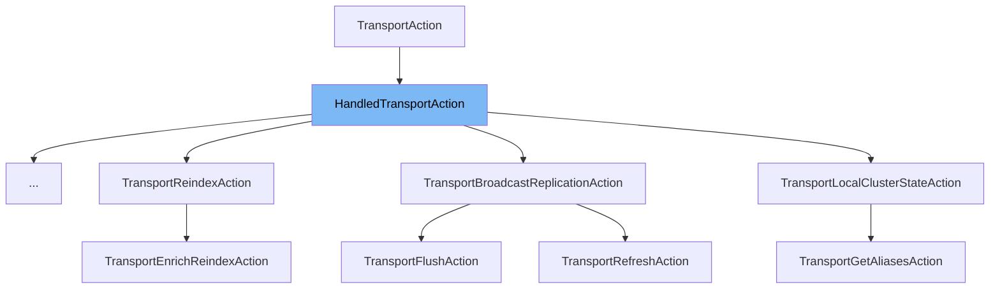

This document will cover the class <SwmToken path="server/src/main/java/org/elasticsearch/action/support/HandledTransportAction.java" pos="24:3:3" line-data="    protected HandledTransportAction(">`HandledTransportAction`</SwmToken>. We will cover:

1. What <SwmToken path="server/src/main/java/org/elasticsearch/action/support/HandledTransportAction.java" pos="24:3:3" line-data="    protected HandledTransportAction(">`HandledTransportAction`</SwmToken> is.
2. Variables and functions in <SwmToken path="server/src/main/java/org/elasticsearch/action/support/HandledTransportAction.java" pos="24:3:3" line-data="    protected HandledTransportAction(">`HandledTransportAction`</SwmToken>.
3. Usage example of <SwmToken path="server/src/main/java/org/elasticsearch/action/support/HandledTransportAction.java" pos="24:3:3" line-data="    protected HandledTransportAction(">`HandledTransportAction`</SwmToken> in <SwmToken path="x-pack/plugin/ml/src/main/java/org/elasticsearch/xpack/ml/action/TransportEstimateModelMemoryAction.java" pos="36:4:4" line-data="public class TransportEstimateModelMemoryAction extends HandledTransportAction&lt;">`TransportEstimateModelMemoryAction`</SwmToken>.



# What is <SwmToken path="server/src/main/java/org/elasticsearch/action/support/HandledTransportAction.java" pos="24:3:3" line-data="    protected HandledTransportAction(">`HandledTransportAction`</SwmToken>

<SwmToken path="server/src/main/java/org/elasticsearch/action/support/HandledTransportAction.java" pos="24:3:3" line-data="    protected HandledTransportAction(">`HandledTransportAction`</SwmToken> is an abstract class in the Elasticsearch codebase, specifically located in <SwmPath>[server/src/main/java/org/elasticsearch/action/support/HandledTransportAction.java](server/src/main/java/org/elasticsearch/action/support/HandledTransportAction.java)</SwmPath>. It extends the <SwmToken path="server/src/main/java/org/elasticsearch/action/support/HandledTransportAction.java" pos="18:9:9" line-data=" * A {@link TransportAction} which, on creation, registers a handler for its own {@link #actionName} with the transport service.">`TransportAction`</SwmToken> class and is designed to register a handler for its own <SwmToken path="server/src/main/java/org/elasticsearch/action/support/HandledTransportAction.java" pos="25:3:3" line-data="        String actionName,">`actionName`</SwmToken> with the transport service upon creation. This class is used to facilitate the handling of transport actions in a consistent and efficient manner.

<SwmSnippet path="/server/src/main/java/org/elasticsearch/action/support/HandledTransportAction.java" line="24">

---

# Variables and functions

The constructor <SwmToken path="server/src/main/java/org/elasticsearch/action/support/HandledTransportAction.java" pos="24:3:3" line-data="    protected HandledTransportAction(">`HandledTransportAction`</SwmToken> initializes the class with the provided parameters: <SwmToken path="server/src/main/java/org/elasticsearch/action/support/HandledTransportAction.java" pos="25:3:3" line-data="        String actionName,">`actionName`</SwmToken>, <SwmToken path="server/src/main/java/org/elasticsearch/action/support/HandledTransportAction.java" pos="26:1:1" line-data="        TransportService transportService,">`TransportService`</SwmToken>, <SwmToken path="server/src/main/java/org/elasticsearch/action/support/HandledTransportAction.java" pos="27:1:1" line-data="        ActionFilters actionFilters,">`ActionFilters`</SwmToken>, <SwmToken path="server/src/main/java/org/elasticsearch/action/support/HandledTransportAction.java" pos="28:8:8" line-data="        Writeable.Reader&lt;Request&gt; requestReader,">`requestReader`</SwmToken>, and <SwmToken path="server/src/main/java/org/elasticsearch/action/support/HandledTransportAction.java" pos="29:1:1" line-data="        Executor executor">`Executor`</SwmToken>. It calls another constructor with an additional parameter <SwmToken path="server/src/main/java/org/elasticsearch/action/support/HandledTransportAction.java" pos="37:3:3" line-data="        boolean canTripCircuitBreaker,">`canTripCircuitBreaker`</SwmToken> set to `true`.

```java
    protected HandledTransportAction(
        String actionName,
        TransportService transportService,
        ActionFilters actionFilters,
        Writeable.Reader<Request> requestReader,
        Executor executor
    ) {
        this(actionName, true, transportService, actionFilters, requestReader, executor);
    }
```

---

</SwmSnippet>

<SwmSnippet path="/server/src/main/java/org/elasticsearch/action/support/HandledTransportAction.java" line="35">

---

The second constructor <SwmToken path="server/src/main/java/org/elasticsearch/action/support/HandledTransportAction.java" pos="35:3:3" line-data="    protected HandledTransportAction(">`HandledTransportAction`</SwmToken> initializes the class with the provided parameters and registers a request handler with the transport service. It uses the <SwmToken path="server/src/main/java/org/elasticsearch/action/support/HandledTransportAction.java" pos="44:1:3" line-data="        transportService.registerRequestHandler(">`transportService.registerRequestHandler`</SwmToken> method to set up the handler with the specified <SwmToken path="server/src/main/java/org/elasticsearch/action/support/HandledTransportAction.java" pos="36:3:3" line-data="        String actionName,">`actionName`</SwmToken>, <SwmToken path="server/src/main/java/org/elasticsearch/action/support/HandledTransportAction.java" pos="41:1:1" line-data="        Executor executor">`Executor`</SwmToken>, <SwmToken path="server/src/main/java/org/elasticsearch/action/support/HandledTransportAction.java" pos="37:3:3" line-data="        boolean canTripCircuitBreaker,">`canTripCircuitBreaker`</SwmToken>, and <SwmToken path="server/src/main/java/org/elasticsearch/action/support/HandledTransportAction.java" pos="40:8:8" line-data="        Writeable.Reader&lt;Request&gt; requestReader,">`requestReader`</SwmToken>.

```java
    protected HandledTransportAction(
        String actionName,
        boolean canTripCircuitBreaker,
        TransportService transportService,
        ActionFilters actionFilters,
        Writeable.Reader<Request> requestReader,
        Executor executor
    ) {
        super(actionName, actionFilters, transportService.getTaskManager(), executor);
        transportService.registerRequestHandler(
            actionName,
            executor,
            false,
            canTripCircuitBreaker,
            requestReader,
            (request, channel, task) -> executeDirect(task, request, new ChannelActionListener<>(channel))
        );
    }
```

---

</SwmSnippet>

# Usage example

An example of how to use <SwmToken path="server/src/main/java/org/elasticsearch/action/support/HandledTransportAction.java" pos="24:3:3" line-data="    protected HandledTransportAction(">`HandledTransportAction`</SwmToken> can be found in the <SwmToken path="x-pack/plugin/ml/src/main/java/org/elasticsearch/xpack/ml/action/TransportEstimateModelMemoryAction.java" pos="36:4:4" line-data="public class TransportEstimateModelMemoryAction extends HandledTransportAction&lt;">`TransportEstimateModelMemoryAction`</SwmToken> class. This class extends <SwmToken path="server/src/main/java/org/elasticsearch/action/support/HandledTransportAction.java" pos="24:3:3" line-data="    protected HandledTransportAction(">`HandledTransportAction`</SwmToken> and provides a concrete implementation for handling transport actions related to estimating model memory.

<SwmSnippet path="/x-pack/plugin/ml/src/main/java/org/elasticsearch/xpack/ml/action/TransportEstimateModelMemoryAction.java" line="1">

---

The <SwmToken path="x-pack/plugin/ml/src/main/java/org/elasticsearch/xpack/ml/action/TransportEstimateModelMemoryAction.java" pos="36:4:4" line-data="public class TransportEstimateModelMemoryAction extends HandledTransportAction&lt;">`TransportEstimateModelMemoryAction`</SwmToken> class imports necessary packages and extends <SwmToken path="server/src/main/java/org/elasticsearch/action/support/HandledTransportAction.java" pos="24:3:3" line-data="    protected HandledTransportAction(">`HandledTransportAction`</SwmToken>. It provides a specific implementation for estimating model memory, demonstrating how <SwmToken path="server/src/main/java/org/elasticsearch/action/support/HandledTransportAction.java" pos="24:3:3" line-data="    protected HandledTransportAction(">`HandledTransportAction`</SwmToken> can be utilized in practice.

```java
/*
 * Copyright Elasticsearch B.V. and/or licensed to Elasticsearch B.V. under one
 * or more contributor license agreements. Licensed under the Elastic License
 * 2.0; you may not use this file except in compliance with the Elastic License
 * 2.0.
 */
package org.elasticsearch.xpack.ml.action;
```

---

</SwmSnippet>

&nbsp;

*This is an auto-generated document by Swimm AI 🌊 and has not yet been verified by a human*

<SwmMeta version="3.0.0" repo-id="Z2l0aHViJTNBJTNBZWxhc3RpY3NlYXJjaCUzQSUzQVN3aW1tLURlbW8=" repo-name="elasticsearch" doc-type="class"><sup>Powered by [Swimm](/)</sup></SwmMeta>
