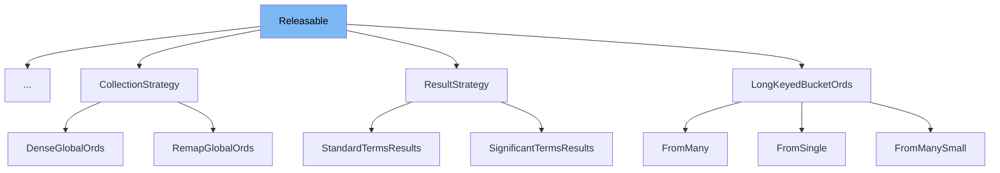

This document will cover the class <SwmToken path="libs/core/src/main/java/org/elasticsearch/core/Releasable.java" pos="16:4:4" line-data="public interface Releasable extends Closeable {">`Releasable`</SwmToken> in Elasticsearch. We will cover:

1. What is Releasable
2. Variables and functions
3. Usage example



# What is Releasable

The <SwmToken path="libs/core/src/main/java/org/elasticsearch/core/Releasable.java" pos="16:4:4" line-data="public interface Releasable extends Closeable {">`Releasable`</SwmToken> interface in <SwmPath>[libs/core/src/main/java/org/elasticsearch/core/Releasable.java](libs/core/src/main/java/org/elasticsearch/core/Releasable.java)</SwmPath> is a specialization of the <SwmToken path="libs/core/src/main/java/org/elasticsearch/core/Releasable.java" pos="11:6:6" line-data="import java.io.Closeable;">`Closeable`</SwmToken> interface. It is designed to handle resources that need to be released, ensuring that only <SwmToken path="libs/core/src/main/java/org/elasticsearch/core/Releasable.java" pos="14:28:28" line-data=" * Specialization of {@link Closeable} that may only throw a {@link RuntimeException}.">`RuntimeException`</SwmToken> can be thrown during the release process. This interface is used to manage resources that require explicit release, such as file handles or network connections, in a safe and consistent manner.

<SwmSnippet path="/libs/core/src/main/java/org/elasticsearch/core/Releasable.java" line="18">

---

# Variables and functions

The <SwmToken path="libs/core/src/main/java/org/elasticsearch/core/Releasable.java" pos="19:3:3" line-data="    void close();">`close`</SwmToken> function is the only method defined in the <SwmToken path="libs/core/src/main/java/org/elasticsearch/core/Releasable.java" pos="16:4:4" line-data="public interface Releasable extends Closeable {">`Releasable`</SwmToken> interface. It overrides the <SwmToken path="libs/core/src/main/java/org/elasticsearch/core/Releasable.java" pos="19:3:3" line-data="    void close();">`close`</SwmToken> method from the <SwmToken path="libs/core/src/main/java/org/elasticsearch/core/Releasable.java" pos="11:6:6" line-data="import java.io.Closeable;">`Closeable`</SwmToken> interface and is intended to release resources. The method signature ensures that only <SwmToken path="libs/core/src/main/java/org/elasticsearch/core/Releasable.java" pos="14:28:28" line-data=" * Specialization of {@link Closeable} that may only throw a {@link RuntimeException}.">`RuntimeException`</SwmToken> can be thrown, providing a more specific contract than the general `IOException` that <SwmToken path="libs/core/src/main/java/org/elasticsearch/core/Releasable.java" pos="11:6:6" line-data="import java.io.Closeable;">`Closeable`</SwmToken> allows.

```java
    @Override
    void close();
```

---

</SwmSnippet>

# Usage example

The <SwmToken path="libs/core/src/main/java/org/elasticsearch/core/Releasable.java" pos="16:4:4" line-data="public interface Releasable extends Closeable {">`Releasable`</SwmToken> interface is implemented by the <SwmToken path="server/src/main/java/org/elasticsearch/search/aggregations/metrics/HyperLogLogPlusPlus.java" pos="34:5:5" line-data=" * The HyperLogLogPlusPlus contains two algorithms, one for linear counting and the HyperLogLog algorithm. Initially hashes added to the">`HyperLogLogPlusPlus`</SwmToken> class in <SwmPath>[server/src/main/java/org/elasticsearch/search/aggregations/metrics/HyperLogLogPlusPlus.java](server/src/main/java/org/elasticsearch/search/aggregations/metrics/HyperLogLogPlusPlus.java)</SwmPath>. Here is an example of how <SwmToken path="libs/core/src/main/java/org/elasticsearch/core/Releasable.java" pos="16:4:4" line-data="public interface Releasable extends Closeable {">`Releasable`</SwmToken> is used in the <SwmToken path="server/src/main/java/org/elasticsearch/search/aggregations/metrics/HyperLogLogPlusPlus.java" pos="34:5:5" line-data=" * The HyperLogLogPlusPlus contains two algorithms, one for linear counting and the HyperLogLog algorithm. Initially hashes added to the">`HyperLogLogPlusPlus`</SwmToken> class.

<SwmSnippet path="/server/src/main/java/org/elasticsearch/search/aggregations/metrics/HyperLogLogPlusPlus.java" line="1">

---

The <SwmToken path="server/src/main/java/org/elasticsearch/search/aggregations/metrics/HyperLogLogPlusPlus.java" pos="34:5:5" line-data=" * The HyperLogLogPlusPlus contains two algorithms, one for linear counting and the HyperLogLog algorithm. Initially hashes added to the">`HyperLogLogPlusPlus`</SwmToken> class implements the <SwmToken path="libs/core/src/main/java/org/elasticsearch/core/Releasable.java" pos="16:4:4" line-data="public interface Releasable extends Closeable {">`Releasable`</SwmToken> interface. This means it provides an implementation of the <SwmToken path="libs/core/src/main/java/org/elasticsearch/core/Releasable.java" pos="19:3:3" line-data="    void close();">`close`</SwmToken> method to release any resources it holds. This ensures that resources are properly managed and released when they are no longer needed.

```java
/*
 * Copyright Elasticsearch B.V. and/or licensed to Elasticsearch B.V. under one
 * or more contributor license agreements. Licensed under the Elastic License
 * 2.0 and the Server Side Public License, v 1; you may not use this file except
 * in compliance with, at your election, the Elastic License 2.0 or the Server
 * Side Public License, v 1.
 */
```

---

</SwmSnippet>

&nbsp;

*This is an auto-generated document by Swimm AI 🌊 and has not yet been verified by a human*

<SwmMeta version="3.0.0" repo-id="Z2l0aHViJTNBJTNBZWxhc3RpY3NlYXJjaCUzQSUzQVN3aW1tLURlbW8=" repo-name="elasticsearch" doc-type="general-class"><sup>Powered by [Swimm](/)</sup></SwmMeta>
