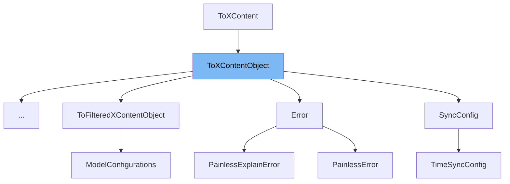

This document will cover the class <SwmToken path="modules/lang-painless/src/main/java/org/elasticsearch/painless/action/PainlessContextClassBindingInfo.java" pos="19:8:8" line-data="import org.elasticsearch.xcontent.ToXContentObject;">`ToXContentObject`</SwmToken>. We will discuss:

1. What <SwmToken path="modules/lang-painless/src/main/java/org/elasticsearch/painless/action/PainlessContextClassBindingInfo.java" pos="19:8:8" line-data="import org.elasticsearch.xcontent.ToXContentObject;">`ToXContentObject`</SwmToken> is.
2. The variables and functions defined in <SwmToken path="modules/lang-painless/src/main/java/org/elasticsearch/painless/action/PainlessContextClassBindingInfo.java" pos="19:8:8" line-data="import org.elasticsearch.xcontent.ToXContentObject;">`ToXContentObject`</SwmToken>.
3. An example of how to use <SwmToken path="modules/lang-painless/src/main/java/org/elasticsearch/painless/action/PainlessContextClassBindingInfo.java" pos="19:8:8" line-data="import org.elasticsearch.xcontent.ToXContentObject;">`ToXContentObject`</SwmToken> in <SwmToken path="modules/lang-painless/src/main/java/org/elasticsearch/painless/action/PainlessContextClassBindingInfo.java" pos="29:4:4" line-data="public class PainlessContextClassBindingInfo implements Writeable, ToXContentObject {">`PainlessContextClassBindingInfo`</SwmToken>.



# What is <SwmToken path="modules/lang-painless/src/main/java/org/elasticsearch/painless/action/PainlessContextClassBindingInfo.java" pos="19:8:8" line-data="import org.elasticsearch.xcontent.ToXContentObject;">`ToXContentObject`</SwmToken>

<SwmToken path="modules/lang-painless/src/main/java/org/elasticsearch/painless/action/PainlessContextClassBindingInfo.java" pos="19:8:8" line-data="import org.elasticsearch.xcontent.ToXContentObject;">`ToXContentObject`</SwmToken> is an interface in the Elasticsearch codebase, specifically located in <SwmPath>[libs/x-content/src/main/java/org/elasticsearch/xcontent/ToXContentObject.java](libs/x-content/src/main/java/org/elasticsearch/xcontent/ToXContentObject.java)</SwmPath>. It allows an object to be transferred to <SwmToken path="modules/lang-painless/src/main/java/org/elasticsearch/painless/action/PainlessContextClassBindingInfo.java" pos="16:6:6" line-data="import org.elasticsearch.xcontent.ConstructingObjectParser;">`xcontent`</SwmToken> using an <SwmToken path="modules/lang-painless/src/main/java/org/elasticsearch/painless/action/PainlessContextClassBindingInfo.java" pos="20:8:8" line-data="import org.elasticsearch.xcontent.XContentBuilder;">`XContentBuilder`</SwmToken>. The primary distinction between <SwmToken path="modules/lang-painless/src/main/java/org/elasticsearch/painless/action/PainlessContextClassBindingInfo.java" pos="19:8:8" line-data="import org.elasticsearch.xcontent.ToXContentObject;">`ToXContentObject`</SwmToken> and <SwmToken path="libs/x-content/src/main/java/org/elasticsearch/xcontent/ToXContentObject.java" pos="13:21:21" line-data=" * {@link XContentBuilder}. The difference between {@link ToXContentFragment}">`ToXContentFragment`</SwmToken> is that <SwmToken path="modules/lang-painless/src/main/java/org/elasticsearch/painless/action/PainlessContextClassBindingInfo.java" pos="19:8:8" line-data="import org.elasticsearch.xcontent.ToXContentObject;">`ToXContentObject`</SwmToken> outputs fully valid syntax without requiring any external additions, whereas <SwmToken path="libs/x-content/src/main/java/org/elasticsearch/xcontent/ToXContentObject.java" pos="13:21:21" line-data=" * {@link XContentBuilder}. The difference between {@link ToXContentFragment}">`ToXContentFragment`</SwmToken> outputs a fragment that needs to start and end a new anonymous object externally.

<SwmSnippet path="/libs/x-content/src/main/java/org/elasticsearch/xcontent/ToXContentObject.java" line="21">

---

# Variables and functions

The function <SwmToken path="libs/x-content/src/main/java/org/elasticsearch/xcontent/ToXContentObject.java" pos="22:5:5" line-data="    default boolean isFragment() {">`isFragment`</SwmToken> is overridden in the <SwmToken path="modules/lang-painless/src/main/java/org/elasticsearch/painless/action/PainlessContextClassBindingInfo.java" pos="19:8:8" line-data="import org.elasticsearch.xcontent.ToXContentObject;">`ToXContentObject`</SwmToken> interface. It returns `false`, indicating that the output is a complete and valid <SwmToken path="modules/lang-painless/src/main/java/org/elasticsearch/painless/action/PainlessContextClassBindingInfo.java" pos="16:6:6" line-data="import org.elasticsearch.xcontent.ConstructingObjectParser;">`xcontent`</SwmToken> object, not a fragment.

```java
    @Override
    default boolean isFragment() {
        return false;
    }
```

---

</SwmSnippet>

# Usage example

Here is an example of how to use <SwmToken path="modules/lang-painless/src/main/java/org/elasticsearch/painless/action/PainlessContextClassBindingInfo.java" pos="19:8:8" line-data="import org.elasticsearch.xcontent.ToXContentObject;">`ToXContentObject`</SwmToken> in the <SwmToken path="modules/lang-painless/src/main/java/org/elasticsearch/painless/action/PainlessContextClassBindingInfo.java" pos="29:4:4" line-data="public class PainlessContextClassBindingInfo implements Writeable, ToXContentObject {">`PainlessContextClassBindingInfo`</SwmToken> class.

<SwmSnippet path="/modules/lang-painless/src/main/java/org/elasticsearch/painless/action/PainlessContextClassBindingInfo.java" line="1">

---

<SwmToken path="modules/lang-painless/src/main/java/org/elasticsearch/painless/action/PainlessContextClassBindingInfo.java" pos="29:4:4" line-data="public class PainlessContextClassBindingInfo implements Writeable, ToXContentObject {">`PainlessContextClassBindingInfo`</SwmToken> implements the <SwmToken path="modules/lang-painless/src/main/java/org/elasticsearch/painless/action/PainlessContextClassBindingInfo.java" pos="19:8:8" line-data="import org.elasticsearch.xcontent.ToXContentObject;">`ToXContentObject`</SwmToken> interface. This class is used to transfer its data to <SwmToken path="modules/lang-painless/src/main/java/org/elasticsearch/painless/action/PainlessContextClassBindingInfo.java" pos="16:6:6" line-data="import org.elasticsearch.xcontent.ConstructingObjectParser;">`xcontent`</SwmToken> using an <SwmToken path="modules/lang-painless/src/main/java/org/elasticsearch/painless/action/PainlessContextClassBindingInfo.java" pos="20:8:8" line-data="import org.elasticsearch.xcontent.XContentBuilder;">`XContentBuilder`</SwmToken>, ensuring that the output is a fully valid <SwmToken path="modules/lang-painless/src/main/java/org/elasticsearch/painless/action/PainlessContextClassBindingInfo.java" pos="16:6:6" line-data="import org.elasticsearch.xcontent.ConstructingObjectParser;">`xcontent`</SwmToken> object.

```java
/*
 * Copyright Elasticsearch B.V. and/or licensed to Elasticsearch B.V. under one
 * or more contributor license agreements. Licensed under the Elastic License
 * 2.0 and the Server Side Public License, v 1; you may not use this file except
 * in compliance with, at your election, the Elastic License 2.0 or the Server
 * Side Public License, v 1.
 */

package org.elasticsearch.painless.action;

import org.elasticsearch.common.io.stream.StreamInput;
import org.elasticsearch.common.io.stream.StreamOutput;
import org.elasticsearch.common.io.stream.Writeable;
import org.elasticsearch.painless.lookup.PainlessClassBinding;
import org.elasticsearch.painless.lookup.PainlessLookupUtility;
import org.elasticsearch.xcontent.ConstructingObjectParser;
import org.elasticsearch.xcontent.ParseField;
import org.elasticsearch.xcontent.ToXContent;
import org.elasticsearch.xcontent.ToXContentObject;
import org.elasticsearch.xcontent.XContentBuilder;
import org.elasticsearch.xcontent.XContentParser;
```

---

</SwmSnippet>

&nbsp;

*This is an auto-generated document by Swimm AI 🌊 and has not yet been verified by a human*

<SwmMeta version="3.0.0" repo-id="Z2l0aHViJTNBJTNBZWxhc3RpY3NlYXJjaCUzQSUzQVN3aW1tLURlbW8=" repo-name="elasticsearch" doc-type="general-class"><sup>Powered by [Swimm](/)</sup></SwmMeta>
