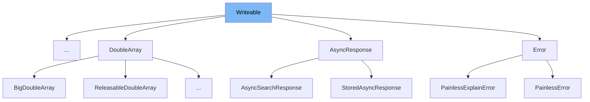

This document will cover the <SwmToken path="server/src/main/java/org/elasticsearch/common/io/stream/Writeable.java" pos="18:4:4" line-data="public interface Writeable {">`Writeable`</SwmToken> interface in Elasticsearch. We will cover:

1. What <SwmToken path="server/src/main/java/org/elasticsearch/common/io/stream/Writeable.java" pos="18:4:4" line-data="public interface Writeable {">`Writeable`</SwmToken> is.
2. Variables and functions in <SwmToken path="server/src/main/java/org/elasticsearch/common/io/stream/Writeable.java" pos="18:4:4" line-data="public interface Writeable {">`Writeable`</SwmToken>.
3. Usage example in <SwmToken path="modules/aggregations/src/main/java/org/elasticsearch/aggregations/metric/MatrixStatsResults.java" pos="33:1:1" line-data="    MatrixStatsResults() {">`MatrixStatsResults`</SwmToken>.



# What is Writeable

The <SwmToken path="server/src/main/java/org/elasticsearch/common/io/stream/Writeable.java" pos="18:4:4" line-data="public interface Writeable {">`Writeable`</SwmToken> interface in <SwmPath>[server/src/main/java/org/elasticsearch/common/io/stream/Writeable.java](server/src/main/java/org/elasticsearch/common/io/stream/Writeable.java)</SwmPath> is used to define objects that can be serialized to a <SwmToken path="server/src/main/java/org/elasticsearch/common/io/stream/Writeable.java" pos="21:15:15" line-data="     * Write this into the {@linkplain StreamOutput}.">`StreamOutput`</SwmToken> and deserialized from a <SwmToken path="server/src/main/java/org/elasticsearch/common/io/stream/Writeable.java" pos="75:5:5" line-data="        V read(StreamInput in) throws IOException;">`StreamInput`</SwmToken>. This allows objects to be transmitted across the network using Elasticsearch's internal protocol. Implementers of this interface should ensure that serialized and deserialized copies of the object are equal and have the same hash code, although they do not need to be entirely unchanged.

<SwmSnippet path="/server/src/main/java/org/elasticsearch/common/io/stream/Writeable.java" line="20">

---

# Variables and functions

The <SwmToken path="server/src/main/java/org/elasticsearch/common/io/stream/Writeable.java" pos="23:3:3" line-data="    void writeTo(StreamOutput out) throws IOException;">`writeTo`</SwmToken> function is used to write the object to a <SwmToken path="server/src/main/java/org/elasticsearch/common/io/stream/Writeable.java" pos="21:15:15" line-data="     * Write this into the {@linkplain StreamOutput}.">`StreamOutput`</SwmToken>. This function must be implemented by any class that implements the <SwmToken path="server/src/main/java/org/elasticsearch/common/io/stream/Writeable.java" pos="18:4:4" line-data="public interface Writeable {">`Writeable`</SwmToken> interface.

```java
    /**
     * Write this into the {@linkplain StreamOutput}.
     */
    void writeTo(StreamOutput out) throws IOException;
```

---

</SwmSnippet>

<SwmSnippet path="/server/src/main/java/org/elasticsearch/common/io/stream/Writeable.java" line="41">

---

The <SwmToken path="server/src/main/java/org/elasticsearch/common/io/stream/Writeable.java" pos="41:3:3" line-data="    interface Writer&lt;V&gt; {">`Writer`</SwmToken> interface is a functional interface that defines a method to write an object of type <SwmToken path="server/src/main/java/org/elasticsearch/common/io/stream/Writeable.java" pos="41:5:5" line-data="    interface Writer&lt;V&gt; {">`V`</SwmToken> to a <SwmToken path="server/src/main/java/org/elasticsearch/common/io/stream/Writeable.java" pos="49:5:5" line-data="        void write(StreamOutput out, V value) throws IOException;">`StreamOutput`</SwmToken>. This is typically a method from <SwmToken path="server/src/main/java/org/elasticsearch/common/io/stream/Writeable.java" pos="49:5:5" line-data="        void write(StreamOutput out, V value) throws IOException;">`StreamOutput`</SwmToken> itself, such as <SwmToken path="server/src/main/java/org/elasticsearch/common/io/stream/Writeable.java" pos="28:38:38" line-data="     * By convention this is a method from {@link StreamOutput} itself (e.g., {@link StreamOutput#writeString(String)}. If the value can be">`writeString`</SwmToken>.

```java
    interface Writer<V> {

        /**
         * Write {@code V}-type {@code value} to the {@code out}put stream.
         *
         * @param out Output to write the {@code value} too
         * @param value The value to add
         */
        void write(StreamOutput out, V value) throws IOException;

```

---

</SwmSnippet>

<SwmSnippet path="/server/src/main/java/org/elasticsearch/common/io/stream/Writeable.java" line="68">

---

The <SwmToken path="server/src/main/java/org/elasticsearch/common/io/stream/Writeable.java" pos="68:3:3" line-data="    interface Reader&lt;V&gt; {">`Reader`</SwmToken> interface is a functional interface that defines a method to read an object of type <SwmToken path="server/src/main/java/org/elasticsearch/common/io/stream/Writeable.java" pos="68:5:5" line-data="    interface Reader&lt;V&gt; {">`V`</SwmToken> from a <SwmToken path="server/src/main/java/org/elasticsearch/common/io/stream/Writeable.java" pos="75:5:5" line-data="        V read(StreamInput in) throws IOException;">`StreamInput`</SwmToken>. This is typically implemented via a constructor or a static method in the case of enumerations.

```java
    interface Reader<V> {

        /**
         * Read {@code V}-type value from a stream.
         *
         * @param in Input to read the value from
         */
        V read(StreamInput in) throws IOException;
    }
```

---

</SwmSnippet>

# Usage example

The <SwmToken path="modules/aggregations/src/main/java/org/elasticsearch/aggregations/metric/MatrixStatsResults.java" pos="33:1:1" line-data="    MatrixStatsResults() {">`MatrixStatsResults`</SwmToken> class in <SwmPath>[modules/aggregations/src/main/java/org/elasticsearch/aggregations/metric/MatrixStatsResults.java](modules/aggregations/src/main/java/org/elasticsearch/aggregations/metric/MatrixStatsResults.java)</SwmPath> is an example of a class that implements the <SwmToken path="server/src/main/java/org/elasticsearch/common/io/stream/Writeable.java" pos="18:4:4" line-data="public interface Writeable {">`Writeable`</SwmToken> interface. Here is how it is used:

<SwmSnippet path="/modules/aggregations/src/main/java/org/elasticsearch/aggregations/metric/MatrixStatsResults.java" line="30">

---

The <SwmToken path="modules/aggregations/src/main/java/org/elasticsearch/aggregations/metric/MatrixStatsResults.java" pos="33:1:1" line-data="    MatrixStatsResults() {">`MatrixStatsResults`</SwmToken> class implements the <SwmToken path="server/src/main/java/org/elasticsearch/common/io/stream/Writeable.java" pos="18:4:4" line-data="public interface Writeable {">`Writeable`</SwmToken> interface and provides an implementation for the <SwmToken path="server/src/main/java/org/elasticsearch/common/io/stream/Writeable.java" pos="23:3:3" line-data="    void writeTo(StreamOutput out) throws IOException;">`writeTo`</SwmToken> method. This allows instances of <SwmToken path="modules/aggregations/src/main/java/org/elasticsearch/aggregations/metric/MatrixStatsResults.java" pos="33:1:1" line-data="    MatrixStatsResults() {">`MatrixStatsResults`</SwmToken> to be serialized and deserialized using Elasticsearch's internal protocol.

```java
    protected final Map<String, HashMap<String, Double>> correlation;

    /** Base ctor */
    MatrixStatsResults() {
        results = new RunningStats();
        this.correlation = new HashMap<>();
```

---

</SwmSnippet>

&nbsp;

*This is an auto-generated document by Swimm AI 🌊 and has not yet been verified by a human*

<SwmMeta version="3.0.0" repo-id="Z2l0aHViJTNBJTNBZWxhc3RpY3NlYXJjaCUzQSUzQVN3aW1tLURlbW8=" repo-name="elasticsearch" doc-type="class"><sup>Powered by [Swimm](/)</sup></SwmMeta>
