```mermaid
classDiagram
    class CompletionSuggester {
        +CompletionSuggester INSTANCE
        +innerExecute()
    }
    class CompletionSuggestion {
        +String text
        +float score
        +Map<String, List<String>> contexts
    }
    class CompletionSuggestionContext {
        +SearchExecutionContext SearchExecutionContext
        +CompletionFieldMapper.CompletionFieldType fieldType
    }
    class TopSuggestGroupDocsCollector {
        +collect()
        +rank()
    }
    CompletionSuggester --> CompletionSuggestionContext
    CompletionSuggester --> TopSuggestGroupDocsCollector
    CompletionSuggestion --> CompletionSuggestionContext

%% Swimm:
%% classDiagram
%%     class <SwmToken path="server/src/main/java/org/elasticsearch/search/suggest/completion/CompletionSuggester.java" pos="31:4:4" line-data="public class CompletionSuggester extends Suggester&lt;CompletionSuggestionContext&gt; {">`CompletionSuggester`</SwmToken> {
%%         +CompletionSuggester INSTANCE
%%         +innerExecute()
%%     }
%%     class <SwmToken path="server/src/main/java/org/elasticsearch/search/suggest/completion/CompletionSuggester.java" pos="46:1:1" line-data="            CompletionSuggestion completionSuggestion = emptySuggestion(name, suggestionContext, spare);">`CompletionSuggestion`</SwmToken> {
%%         +String text
%%         +float score
%%         +Map<String, List<String>> contexts
%%     }
%%     class <SwmToken path="server/src/main/java/org/elasticsearch/search/suggest/completion/CompletionSuggester.java" pos="31:10:10" line-data="public class CompletionSuggester extends Suggester&lt;CompletionSuggestionContext&gt; {">`CompletionSuggestionContext`</SwmToken> {
%%         +SearchExecutionContext <SwmToken path="server/src/main/java/org/elasticsearch/search/suggest/completion/CompletionSuggestionBuilder.java" pos="21:10:10" line-data="import org.elasticsearch.index.query.SearchExecutionContext;">`SearchExecutionContext`</SwmToken>
%%         +CompletionFieldMapper.CompletionFieldType <SwmToken path="server/src/main/java/org/elasticsearch/search/suggest/completion/CompletionSuggester.java" pos="45:7:7" line-data="            final CompletionFieldMapper.CompletionFieldType fieldType = suggestionContext.getFieldType();">`fieldType`</SwmToken>
%%     }
%%     class <SwmToken path="server/src/main/java/org/elasticsearch/search/suggest/completion/CompletionSuggester.java" pos="48:1:1" line-data="            TopSuggestGroupDocsCollector collector = new TopSuggestGroupDocsCollector(shardSize, suggestionContext.isSkipDuplicates());">`TopSuggestGroupDocsCollector`</SwmToken> {
%%         +collect()
%%         +rank()
%%     }
%%     <SwmToken path="server/src/main/java/org/elasticsearch/search/suggest/completion/CompletionSuggester.java" pos="31:4:4" line-data="public class CompletionSuggester extends Suggester&lt;CompletionSuggestionContext&gt; {">`CompletionSuggester`</SwmToken> --> <SwmToken path="server/src/main/java/org/elasticsearch/search/suggest/completion/CompletionSuggester.java" pos="31:10:10" line-data="public class CompletionSuggester extends Suggester&lt;CompletionSuggestionContext&gt; {">`CompletionSuggestionContext`</SwmToken>
%%     <SwmToken path="server/src/main/java/org/elasticsearch/search/suggest/completion/CompletionSuggester.java" pos="31:4:4" line-data="public class CompletionSuggester extends Suggester&lt;CompletionSuggestionContext&gt; {">`CompletionSuggester`</SwmToken> --> <SwmToken path="server/src/main/java/org/elasticsearch/search/suggest/completion/CompletionSuggester.java" pos="48:1:1" line-data="            TopSuggestGroupDocsCollector collector = new TopSuggestGroupDocsCollector(shardSize, suggestionContext.isSkipDuplicates());">`TopSuggestGroupDocsCollector`</SwmToken>
%%     <SwmToken path="server/src/main/java/org/elasticsearch/search/suggest/completion/CompletionSuggester.java" pos="46:1:1" line-data="            CompletionSuggestion completionSuggestion = emptySuggestion(name, suggestionContext, spare);">`CompletionSuggestion`</SwmToken> --> <SwmToken path="server/src/main/java/org/elasticsearch/search/suggest/completion/CompletionSuggester.java" pos="31:10:10" line-data="public class CompletionSuggester extends Suggester&lt;CompletionSuggestionContext&gt; {">`CompletionSuggestionContext`</SwmToken>
```

# Understanding Completion in Suggest

Completion in Elasticsearch refers to a type of suggestion mechanism used to provide <SwmToken path="server/src/main/java/org/elasticsearch/search/suggest/completion/CompletionSuggestionBuilder.java" pos="42:27:29" line-data=" * Defines a suggest command based on a prefix, typically to provide &quot;auto-complete&quot; functionality">`auto-complete`</SwmToken> functionality for search queries. It is part of the suggesters framework and is specifically designed to handle large datasets efficiently.

<SwmSnippet path="/server/src/main/java/org/elasticsearch/search/suggest/completion/CompletionSuggester.java" line="31">

---

## <SwmToken path="server/src/main/java/org/elasticsearch/search/suggest/completion/CompletionSuggester.java" pos="31:4:4" line-data="public class CompletionSuggester extends Suggester&lt;CompletionSuggestionContext&gt; {">`CompletionSuggester`</SwmToken>

The <SwmToken path="server/src/main/java/org/elasticsearch/search/suggest/completion/CompletionSuggester.java" pos="31:4:4" line-data="public class CompletionSuggester extends Suggester&lt;CompletionSuggestionContext&gt; {">`CompletionSuggester`</SwmToken> class is the core component responsible for executing completion suggestions. It extends the <SwmToken path="server/src/main/java/org/elasticsearch/search/suggest/completion/CompletionSuggester.java" pos="31:8:8" line-data="public class CompletionSuggester extends Suggester&lt;CompletionSuggestionContext&gt; {">`Suggester`</SwmToken> class and overrides the <SwmToken path="server/src/main/java/org/elasticsearch/search/suggest/completion/CompletionSuggester.java" pos="38:28:28" line-data="    protected Suggest.Suggestion&lt;? extends Suggest.Suggestion.Entry&lt;? extends Suggest.Suggestion.Entry.Option&gt;&gt; innerExecute(">`innerExecute`</SwmToken> method to perform the actual suggestion logic.

```java
public class CompletionSuggester extends Suggester<CompletionSuggestionContext> {

    public static final CompletionSuggester INSTANCE = new CompletionSuggester();

    private CompletionSuggester() {}

    @Override
    protected Suggest.Suggestion<? extends Suggest.Suggestion.Entry<? extends Suggest.Suggestion.Entry.Option>> innerExecute(
        String name,
        final CompletionSuggestionContext suggestionContext,
        final IndexSearcher searcher,
        CharsRefBuilder spare
    ) throws IOException {
```

---

</SwmSnippet>

<SwmSnippet path="/server/src/main/java/org/elasticsearch/search/suggest/completion/CompletionSuggester.java" line="44">

---

The <SwmToken path="server/src/main/java/org/elasticsearch/search/suggest/completion/CompletionSuggester.java" pos="38:28:28" line-data="    protected Suggest.Suggestion&lt;? extends Suggest.Suggestion.Entry&lt;? extends Suggest.Suggestion.Entry.Option&gt;&gt; innerExecute(">`innerExecute`</SwmToken> method in <SwmToken path="server/src/main/java/org/elasticsearch/search/suggest/completion/CompletionSuggester.java" pos="31:4:4" line-data="public class CompletionSuggester extends Suggester&lt;CompletionSuggestionContext&gt; {">`CompletionSuggester`</SwmToken> handles the main logic for generating suggestions. It retrieves the field type, creates an empty suggestion, and uses <SwmToken path="server/src/main/java/org/elasticsearch/search/suggest/completion/CompletionSuggester.java" pos="48:1:1" line-data="            TopSuggestGroupDocsCollector collector = new TopSuggestGroupDocsCollector(shardSize, suggestionContext.isSkipDuplicates());">`TopSuggestGroupDocsCollector`</SwmToken> to collect and rank the suggestion results.

```java
        if (suggestionContext.getFieldType() != null) {
            final CompletionFieldMapper.CompletionFieldType fieldType = suggestionContext.getFieldType();
            CompletionSuggestion completionSuggestion = emptySuggestion(name, suggestionContext, spare);
            int shardSize = suggestionContext.getShardSize() != null ? suggestionContext.getShardSize() : suggestionContext.getSize();
            TopSuggestGroupDocsCollector collector = new TopSuggestGroupDocsCollector(shardSize, suggestionContext.isSkipDuplicates());
            suggest(searcher, suggestionContext.toQuery(), collector);
            int numResult = 0;
            for (TopSuggestDocs.SuggestScoreDoc suggestDoc : collector.get().scoreLookupDocs()) {
```

---

</SwmSnippet>

<SwmSnippet path="/server/src/main/java/org/elasticsearch/search/suggest/completion/CompletionSuggestion.java" line="34">

---

## <SwmToken path="server/src/main/java/org/elasticsearch/search/suggest/completion/CompletionSuggestion.java" pos="50:6:6" line-data="public final class CompletionSuggestion extends Suggest.Suggestion&lt;CompletionSuggestion.Entry&gt; {">`CompletionSuggestion`</SwmToken>

The <SwmToken path="server/src/main/java/org/elasticsearch/search/suggest/completion/CompletionSuggestion.java" pos="50:6:6" line-data="public final class CompletionSuggestion extends Suggest.Suggestion&lt;CompletionSuggestion.Entry&gt; {">`CompletionSuggestion`</SwmToken> class represents the suggestion response for completion suggester results. It includes details such as the suggestion text, score, and contexts.

```java
/**
 * Suggestion response for {@link CompletionSuggester} results
 *
 * Response format for each entry:
 * {
 *     "text" : STRING
 *     "score" : FLOAT
 *     "contexts" : CONTEXTS
 * }
 *
 * CONTEXTS : {
 *     "CONTEXT_NAME" : ARRAY,
 *     ..
 * }
 *
 */
public final class CompletionSuggestion extends Suggest.Suggestion<CompletionSuggestion.Entry> {

    private final boolean skipDuplicates;

    /**
```

---

</SwmSnippet>

<SwmSnippet path="/server/src/main/java/org/elasticsearch/search/suggest/completion/CompletionSuggestionBuilder.java" line="37">

---

## <SwmToken path="server/src/main/java/org/elasticsearch/search/suggest/completion/CompletionSuggester.java" pos="31:10:10" line-data="public class CompletionSuggester extends Suggester&lt;CompletionSuggestionContext&gt; {">`CompletionSuggestionContext`</SwmToken>

The <SwmToken path="server/src/main/java/org/elasticsearch/search/suggest/completion/CompletionSuggester.java" pos="31:10:10" line-data="public class CompletionSuggester extends Suggester&lt;CompletionSuggestionContext&gt; {">`CompletionSuggestionContext`</SwmToken> class provides the context in which the completion suggestion is executed. It includes information about the search execution context and the specific field type being queried.

```java
import java.util.List;
import java.util.Map;
import java.util.Objects;

/**
```

---

</SwmSnippet>

<SwmSnippet path="/server/src/main/java/org/elasticsearch/search/suggest/completion/TopSuggestGroupDocsCollector.java" line="52">

---

## <SwmToken path="server/src/main/java/org/elasticsearch/search/suggest/completion/CompletionSuggester.java" pos="48:1:1" line-data="            TopSuggestGroupDocsCollector collector = new TopSuggestGroupDocsCollector(shardSize, suggestionContext.isSkipDuplicates());">`TopSuggestGroupDocsCollector`</SwmToken>

The <SwmToken path="server/src/main/java/org/elasticsearch/search/suggest/completion/CompletionSuggester.java" pos="31:4:4" line-data="public class CompletionSuggester extends Suggester&lt;CompletionSuggestionContext&gt; {">`CompletionSuggester`</SwmToken> uses a <SwmToken path="server/src/main/java/org/elasticsearch/search/suggest/completion/CompletionSuggester.java" pos="48:1:1" line-data="            TopSuggestGroupDocsCollector collector = new TopSuggestGroupDocsCollector(shardSize, suggestionContext.isSkipDuplicates());">`TopSuggestGroupDocsCollector`</SwmToken> to collect and rank the suggestion results based on their scores. It also handles the retrieval of context mappings if they are defined for the field.

```java
        if (context != null) {
            contexts.add(context);
        }
```

---

</SwmSnippet>

&nbsp;

*This is an auto-generated document by Swimm AI 🌊 and has not yet been verified by a human*

<SwmMeta version="3.0.0" repo-id="Z2l0aHViJTNBJTNBZWxhc3RpY3NlYXJjaCUzQSUzQVN3aW1tLURlbW8=" repo-name="elasticsearch" doc-type="overview"><sup>Powered by [Swimm](/)</sup></SwmMeta>
